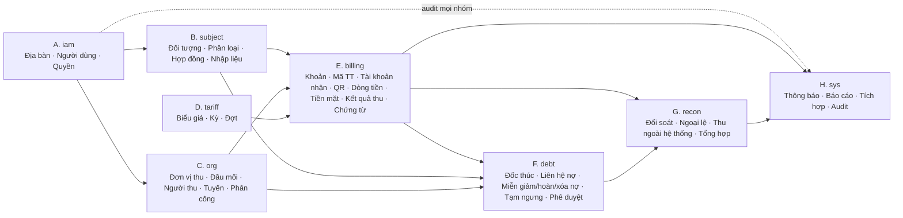
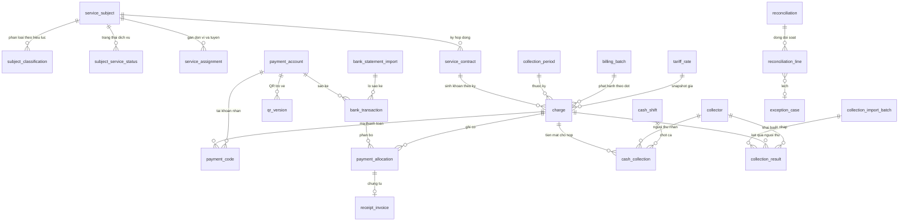
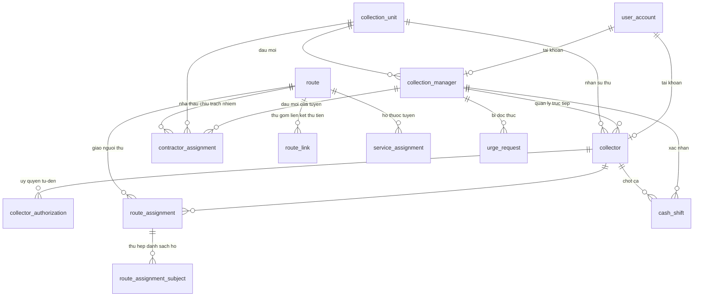
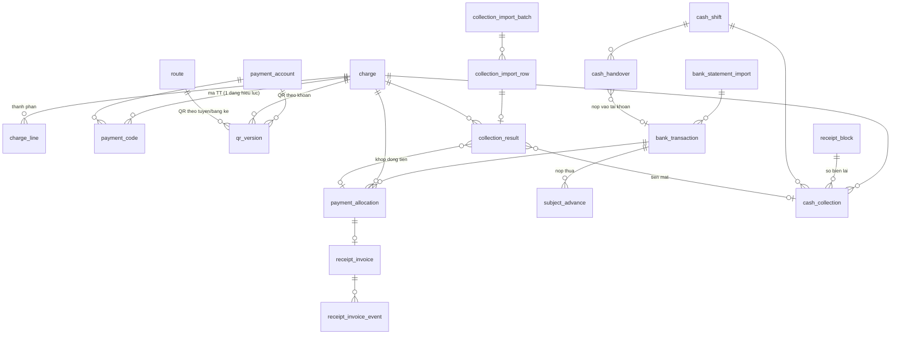

# THIẾT KẾ CƠ SỞ DỮ LIỆU

> **Cảnh báo đồng bộ 15/09/2026:** tài liệu này được lập theo mô hình prototype trước 2.9 và **chưa được phép dùng nguyên trạng để triển khai backend**. Các bảng/DDL về hai loại tuyến, xã giao trực tiếp người thu, QR tiền hộ vào xã và đối soát tiền mặt từng người đã bị thay thế về mặt nghiệp vụ bởi `SPEC-TONG-HOP.md` 2.9. Thiết kế CSDL tiếp theo phải dùng một `AreaAssignment` cho một công ty vừa thu gom vừa thu tiền; tách `sourceUnitId` của dòng Excel khỏi phân công chính thức; bổ sung `ProcessingObligation` và `ProcessingRemittance`; dùng sao kê tài khoản xã để đối soát phần xử lý; lãnh đạo xác nhận báo cáo và kế toán khóa sổ.

## Hệ thống số hóa quản lý và thu giá dịch vụ vệ sinh môi trường

**Địa bàn tham chiếu:** Xã Đông Thạnh, Thành phố Hồ Chí Minh  
**Loại tài liệu:** Thuyết minh thiết kế cơ sở dữ liệu (mức logic và mức vật lý)  
**Hệ quản trị mục tiêu:** PostgreSQL 15 trở lên  
**Phiên bản:** 1.0  
**Ngày lập:** 14/09/2026  
**Nguồn thiết kế:** `SPEC-TONG-HOP.md` phiên bản 2.4 ngày 14/09/2026 (§5 vai trò, §7 chức năng, §8 luồng vận hành, §9 quy tắc BR-01…BR-21, §10 mô hình dữ liệu khái niệm, §11 mô hình trạng thái, §13 báo cáo, §14 tích hợp, §15 yêu cầu phi chức năng)  
**Nguồn bổ sung:** Prototype `outputs/prototype-v2` (định dạng mã, hình dạng dữ liệu minh họa) và kết luận trao đổi ngày 14/09/2026 về mô hình đầu mối quản lý người đi thu  
**Trạng thái:** Dự thảo để BA, kế toán, lãnh đạo xã và nhóm phát triển rà soát trước khi dựng schema thật

---

## 0. Cách đọc tài liệu

### 0.1. Nhãn xác nhận

Tài liệu kế thừa hệ thống nhãn của đặc tả tổng hợp và bổ sung một nhãn cho phần vượt spec:

| Nhãn | Ý nghĩa trong tài liệu này |
|---|---|
| **Theo spec 2.4** | Bảng/cột/ràng buộc được suy trực tiếp từ thực thể §10, quy tắc §9 hoặc trạng thái §11 của đặc tả |
| **Cần BA xác nhận** | Thiết kế đã dựng sẵn nhưng phụ thuộc quyết định về tiền, thẩm quyền, pháp lý hoặc tích hợp chưa chốt (đối chiếu §19 của spec) |
| **Đề xuất mở rộng** | Vượt phạm vi spec 2.4, xuất phát từ trao đổi ngày 14/09/2026; có thể bỏ mà không phá vỡ phần còn lại |
| **Giai đoạn mở rộng** | Bảng/cột dựng trước để không phải sửa lõi sau này (KBNN, GIS, tính theo khối lượng, cổng người dân) |

### 0.2. Quy ước đặt tên và kiểu dữ liệu

| Hạng mục | Quy ước |
|---|---|
| Schema | Tám schema theo nhóm nghiệp vụ: `iam`, `subject`, `org`, `tariff`, `billing`, `debt`, `recon`, `sys` |
| Tên bảng | `snake_case`, số ít, tiếng Anh, giữ gốc tên thực thể trong spec §10 để truy vết (`ServiceSubject` → `subject.service_subject`) |
| Khóa chính | `id uuid` sinh bằng `gen_random_uuid()`; không dùng mã nghiệp vụ làm khóa chính vì mã có thể đổi định dạng khi hợp nhất dữ liệu |
| Mã nghiệp vụ | Cột `code` kiểu `varchar`, ràng buộc `UNIQUE`, giữ định dạng đã dùng ở prototype (`DTH-H000128`, `DTH-T07`, `DTH-0926-H000128`, `KT-2026-09`) |
| Tiền | `numeric(18,0)`, đơn vị đồng Việt Nam, không lưu số thập phân |
| Thời điểm | `timestamptz`; ngày hiệu lực dùng `date` |
| Khoảng hiệu lực | Hai cột `valid_from date NOT NULL`, `valid_to date NULL` (NULL = chưa kết thúc) và một cột sinh `validity daterange` để dùng ràng buộc `EXCLUDE` chống chồng lấn |
| Trạng thái | Kiểu `ENUM` của PostgreSQL cho tập giá trị đóng theo spec §11; bảng danh mục cho tập giá trị mở (loại đối tượng, nhóm giá, mẫu thông báo) |
| Dữ liệu bán cấu trúc | `jsonb` cho payload lô nhập, snapshot trước/sau trong audit, tham số báo cáo, hình học GIS tùy chọn |
| Cột chuẩn | Mọi bảng nghiệp vụ có `created_at timestamptz NOT NULL DEFAULT now()`, `created_by uuid`, `updated_at timestamptz`, `updated_by uuid`, `row_version int NOT NULL DEFAULT 1` (khóa lạc quan). Các bảng nhật ký chỉ ghi thêm (`audit_log`, `integration_log`) dùng `id bigint GENERATED ALWAYS AS IDENTITY` và không có `updated_*` |
| Xóa | Không có `DELETE` vật lý trên bảng nghiệp vụ và tài chính; dùng cột trạng thái. Cột `deleted_at` chỉ dùng cho bảng cấu hình phi tài chính |

Trong các bảng đặc tả ở mục 5, cột chuẩn được lược bỏ để ngắn gọn và được ghi là “+ cột chuẩn”.

### 0.3. Ký hiệu trong bảng đặc tả

| Ký hiệu | Nghĩa |
|---|---|
| `PK` | Khóa chính |
| `FK → schema.bảng` | Khóa ngoại |
| `UQ` | Ràng buộc duy nhất |
| `UQx` | Duy nhất một phần (partial unique index, có điều kiện) |
| `EX` | Ràng buộc `EXCLUDE USING gist` chống chồng lấn hiệu lực |
| `CK` | Ràng buộc `CHECK` |
| `IX` | Chỉ mục phục vụ truy vấn |
| `TRG` | Thực thi bằng trigger |
| `APP` | Thực thi ở tầng ứng dụng/API, CSDL chỉ lưu kết quả |

---

## 1. Mục đích, phạm vi và người đọc

### 1.1. Mục đích

Tài liệu chuyển mô hình dữ liệu khái niệm của đặc tả (36 thực thể, mỗi thực thể một dòng thuộc tính) thành thiết kế CSDL có thể dựng được: bảng, cột, kiểu, khóa, ràng buộc, chỉ mục, trạng thái, view phục vụ màn hình và quy tắc thực thi. Mục tiêu số một của hệ thống là **chống thất thu và truy vết được dòng tiền**, nên thiết kế ưu tiên:

- Chuỗi truy vết không đứt: đối tượng → hợp đồng → khoản phải thu → mã thanh toán → dòng tiền → phân bổ → chứng từ → đối soát.
- Không ghi đè lịch sử: phân loại, phân công, biểu giá, tài khoản nhận và QR đều có thời gian hiệu lực.
- Tách ba nguồn số liệu để đối soát độc lập: khoản đã phát hành (xã), kết quả người thu khai báo, dòng tiền trên sao kê.
- Tách người thu, người đối soát và người phê duyệt ở mức dữ liệu, không chỉ ở giao diện.

### 1.2. Phạm vi

Trong phạm vi:

- Toàn bộ thực thể §10 của spec và các bảng phụ trợ cần thiết để thực thi BR-01…BR-21.
- Vai trò, phân quyền và phạm vi dữ liệu ở mức CSDL.
- Mô hình đầu mối quản lý người đi thu (đề xuất mở rộng) vì ảnh hưởng trực tiếp đến bảng tổ chức thu và tiền mặt.
- View và truy vấn cho các màn hình đã có trong prototype v2.4.
- Chiến lược nạp dữ liệu từ ba xã cũ.

Ngoài phạm vi:

- Thiết kế API, tầng ứng dụng, hàng đợi offline.
- Cổng người dân (giai đoạn 2): chỉ dựng chỗ liên kết tài khoản người dân với hồ sơ đối tượng.
- Hạch toán KBNN: chỉ dựng bảng dòng khoản để sau này ánh xạ mục lục ngân sách.

### 1.3. Người đọc

| Người đọc | Dùng phần nào |
|---|---|
| BA / khách hàng | Mục 2, 3, 6, 12 để xác nhận nguyên tắc, actor, trạng thái và các điểm chưa chốt |
| Kiến trúc sư / lập trình viên backend | Mục 5, 7, 8, 10, 13 để dựng schema, trigger, view |
| Kế toán / kiểm soát | Mục 5.E, 5.G, 7, 8 để rà chuỗi tiền và đối soát |
| Kiểm thử | Mục 6, 7 và kịch bản TC-01…TC-31 của spec để lập dữ liệu kiểm thử |
| Đội triển khai dữ liệu | Mục 11 để lập kế hoạch nạp dữ liệu cũ |

---

## 2. Nguyên tắc thiết kế

| Mã | Nguyên tắc | Hệ quả trong schema | Nguồn |
|---|---|---|---|
| NT-01 | Một hệ thống, một nguồn dữ liệu; không tạo kho riêng cho người đi thu | Người đi thu ghi vào cùng bảng `collection_result`, `cash_collection`; phạm vi dữ liệu tính từ `route_assignment` chứ không sao chép dữ liệu | Spec §6 |
| NT-02 | Không xóa vật lý dữ liệu nghiệp vụ và tài chính | Mọi bảng có cột trạng thái; xóa nợ, hủy chứng từ, kết thúc phân công là chuyển trạng thái | BR-12, §15.2 |
| NT-03 | Thay đổi theo thời gian là bản ghi mới, không ghi đè | `subject_classification`, `subject_service_status`, `service_assignment`, `contractor_assignment`, `route_assignment`, `tariff_version`, `payment_account`, `qr_version` đều có `valid_from`/`valid_to` và ràng buộc chống chồng lấn | BR-01, BR-16, BR-19A, BR-21 |
| NT-04 | Dòng phải thu và dòng đã thu tách biệt; số còn lại là giá trị tính | `charge` giữ số ghi nợ; `payment_allocation` giữ số ghi có; view `v_charge_balance` tính số còn lại | BR-18 |
| NT-05 | Khóa nghiệp vụ hộ–kỳ–dịch vụ | Chỉ mục duy nhất một phần trên `charge(subject_id, period_id, service_type)` cho khoản gốc đang hiệu lực; `contract_id` bổ sung khi một hộ có nhiều hợp đồng cùng loại | BR-18 |
| NT-06 | Giá được chụp vào khoản | `charge` lưu snapshot mã biểu giá, nhóm, đơn giá, từng thành phần phí và VAT; đổi biểu giá không sửa khoản cũ | BR-01, TC-15 |
| NT-07 | Mã thanh toán duy nhất, không tái sử dụng | `payment_code.code` UNIQUE toàn hệ thống; tạo lại QR sinh `qr_version` mới, không đổi mã khoản | BR-04 |
| NT-08 | Tiền mặt là trạng thái tạm, không phải tiền đã về | `cash_collection` không làm đổi trạng thái `charge`; chỉ `payment_allocation` gắn `bank_transaction` mới đóng khoản; ngoại lệ có phê duyệt đi qua `exception_case` + `approval` | BR-06, §7.5 |
| NT-09 | Chống ghi trùng (idempotency) | UNIQUE `(payment_account_id, bank_tx_ref)`; UNIQUE `file_checksum` trên lô nhập; bảng `sys.idempotency_key` cho API ghi tài chính | TH-11, BR-17 |
| NT-10 | Tách người đề nghị và người duyệt | `approval` lưu `requester_id` và `approver_id`; trigger từ chối khi trùng | BR-11, BR-13, TC-11 |
| NT-11 | Kỳ đã khóa không sửa trực tiếp | Trigger trên `charge`, `payment_allocation`, `receipt_invoice`, `adjustment_request_line` kiểm tra `collection_period.status <> 'LOCKED'`; mở lại kỳ đi qua `period_lock_event` + `approval` | BR-14, TC-14 |
| NT-12 | Audit bất biến | `sys.audit_log` chỉ cho INSERT; thu hồi quyền UPDATE/DELETE ở mức role CSDL; có chuỗi băm `prev_hash`/`row_hash` | QT-09, §15.2 |
| NT-13 | Đa địa bàn và phạm vi quyền nằm trong dữ liệu | `administrative_area` phân cấp; `user_data_scope` và `route_assignment` là nguồn duy nhất để lọc dữ liệu theo người dùng; ẩn menu không phải bảo mật | §5.1, §15.1 |
| NT-14 | Dữ liệu tổng hợp phải truy nguyên được | `organization_debt_summary`, `collector_progress_snapshot` là bảng snapshot có `computed_at` và tham số nguồn; số liệu gốc luôn ở `charge`/`collection_result`/`payment_allocation` | BR-19, §13 |
| NT-15 | Không hard-code giá, văn bản pháp lý, tài khoản nhận | Tất cả là dữ liệu trong `tariff_version`, `payment_account`, `integration_config` có hiệu lực và phê duyệt | §4.2, QT-12 |

---

## 3. Đối tượng tham gia và ánh xạ vào CSDL

### 3.1. Danh sách actor

| # | Actor | Loại | Mã vai trò (`iam.role.code`) | Bảng định danh | Nhãn |
|---|---|---|---|---|---|
| 1 | Quản trị hệ thống | Người dùng nội bộ | `ADMIN` | `iam.user_account` | Theo spec 2.4 |
| 2 | Cán bộ xã | Người dùng nội bộ | `COMMUNE_OFFICER` | `iam.user_account` | Theo spec 2.4 |
| 3 | Người đi thu (cán bộ/CTV xã hoặc nhân viên công ty được ủy quyền) | Người dùng nội bộ | `COLLECTOR` | `iam.user_account` + `org.collector` | Theo spec 2.4; cột `collector_type` là đề xuất mở rộng |
| 4 | Quản lý thu (đầu mối của tổ thu xã hoặc nhà thầu) | Người dùng nội bộ | `COLLECTION_MANAGER` | `iam.user_account` + `org.collection_manager` | **Đề xuất mở rộng — Cần BA xác nhận** (spec 2.4 nói đầu mối không bắt buộc có tài khoản) |
| 5 | Kế toán | Người dùng nội bộ | `ACCOUNTANT` | `iam.user_account` | Theo spec 2.4 |
| 6 | Lãnh đạo | Người dùng nội bộ | `LEADER` | `iam.user_account` | Theo spec 2.4 |
| 7 | Đơn vị thu (11 nhà thầu, tổ thu của xã) | Tổ chức, không đăng nhập | — | `org.collection_unit` | Theo spec 2.4 (CollectionCompany), mở rộng thêm loại `COMMUNE_TEAM` |
| 8 | Người dân / chủ nguồn thải | Đối tượng dữ liệu; người dùng ở giai đoạn 2 | `CITIZEN` (dựng trước, chưa cấp) | `subject.service_subject`; liên kết `subject.subject_portal_account` khi có GĐ2 | Giai đoạn mở rộng |
| 9 | Người đóng thay | Không phải người dùng | — | `subject.subject_contact` (vai `PAYER`), `billing.cash_collection.payer_name`, `billing.collection_result.payer_name` | Theo spec 2.4 (BR-09) |
| 10 | Ngân hàng / VietQR | Hệ thống ngoài | tài khoản kỹ thuật `svc_bank` | `sys.integration_config`; ghi `billing.bank_statement_import`, `billing.bank_transaction` | Cần BA xác nhận (API hay import) |
| 11 | Nhà cung cấp HĐĐT | Hệ thống ngoài | tài khoản kỹ thuật `svc_einvoice` | `billing.receipt_invoice.provider_ref`, `billing.receipt_invoice_event` | Cần BA xác nhận |
| 12 | Kênh SMS/Zalo/Email | Hệ thống ngoài | tài khoản kỹ thuật `svc_notify` | `sys.notification` | Theo spec 2.4 |
| 13 | Kho bạc Nhà nước | Hệ thống ngoài | — | `billing.charge_line`, `sys.report` | Giai đoạn mở rộng |
| 14 | Tiến trình nền (khớp sao kê, tính snapshot, nhắc nợ, sao lưu) | Hệ thống | tài khoản kỹ thuật `system` | Ghi `payment_allocation` (AUTO), `collector_progress_snapshot`, `organization_debt_summary`, `notification`, `audit_log` | Theo spec 2.4 |

Tài khoản kỹ thuật (`svc_*`, `system`) là bản ghi trong `iam.user_account` có `account_type = 'SERVICE'` để mọi dòng audit đều có `actor_user_id`.

### 3.2. Actor và nhóm bảng: ma trận quyền ở mức dữ liệu

Ký hiệu: `R` đọc, `C` tạo, `U` cập nhật, `A` duyệt, `–` không có quyền. Ma trận này là bản chi tiết hóa §5.1 của spec, dùng để sinh dữ liệu mẫu cho `iam.role_permission`.

| Nhóm bảng | ADMIN | COMMUNE_OFFICER | COLLECTOR | COLLECTION_MANAGER* | ACCOUNTANT | LEADER |
|---|---|---|---|---|---|---|
| A. `iam` (người dùng, vai trò, quyền, phạm vi, phiên) | C/U | R (của mình) | R (của mình) | R (người thu thuộc đơn vị) | R (của mình) | R |
| A. `iam.administrative_area`, `area_mapping` | C/U | R | R | R | R | R |
| B. `subject.*` (đối tượng, phân loại, hợp đồng, nhập liệu) | R | C/U | R trong phạm vi; C `subject_change_request` | R trong phạm vi đơn vị | R | R |
| C. `org.*` (đơn vị, đầu mối, người thu, tuyến, phân công) | C/U `collection_unit`; R còn lại | C/U tuyến, `contractor_assignment`, `route_assignment`, `collector_authorization` | R của mình | R đơn vị mình; C đề nghị người thu | R | R |
| D. `tariff.*` (biểu giá, kỳ, đợt) | C/U cấu hình `tariff_version` | C/U kỳ, đợt; R biểu giá | R khoản được giao | R | R | R; A đợt nếu quy chế bật; A khóa kỳ |
| E. `billing` – khoản, mã thanh toán | R | C/U (sinh, phát hành, khoản lẻ) | R trong phạm vi | R đơn vị mình | R | R |
| E. `billing` – tài khoản nhận, QR | C/U `payment_account` (cấu hình) | R | C `qr_version` đề xuất; R QR đang hiệu lực | R | R | A `payment_account`, `qr_version` |
| E. `billing` – sao kê, dòng tiền, phân bổ | R kỹ thuật | R | R của mình | C `bank_statement_import` của đơn vị*; R | C/U | R; A gán tay giá trị lớn nếu quy chế |
| E. `billing` – tiền mặt, chốt ca, biên lai lô | R | R; C `receipt_block` | C/U `cash_collection`, `cash_shift` của mình | U xác nhận `cash_shift`, C `cash_handover`* | R; U đối soát | R |
| E. `billing` – kết quả thu (web/Excel) | R | R | C/U của mình | R người thu thuộc mình | R | R |
| E. `billing` – chứng từ | R | R | R của mình | R | C/U | A hủy/điều chỉnh |
| F. `debt` – đốc thúc, liên hệ nợ | R | C `urge_request`; R | C `debt_contact_log` trong phạm vi | U phản hồi `urge_request`* | R | R |
| F. `debt` – miễn giảm/hoàn/xóa nợ/tạm ngưng | R kỹ thuật | C đề nghị | – | – | U kiểm tra/áp dụng | A |
| G. `recon.*` (đối soát, ngoại lệ, thu ngoài hệ thống, tổng hợp) | R kỹ thuật | R; C giải trình ngoại lệ thuộc xã | R của mình; C giải trình | C giải trình đơn vị mình* | C/U | R; A quyết định ngoại lệ |
| H. `sys` – thông báo, báo cáo | R | R nghiệp vụ; C nhắc nợ theo quy trình | R cá nhân | R đơn vị mình | C/U báo cáo | R; A xác nhận báo cáo |
| H. `sys` – tích hợp, audit, idempotency | C/U cấu hình; R audit | – | – | – | R audit tài chính | R |

`*` Cột `COLLECTION_MANAGER` và các ô đánh dấu `*` thuộc **Đề xuất mở rộng — Cần BA xác nhận**. Nếu không bật vai trò này, các quyền tương ứng chuyển về cán bộ xã (xác nhận tiền mặt) và kế toán (nộp sao kê).

Quyền thực tế được kiểm tra ở API và trong truy vấn (mục 3.4); ma trận này không thay thế `iam.role_permission`.

### 3.3. Actor và luồng ghi dữ liệu chính

```text
Cán bộ xã          : service_subject → subject_classification → service_assignment → service_contract
                     → collection_period → billing_batch → charge (+ payment_code)
                     → route / contractor_assignment / route_assignment → urge_request
Người đi thu       : collection_import_batch → collection_result
                     → cash_collection → cash_shift → (qr_version đề xuất) → debt_contact_log
Quản lý thu*       : cash_shift (xác nhận) → cash_handover → bank_statement_import (đơn vị)
                     → urge_request (phản hồi)
Ngân hàng/Kế toán  : bank_statement_import → bank_transaction → payment_allocation
                     → receipt_invoice → reconciliation → exception_case
Lãnh đạo           : approval → period_lock_event → report (xác nhận)
Hệ thống           : payment_allocation (AUTO) → collector_progress_snapshot
                     → organization_debt_summary → notification → audit_log
```

### 3.4. Cơ chế phạm vi dữ liệu

Phạm vi dữ liệu có hai nguồn, đều nằm trong CSDL:

1. **Phạm vi theo địa bàn/đơn vị** (`iam.user_data_scope`): áp dụng cho cán bộ xã, kế toán, lãnh đạo, quản lý thu. Một dòng cho mỗi cặp người dùng – phạm vi (`AREA`, `UNIT`, `ROUTE`) có hiệu lực.
2. **Phạm vi theo phân công tuyến** (`org.route_assignment`): áp dụng cho người đi thu. Người thu chỉ thấy các đối tượng đang được gán vào tuyến mà họ có phân công còn hiệu lực; bảng `route_assignment_subject` cho phép thu hẹp thêm theo danh sách hộ.

Truy vấn chuẩn để tính tập đối tượng của một người thu tại một ngày (dùng làm hàm `org.fn_collector_subject_ids(collector_id, as_of date)`):

```sql
select distinct sa.subject_id
from org.route_assignment ra
join subject.service_assignment sa
  on (sa.payment_route_id = ra.route_id or sa.collection_route_id = ra.route_id)
 and sa.validity @> :as_of
 and sa.status = 'ACTIVE'
where ra.collector_id = :collector_id
  and ra.status = 'ACTIVE'
  and ra.validity @> :as_of
  and not exists (                                   -- danh sách loại trừ
        select 1 from org.route_assignment_subject x
        where x.route_assignment_id = ra.id and x.subject_id = sa.subject_id and x.include_flag = false)
  and (not exists (                                  -- nếu có danh sách bao gồm thì chỉ lấy trong danh sách
        select 1 from org.route_assignment_subject y
        where y.route_assignment_id = ra.id and y.include_flag = true)
       or exists (
        select 1 from org.route_assignment_subject y
        where y.route_assignment_id = ra.id and y.subject_id = sa.subject_id and y.include_flag = true));
```

Mọi API của người đi thu phải lọc `subject_id IN (select * from org.fn_collector_subject_ids(...))`. Hộ đã chấm dứt (`subject_service_status.status = 'TERMINATED'`) vẫn nằm trong tập để hiển thị ở chế độ khóa thu, nhưng trigger chặn ghi kết quả “đã thu” (mục 7, RB-09).

Nếu triển khai Row-Level Security của PostgreSQL, hai nguồn trên là điều kiện `USING` cho policy trên các bảng `service_subject`, `charge`, `collection_result`, `cash_collection`; tài liệu này không bắt buộc RLS mà chỉ yêu cầu API áp dụng cùng logic.

---

## 4. Sơ đồ tổng thể

### 4.1. Tám nhóm bảng và quan hệ giữa các nhóm



### 4.2. Chuỗi truy vết trung tâm



Tên thực thể trong sơ đồ bỏ dấu để Mermaid hiển thị ổn định; tên bảng thật ghi ở mục 5.

### 4.3. Tổ chức thu và phạm vi dữ liệu



---

## 5. Đặc tả bảng

Mỗi bảng gồm: mục đích, cột chính (lược cột chuẩn), khóa và ràng buộc, chỉ mục, quy tắc nghiệp vụ liên quan và nhãn xác nhận. Kiểu dữ liệu ghi theo PostgreSQL.

### 5.A. Nhóm `iam` — địa bàn, người dùng, phân quyền

#### 5.A.1. `iam.administrative_area` — địa bàn

Phân vùng dữ liệu, biểu giá và phạm vi quyền. Lưu cả địa giới cũ (ba xã trước hợp nhất) để kế thừa dữ liệu và địa giới mới (xã Đông Thạnh, các ấp, khu vực quản lý tuyến).

| Cột | Kiểu | Null | Mô tả |
|---|---|---|---|
| `id` | uuid | PK | |
| `code` | varchar(20) | UQ | Mã địa bàn, ví dụ `DTH`, `TTT`, `NB`, `DTH-AP7` |
| `name` | varchar(150) | | Tên hiển thị |
| `area_type` | enum `area_type` | | `COMMUNE` xã hiện hành; `ZONE` khu vực quản lý tuyến (Đông Thạnh/Thới Tam Thôn/Nhị Bình); `HAMLET` ấp; `LEGACY_COMMUNE` xã cũ |
| `parent_id` | uuid | ✓ | FK → `iam.administrative_area`, cây phân cấp |
| `is_legacy` | boolean | | `true` nếu chỉ dùng để tra cứu lịch sử |
| `valid_from`, `valid_to`, `validity` | date, date, daterange | | Hiệu lực địa giới (xã Đông Thạnh từ 01/07/2025) |
| `geometry` | jsonb | ✓ | GeoJSON ranh giới, tùy chọn (Giai đoạn mở rộng GIS) |
| `status` | enum `active_status` | | `ACTIVE` / `INACTIVE` |
| + cột chuẩn | | | |

Ràng buộc: `CK` `parent_id <> id`; `IX (parent_id)`, `IX (area_type)`.  
Liên quan: QT-04, DM-05, §3. Nhãn: Theo spec 2.4.

#### 5.A.2. `iam.area_mapping` — ánh xạ địa giới cũ sang mới

| Cột | Kiểu | Null | Mô tả |
|---|---|---|---|
| `id` | uuid | PK | |
| `legacy_area_id` | uuid | | FK → `administrative_area` (xã/ấp cũ) |
| `new_area_id` | uuid | | FK → `administrative_area` (địa bàn mới) |
| `mapping_rule` | text | ✓ | Mô tả quy tắc (theo ấp, theo đoạn đường, theo mã cũ) |
| `address_pattern` | text | ✓ | Mẫu địa chỉ dùng khi chuẩn hóa tự động |
| `valid_from`, `valid_to`, `validity` | | | |
| + cột chuẩn | | | |

Ràng buộc: `UQ (legacy_area_id, new_area_id, valid_from)`. Liên quan: DM-05, QT-04.

#### 5.A.3. `iam.user_account` — tài khoản

| Cột | Kiểu | Null | Mô tả |
|---|---|---|---|
| `id` | uuid | PK | |
| `username` | varchar(64) | UQ | Đăng nhập, ví dụ `nguyenthuha` |
| `full_name` | varchar(150) | | |
| `email` | varchar(150) | ✓ | UQx khi không null |
| `phone` | varchar(20) | ✓ | Dùng để liên hệ và 2FA |
| `organization_name` | varchar(150) | ✓ | Đơn vị công tác hiển thị (Phòng Kinh tế, Tổ thu 03…) |
| `account_type` | enum `account_type` | | `PERSON` người thật; `SERVICE` tài khoản kỹ thuật |
| `password_hash` | text | ✓ | Null khi dùng SSO/định danh ngoài |
| `identity_provider` | varchar(50) | ✓ | `LOCAL`, `VNEID`, … (Cần BA xác nhận phương án định danh) |
| `mfa_enabled` | boolean | | Bắt buộc `true` với ADMIN, ACCOUNTANT, LEADER (kiểm tra ở APP) |
| `status` | enum `user_status` | | `ACTIVE`, `LOCKED`, `DISABLED`, `PENDING_MFA` |
| `failed_login_count` | int | | |
| `last_login_at` | timestamptz | ✓ | |
| `must_change_password` | boolean | | |
| + cột chuẩn | | | |

Liên quan: QT-01, §15.1. Nhãn: Theo spec 2.4.

#### 5.A.4. `iam.role`, `iam.permission`, `iam.role_permission`, `iam.user_role`

`iam.role`

| Cột | Kiểu | Null | Mô tả |
|---|---|---|---|
| `id` | uuid | PK | |
| `code` | varchar(40) | UQ | `ADMIN`, `COMMUNE_OFFICER`, `COLLECTOR`, `COLLECTION_MANAGER`, `ACCOUNTANT`, `LEADER`, `CITIZEN` |
| `name` | varchar(100) | | Tên tiếng Việt |
| `description` | text | ✓ | |
| `is_system` | boolean | | Vai trò hệ thống không xóa |
| `status` | enum `active_status` | | |

`iam.permission`

| Cột | Kiểu | Null | Mô tả |
|---|---|---|---|
| `id` | uuid | PK | |
| `code` | varchar(80) | UQ | Dạng `module.object.action`, ví dụ `billing.charge.issue`, `debt.adjustment.approve`, `billing.qr_version.propose` |
| `module` | varchar(40) | | `iam`, `subject`, `org`, `tariff`, `billing`, `debt`, `recon`, `sys` |
| `action` | varchar(40) | | `read`, `create`, `update`, `approve`, `export`, `view_sensitive` |
| `description` | text | ✓ | |

`iam.role_permission`

| Cột | Kiểu | Null | Mô tả |
|---|---|---|---|
| `role_id` | uuid | PK, FK | |
| `permission_id` | uuid | PK, FK | |
| `scope_type` | enum `scope_type` | | `ALL` toàn xã; `AREA` theo `user_data_scope`; `UNIT` theo đơn vị; `ROUTE` theo phân công tuyến; `OWN` bản ghi do chính mình tạo |

`iam.user_role`

| Cột | Kiểu | Null | Mô tả |
|---|---|---|---|
| `id` | uuid | PK | |
| `user_id` | uuid | FK | |
| `role_id` | uuid | FK | |
| `valid_from`, `valid_to`, `validity` | | | Một người có thể được gán nhiều vai trò có hiệu lực |
| `granted_by` | uuid | | FK → `user_account` |
| `note` | text | ✓ | |

Ràng buộc: `UQ (user_id, role_id, valid_from)`. Quy tắc §5 của spec “một người có thể được gán nhiều vai nhưng không tự đề nghị–tự duyệt” thực thi ở `approval` (RB-07), không ở đây.  
Liên quan: QT-01, QT-02, §5.1.

#### 5.A.5. `iam.user_data_scope` — phạm vi dữ liệu theo địa bàn/đơn vị

| Cột | Kiểu | Null | Mô tả |
|---|---|---|---|
| `id` | uuid | PK | |
| `user_id` | uuid | FK | |
| `scope_type` | enum `scope_type` | | `AREA`, `UNIT`, `ROUTE` (không dùng `ALL`/`OWN` ở đây) |
| `area_id` | uuid | ✓ | FK → `administrative_area` |
| `unit_id` | uuid | ✓ | FK → `org.collection_unit` |
| `route_id` | uuid | ✓ | FK → `org.route` |
| `valid_from`, `valid_to`, `validity` | | | |
| `granted_by` | uuid | | |

Ràng buộc: `CK` đúng một trong `area_id`/`unit_id`/`route_id` khác null theo `scope_type`. Người đi thu không dùng bảng này; phạm vi của họ đến từ `org.route_assignment` (mục 3.4).

#### 5.A.6. `iam.user_session` — phiên đăng nhập và thu hồi

| Cột | Kiểu | Null | Mô tả |
|---|---|---|---|
| `id` | uuid | PK | Session/refresh token id |
| `user_id` | uuid | FK | |
| `device_label` | varchar(150) | ✓ | Tên thiết bị người thu |
| `device_fingerprint` | varchar(200) | ✓ | |
| `ip_address` | inet | ✓ | |
| `issued_at`, `expires_at` | timestamptz | | |
| `last_seen_at` | timestamptz | ✓ | |
| `revoked_at` | timestamptz | ✓ | |
| `revoked_by` | uuid | ✓ | |
| `revoke_reason` | varchar(100) | ✓ | `LOST_DEVICE`, `RESIGNED`, `ADMIN`, `EXPIRED` |

Liên quan: §15.1 (thu hồi phiên khi mất máy/nghỉ việc). `IX (user_id, revoked_at)`.

### 5.B. Nhóm `subject` — đối tượng, phân loại, hợp đồng, nhập liệu

#### 5.B.1. `subject.attribute_type` — loại đối tượng (`attributeType`)

Danh mục mở do xã cấu hình.

| Cột | Kiểu | Null | Mô tả |
|---|---|---|---|
| `id` | uuid | PK | |
| `code` | varchar(20) | UQ | `HGD` hộ gia đình, `HKD` hộ kinh doanh, `DN` doanh nghiệp, `CSSX` cơ sở sản xuất, `CQ` cơ quan/tổ chức |
| `name` | varchar(100) | | |
| `code_prefix` | varchar(5) | | Tiền tố khi sinh mã đối tượng (`H`, `KD`, `DN`, `CS`, `CQ`) |
| `default_subject_group_id` | uuid | ✓ | FK → `tariff.subject_group`, gợi ý nhóm giá |
| `requires_tax_code` | boolean | | Doanh nghiệp bắt buộc mã số thuế khi phát hành HĐĐT |
| `status` | enum `active_status` | | |

Liên quan: DM-11, BR-16.

#### 5.B.2. `subject.service_subject` — đối tượng/chủ nguồn thải

Bản ghi gốc do xã tạo. Các thuộc tính thay đổi theo thời gian (loại, nhóm giá, trạng thái dịch vụ, đơn vị, tuyến) nằm ở bảng lịch sử; bảng này giữ cột `current_*` để truy vấn nhanh, được cập nhật bằng trigger từ bảng lịch sử.

| Cột | Kiểu | Null | Mô tả |
|---|---|---|---|
| `id` | uuid | PK | |
| `code` | varchar(20) | UQ | Mã định danh thống nhất, ví dụ `DTH-H000128`, `TTT-KD00142`, `NB-DN00038`; sinh từ `area.code + attribute_type.code_prefix + số thứ tự`, không tái sử dụng |
| `name` | varchar(200) | | Tên chủ hộ/cơ sở/doanh nghiệp |
| `area_id` | uuid | FK | Địa bàn hiện hành (ấp hoặc khu vực) |
| `legacy_area_id` | uuid | ✓ | FK → `administrative_area`, xã cũ nếu kế thừa |
| `legacy_code` | varchar(40) | ✓ | Mã trong sổ cũ, `IX` |
| `address_line` | varchar(300) | | Địa chỉ đã chuẩn hóa theo địa giới mới |
| `address_raw` | varchar(300) | ✓ | Địa chỉ gốc trước chuẩn hóa |
| `latitude`, `longitude` | numeric(9,6) | ✓ | Tùy chọn cho bản đồ |
| `household_size` | smallint | ✓ | Số nhân khẩu, dùng cho nhóm giá HGĐ ≤ 2 / ≥ 3 |
| `tax_code` | varchar(20) | ✓ | Mã số thuế của DN/HKD |
| `national_id_enc` | bytea | ✓ | CCCD mã hóa; chỉ lưu khi có căn cứ (BR-09, §15.1). Không bắt buộc |
| `national_id_last4` | char(4) | ✓ | Phục vụ hiển thị che |
| `phone` | varchar(20) | ✓ | Liên hệ chính; hiển thị che theo vai trò |
| `email` | varchar(150) | ✓ | |
| `status` | enum `subject_status` | | §11.1: `PENDING_VERIFICATION`, `ACTIVE`, `SUSPENDED`, `MOVED`, `TERMINATED` |
| `verified_at`, `verified_by` | timestamptz, uuid | ✓ | Bước xác minh sau khi tạo |
| `current_attribute_type_id` | uuid | ✓ | Đồng bộ từ `subject_classification` |
| `current_subject_group_id` | uuid | ✓ | Đồng bộ từ `subject_classification` |
| `current_service_status` | enum `service_status` | ✓ | Đồng bộ từ `subject_service_status` |
| `current_unit_id` | uuid | ✓ | Đồng bộ từ `service_assignment` |
| `current_collection_route_id`, `current_payment_route_id` | uuid | ✓ | Đồng bộ từ `service_assignment` |
| `source_import_batch_id` | uuid | ✓ | FK → `subject.data_import_batch` nếu tạo từ import |
| `merged_into_subject_id` | uuid | ✓ | FK tự tham chiếu; khác null khi bản ghi bị gộp (DM-04) |
| `note` | text | ✓ | |
| + cột chuẩn | | | |

Ràng buộc và chỉ mục:

- `IX (area_id)`, `IX (current_payment_route_id)`, `IX (current_collection_route_id)`, `IX (current_unit_id)`, `IX (status)`.
- `IX` GIN trigram trên `name`, `address_line` cho tìm kiếm hiện trường (mở rộng `pg_trgm`).
- `CK` `merged_into_subject_id <> id`.
- Không được xóa; “chuyển đi” là `status = MOVED`.

Liên quan: DM-01…DM-07, BR-16, TC-16. Nhãn: Theo spec 2.4.

#### 5.B.3. `subject.subject_contact` — liên hệ, người đại diện, người đóng thay

| Cột | Kiểu | Null | Mô tả |
|---|---|---|---|
| `id` | uuid | PK | |
| `subject_id` | uuid | FK | |
| `contact_role` | enum `contact_role` | | `OWNER` chủ đối tượng; `REPRESENTATIVE` người đại diện; `PAYER` người đóng thay thường xuyên; `OTHER` |
| `full_name` | varchar(150) | | |
| `phone` | varchar(20) | ✓ | |
| `relation` | varchar(60) | ✓ | Quan hệ với chủ hộ |
| `is_primary` | boolean | | Liên hệ chính cho thông báo |
| `notify_consent` | boolean | | Đồng ý nhận SMS/Zalo (§14) |
| `valid_from`, `valid_to`, `validity` | | | |
| + cột chuẩn | | | |

Theo BR-09, người đóng thay không làm thay đổi chủ sở hữu nghĩa vụ; bảng này chỉ lưu tối thiểu họ tên và liên hệ. `UQx (subject_id) where is_primary`.

#### 5.B.4. `subject.subject_classification` — phân loại theo hiệu lực

| Cột | Kiểu | Null | Mô tả |
|---|---|---|---|
| `id` | uuid | PK | |
| `subject_id` | uuid | FK | |
| `attribute_type_id` | uuid | FK | Loại đối tượng |
| `subject_group_id` | uuid | FK → `tariff.subject_group` | Nhóm giá áp dụng |
| `pricing_method` | enum `pricing_method` | | `FIXED`, `WEIGHT`, `VOLUME` (BR-15) |
| `reason` | varchar(200) | ✓ | Lý do phân loại/đổi nhóm |
| `evidence_ref` | varchar(300) | ✓ | Đường dẫn minh chứng |
| `valid_from`, `valid_to`, `validity` | | | |
| `decided_by` | uuid | | Cán bộ xã |
| + cột chuẩn | | | |

Ràng buộc: `EX (subject_id WITH =, validity WITH &&)` — một đối tượng chỉ có một phân loại tại một thời điểm. Trigger đồng bộ `service_subject.current_*`.  
Liên quan: DM-11, BR-16 (“thay đổi mới không ghi đè lịch sử cũ”).

#### 5.B.5. `subject.subject_service_status` — trạng thái dịch vụ theo thời đoạn

| Cột | Kiểu | Null | Mô tả |
|---|---|---|---|
| `id` | uuid | PK | |
| `subject_id` | uuid | FK | |
| `status` | enum `service_status` | | §11.9: `PENDING_CLASSIFICATION`, `ACTIVE`, `SUSPENDED`, `TERMINATED` |
| `valid_from`, `valid_to`, `validity` | | | Ngày hiệu lực tạm ngưng/chấm dứt/khôi phục |
| `reason` | varchar(200) | ✓ | |
| `suspension_request_id` | uuid | ✓ | FK → `debt.service_suspension_request` — bắt buộc khi `status` ∈ {`SUSPENDED`,`TERMINATED`} đến từ đề nghị (BR-20) |
| `decided_by` | uuid | | |
| + cột chuẩn | | | |

Ràng buộc: `EX (subject_id WITH =, validity WITH &&)`. Khôi phục dịch vụ tạo thời đoạn mới `ACTIVE`, không sửa dòng `TERMINATED` (§11.9).  
Liên quan: BR-20, TH-17, TC-18, TC-28.

#### 5.B.6. `subject.service_assignment` — gán đơn vị xử lý và tuyến cho đối tượng

| Cột | Kiểu | Null | Mô tả |
|---|---|---|---|
| `id` | uuid | PK | |
| `subject_id` | uuid | FK | |
| `unit_id` | uuid | FK → `org.collection_unit` | Đơn vị thu gom/xử lý chịu trách nhiệm |
| `collection_route_id` | uuid | ✓ | FK → `org.route` (`routeType = COLLECTION` hoặc `SHARED`) |
| `payment_route_id` | uuid | ✓ | FK → `org.route` (`routeType = PAYMENT` hoặc `SHARED`) |
| `valid_from`, `valid_to`, `validity` | | | |
| `status` | enum `assignment_status` | | `SCHEDULED`, `ACTIVE`, `ENDED` |
| `reason` | varchar(200) | ✓ | Lý do phân công/đổi |
| `previous_assignment_id` | uuid | ✓ | FK tự tham chiếu, chuỗi lịch sử |
| + cột chuẩn | | | |

Ràng buộc: `EX (subject_id WITH =, validity WITH &&) WHERE status <> 'ENDED'`; `CK` ít nhất một trong hai `*_route_id` khác null. Người đi thu **không** nằm ở bảng này (khác với dòng “ServiceAssignment” của spec §10 có ghi “người đi thu”): quyền dữ liệu người thu đi qua `org.route_assignment` theo BR-16 “tách ba thông tin”.  
Liên quan: BR-16, BR-19 (“chuyển hộ sang đơn vị mới không làm mất công nợ cũ; lưu đơn vị chịu trách nhiệm ở từng thời đoạn”).

#### 5.B.7. `subject.service_contract` — hợp đồng dịch vụ

| Cột | Kiểu | Null | Mô tả |
|---|---|---|---|
| `id` | uuid | PK | |
| `code` | varchar(30) | UQ | `HĐ-DTH-0128` |
| `subject_id` | uuid | FK | |
| `service_type` | enum `service_type` | | `CTRSH` (thu gom, vận chuyển, xử lý CTRSH); dựng sẵn để mở rộng |
| `provider_unit_id` | uuid | ✓ | FK → `org.collection_unit`: bên ký/cung cấp dịch vụ nếu hợp đồng là giữa hộ và đơn vị; null nếu xã là bên tổ chức thu (Cần BA xác nhận) |
| `subject_group_id` | uuid | ✓ | Nhóm giá chốt trong hợp đồng; null thì dùng phân loại hiện hành khi sinh khoản |
| `pricing_method` | enum `pricing_method` | | |
| `quantity_basis` | numeric(12,2) | ✓ | Khối lượng/thể tích cam kết khi tính theo kg/m³ (BR-15) |
| `signed_date` | date | ✓ | |
| `valid_from`, `valid_to`, `validity` | | | |
| `status` | enum `contract_status` | | §11.2: `DRAFT`, `PENDING_CONFIRM`, `ACTIVE`, `SUSPENDED`, `EXPIRED`, `TERMINATED` |
| `termination_reason` | varchar(200) | ✓ | |
| `replaced_by_contract_id` | uuid | ✓ | Khi nhà thầu mới là bên ký hợp đồng (BR-19A) |
| `source` | enum `record_source` | | `IMPORT`, `MANUAL`, `MIGRATED` |
| `file_ref` | varchar(300) | ✓ | Bản scan |
| + cột chuẩn | | | |

Ràng buộc: `EX (subject_id WITH =, service_type WITH =, validity WITH &&) WHERE status IN ('ACTIVE','SUSPENDED')` — không chồng lấn hợp đồng cùng loại (§10.1). `IX (subject_id)`, `IX (status, valid_to)`.  
Liên quan: DM-10, BR-02, TC-29/TC-30.

#### 5.B.8. `subject.exemption_category`, `subject.subject_exemption` — diện miễn/giảm

`subject.exemption_category`

| Cột | Kiểu | Null | Mô tả |
|---|---|---|---|
| `id` | uuid | PK | |
| `code` | varchar(20) | UQ | |
| `name` | varchar(150) | | Hộ nghèo, hộ chính sách… |
| `legal_basis` | varchar(200) | | |
| `reduction_type` | enum `reduction_type` | | `PERCENT`, `FIXED`, `FULL` |
| `reduction_value` | numeric(18,2) | ✓ | |
| `valid_from`, `valid_to`, `validity` | | | |
| `status` | enum `active_status` | | |

`subject.subject_exemption`

| Cột | Kiểu | Null | Mô tả |
|---|---|---|---|
| `id` | uuid | PK | |
| `subject_id` | uuid | FK | |
| `exemption_category_id` | uuid | FK | |
| `adjustment_request_id` | uuid | FK → `debt.adjustment_request` | Hồ sơ đã duyệt cấp diện miễn giảm (BR-10) |
| `valid_from`, `valid_to`, `validity` | | | |
| `status` | enum `active_status` | | |

Sinh khoản đọc bảng này để tính `charge.amount_exempted` cho các kỳ trong hiệu lực. Liên quan: DM-06, CN-04.

#### 5.B.9. `subject.legacy_debt_source` — công nợ kế thừa từ xã cũ

| Cột | Kiểu | Null | Mô tả |
|---|---|---|---|
| `id` | uuid | PK | |
| `subject_id` | uuid | FK | |
| `legacy_area_id` | uuid | FK | Xã cũ |
| `legacy_code` | varchar(40) | | Mã hộ trong sổ cũ |
| `legacy_period_label` | varchar(40) | | Kỳ theo cách ghi cũ, ví dụ `T5-T6/2025` |
| `amount` | numeric(18,0) | | Số nợ kế thừa |
| `import_batch_id` | uuid | FK → `data_import_batch` | Nguồn |
| `evidence_ref` | varchar(300) | ✓ | Sổ thu/biên bản bàn giao |
| `charge_id` | uuid | ✓ | FK → `billing.charge` khoản kế thừa đã tạo (`is_legacy = true`) |
| `status` | enum `legacy_debt_status` | | `PENDING`, `CONVERTED`, `DISPUTED`, `REJECTED` |
| + cột chuẩn | | | |

Liên quan: CN-03, §3. Nhãn: Theo spec 2.4.

#### 5.B.10. `subject.data_import_batch`, `subject.data_import_row` — nhập dữ liệu nền theo lô

`subject.data_import_batch`

| Cột | Kiểu | Null | Mô tả |
|---|---|---|---|
| `id` | uuid | PK | |
| `code` | varchar(30) | UQ | `IMP-2609-04` |
| `import_kind` | enum `data_import_kind` | | `SUBJECT`, `CONTRACT`, `LEGACY_DEBT`, `ADDRESS_MAPPING` |
| `source_file_name` | varchar(200) | | |
| `file_checksum` | char(64) | UQ | SHA-256, chống nhập lại cùng tệp |
| `source_system` | varchar(60) | ✓ | Xã cũ/phần mềm cũ |
| `area_id` | uuid | ✓ | |
| `total_rows`, `valid_rows`, `warning_rows`, `error_rows`, `duplicate_rows` | int | | |
| `status` | enum `import_batch_status` | | `UPLOADED`, `VALIDATING`, `HAS_ERRORS`, `READY`, `IMPORTED`, `CANCELLED` |
| `imported_by`, `imported_at` | uuid, timestamptz | ✓ | |
| `report` | jsonb | ✓ | Tóm tắt lỗi theo mã |
| + cột chuẩn | | | |

`subject.data_import_row`

| Cột | Kiểu | Null | Mô tả |
|---|---|---|---|
| `id` | uuid | PK | |
| `batch_id` | uuid | FK | |
| `row_no` | int | | `UQ (batch_id, row_no)` |
| `raw_data` | jsonb | | Dòng gốc |
| `normalized_data` | jsonb | ✓ | Sau chuẩn hóa mã/địa chỉ |
| `validation` | enum `row_validation` | | `VALID`, `WARNING`, `BLOCKED` |
| `error_codes` | text[] | ✓ | `DUP_CODE`, `ADDR_UNMAPPED`, `MISSING_NAME`… |
| `subject_id` | uuid | ✓ | Bản ghi đã tạo hoặc đã khớp |
| `duplicate_of_subject_id` | uuid | ✓ | |
| `resolved_by`, `resolved_at` | uuid, timestamptz | ✓ | |

Liên quan: DM-02, DM-03, TC-01. Nhãn: Theo spec 2.4 (ImportBatch).

#### 5.B.11. `subject.duplicate_candidate`, `subject.merge_log` — chống trùng và gộp

`subject.duplicate_candidate`

| Cột | Kiểu | Null | Mô tả |
|---|---|---|---|
| `id` | uuid | PK | |
| `subject_id_a`, `subject_id_b` | uuid | FK | `CK a < b`, `UQ (a, b)` |
| `score` | numeric(5,2) | | Điểm tương đồng |
| `match_fields` | jsonb | | Trường trùng (tên, địa chỉ, SĐT, mã cũ) |
| `status` | enum `duplicate_status` | | `OPEN`, `MERGED`, `NOT_DUPLICATE` |
| `reviewed_by`, `reviewed_at` | uuid, timestamptz | ✓ | |

`subject.merge_log`

| Cột | Kiểu | Null | Mô tả |
|---|---|---|---|
| `id` | uuid | PK | |
| `survivor_subject_id` | uuid | FK | Bản ghi giữ lại |
| `merged_subject_id` | uuid | FK | Bản ghi bị gộp (`merged_into_subject_id` trỏ về survivor) |
| `snapshot_before` | jsonb | | Toàn bộ dữ liệu hai bản ghi trước gộp |
| `moved_contracts`, `moved_charges`, `moved_allocations` | int | | Số bản ghi con được chuyển |
| `merged_by`, `merged_at` | uuid, timestamptz | | |
| `reason` | varchar(200) | ✓ | |

Gộp là chuyển FK của hợp đồng/khoản/phân bổ sang survivor và đặt trạng thái bản ghi bị gộp; không xóa (DM-04).

#### 5.B.12. `subject.subject_change_request` — yêu cầu sửa hồ sơ từ hiện trường

| Cột | Kiểu | Null | Mô tả |
|---|---|---|---|
| `id` | uuid | PK | |
| `code` | varchar(30) | UQ | |
| `subject_id` | uuid | ✓ | Null khi đề nghị bổ sung hộ mới |
| `request_type` | enum `subject_change_type` | | `UPDATE_INFO`, `NEW_SUBJECT`, `MOVED`, `VERIFY_TERMINATION`, `OTHER` |
| `proposed_data` | jsonb | | Dữ liệu đề xuất |
| `reason` | varchar(300) | | |
| `requested_by` | uuid | | Người đi thu |
| `route_id` | uuid | ✓ | Tuyến lúc đề nghị |
| `status` | enum `review_status` | | `PENDING`, `APPROVED`, `REJECTED`, `NEED_MORE_INFO` |
| `reviewed_by`, `reviewed_at`, `review_note` | | ✓ | Cán bộ xã xác nhận trước khi cập nhật dữ liệu gốc |
| + cột chuẩn | | | |

Liên quan: BR-05, BR-16 (“đơn vị thu chỉ được gửi yêu cầu bổ sung/sửa hộ”).

#### 5.B.13. `subject.subject_portal_account` — liên kết tài khoản người dân (dựng trước)

| Cột | Kiểu | Null | Mô tả |
|---|---|---|---|
| `id` | uuid | PK | |
| `subject_id` | uuid | FK | |
| `user_id` | uuid | FK → `iam.user_account` | Vai trò `CITIZEN` |
| `linked_at`, `linked_by` | | | |
| `status` | enum `active_status` | | |

Nhãn: Giai đoạn mở rộng (GĐ2). Không cấp quyền ở giai đoạn đầu.

### 5.C. Nhóm `org` — tổ chức thu, đầu mối, người thu, tuyến, phân công

Nhóm này hiện thực hóa mô hình “một quy trình, hai nguồn nhân lực”: đơn vị thu có thể là tổ thu của xã hoặc nhà thầu; mỗi đơn vị có đầu mối; mỗi người đi thu thuộc đúng một đầu mối; xã giao tuyến cho người thu và đốc thúc đầu mối.

```text
collection_unit (COMMUNE_TEAM | CONTRACTOR)
 └─ collection_manager (đầu mối, có tài khoản)
     └─ collector (COMMUNE_STAFF | CONTRACTOR_STAFF, có tài khoản)
         └─ route_assignment → route → service_assignment → service_subject
```

#### 5.C.1. `org.collection_unit` — đơn vị thu (nhà thầu và tổ thu của xã)

| Cột | Kiểu | Null | Mô tả |
|---|---|---|---|
| `id` | uuid | PK | |
| `code` | varchar(20) | UQ | `NT-01`… cho nhà thầu, `TX-01`… cho tổ thu xã |
| `name` | varchar(200) | | Tên hiển thị (Công ty MTĐT Đông Thạnh, HTX Môi trường An Phú, Tổ thu ấp 7…) |
| `unit_type` | enum `unit_type` | | `CONTRACTOR` nhà thầu/công ty; `COMMUNE_TEAM` tổ thu của xã |
| `legal_name` | varchar(200) | ✓ | Tên pháp nhân (bắt buộc với `CONTRACTOR`) |
| `tax_code` | varchar(20) | ✓ | |
| `address`, `phone`, `email` | | ✓ | |
| `service_contract_ref` | varchar(100) | ✓ | Số hợp đồng dịch vụ giữa xã và đơn vị |
| `is_contract_party` | boolean | | `true` nếu đơn vị là bên ký hợp đồng dịch vụ với hộ (ảnh hưởng quyết định giữ/tạo hợp đồng khi thay nhà thầu, BR-19A) |
| `valid_from`, `valid_to`, `validity` | | | |
| `status` | enum `active_status` | | |
| `note` | text | ✓ | |
| + cột chuẩn | | | |

Đơn vị **không** có tài khoản đăng nhập; tài khoản thuộc về đầu mối và người thu (§5 spec, TC-22). Liên quan: QT-03, TH-01. Nhãn: Theo spec 2.4 (CollectionCompany) + Đề xuất mở rộng (`unit_type = COMMUNE_TEAM`).

#### 5.C.2. `org.collection_manager` — đầu mối quản lý

| Cột | Kiểu | Null | Mô tả |
|---|---|---|---|
| `id` | uuid | PK | |
| `unit_id` | uuid | FK → `collection_unit` | |
| `user_id` | uuid | FK → `iam.user_account`, UQx theo hiệu lực | Tài khoản vai trò `COLLECTION_MANAGER` (Đề xuất mở rộng); họ tên, điện thoại lấy từ `user_account` |
| `title` | varchar(100) | ✓ | Chức danh tại đơn vị |
| `is_primary` | boolean | | Đầu mối chính của đơn vị (một đơn vị có thể có đầu mối phụ theo khu vực) |
| `valid_from`, `valid_to`, `validity` | | | |
| `status` | enum `active_status` | | |
| `note` | text | ✓ | |
| + cột chuẩn | | | |

Ràng buộc: `UQx (unit_id) WHERE is_primary AND status = 'ACTIVE'`; `EX (user_id WITH =, validity WITH &&)` một người không làm đầu mối hai nơi cùng lúc.  
Nếu BA giữ nguyên spec 2.4 (đầu mối không có tài khoản): cho phép `user_id NULL` và thêm cột `full_name`, `phone`; các thao tác xác nhận tiền chuyển về cán bộ xã. Nhãn: **Đề xuất mở rộng — Cần BA xác nhận**.

#### 5.C.3. `org.collector` — người đi thu

| Cột | Kiểu | Null | Mô tả |
|---|---|---|---|
| `id` | uuid | PK | |
| `user_id` | uuid | FK → `iam.user_account`, UQ | Tài khoản vai trò `COLLECTOR` |
| `unit_id` | uuid | FK → `collection_unit` | Đơn vị trực thuộc |
| `manager_id` | uuid | FK → `collection_manager` | Đầu mối quản lý trực tiếp — bắt buộc |
| `collector_type` | enum `collector_type` | | `COMMUNE_STAFF` cán bộ/CTV/tổ trưởng của xã; `CONTRACTOR_STAFF` nhân viên công ty được xã ủy quyền |
| `staff_code` | varchar(30) | ✓ | Mã nhân sự tại đơn vị |
| `phone` | varchar(20) | ✓ | Số liên hệ hiện trường (có thể khác số tài khoản) |
| `status` | enum `collector_status` | | `ACTIVE`, `SUSPENDED`, `ENDED` |
| `valid_from`, `valid_to`, `validity` | | | |
| `note` | text | ✓ | |
| + cột chuẩn | | | |

Ràng buộc: `CK` `manager_id` phải thuộc cùng `unit_id` (trigger). `IX (manager_id)`, `IX (unit_id, status)`.  
Liên quan: DM-09, §5 (Người đi thu). Nhãn: Theo spec 2.4 (Collector) + Đề xuất mở rộng (`collector_type`, `manager_id` bắt buộc).

#### 5.C.4. `org.collector_authorization` — quyết định giao/ủy quyền thu

| Cột | Kiểu | Null | Mô tả |
|---|---|---|---|
| `id` | uuid | PK | |
| `collector_id` | uuid | FK | |
| `decision_no` | varchar(60) | | Số văn bản giao nhiệm vụ (người của xã) hoặc ủy quyền (người công ty) |
| `decision_date` | date | | |
| `issued_by` | varchar(150) | | Cơ quan/người ký (UBND xã) |
| `scope_note` | varchar(300) | ✓ | Phạm vi được ủy quyền (tuyến, khu vực, loại việc) |
| `may_receive_cash` | boolean | | Được phép nhận tiền mặt hay chỉ hướng dẫn chuyển khoản (Cần BA xác nhận) |
| `valid_from`, `valid_to`, `validity` | | | |
| `status` | enum `authorization_status` | | `ACTIVE`, `EXPIRED`, `REVOKED` |
| `revoked_at`, `revoked_by`, `revoke_reason` | | ✓ | |
| `file_ref` | varchar(300) | ✓ | Bản scan văn bản |
| + cột chuẩn | | | |

Ràng buộc: `UQ (collector_id, decision_no)`. Trigger: `route_assignment` chỉ được tạo/hiệu lực khi người thu có ủy quyền `ACTIVE` bao trùm khoảng phân công (RB-13). Hết ủy quyền → API thu hồi phiên và phạm vi dữ liệu.  
Nhãn: **Đề xuất mở rộng — Cần BA xác nhận** (bổ sung cho BR-16).

#### 5.C.5. `org.route` — tuyến

| Cột | Kiểu | Null | Mô tả |
|---|---|---|---|
| `id` | uuid | PK | |
| `code` | varchar(20) | UQ | `DTH-T07`, `TTT-T11` |
| `route_type` | enum `route_type` | | `COLLECTION` tuyến thu gom; `PAYMENT` tuyến thu tiền; `SHARED` dùng chung đã xác nhận |
| `name` | varchar(150) | | Tên/trục đường, ví dụ “Đặng Thúc Vịnh – ấp 7” |
| `area_id` | uuid | FK → `administrative_area` (`ZONE`/`HAMLET`) | Khu vực cha để lọc |
| `coverage` | varchar(300) | ✓ | Phạm vi: “Số 1–126 và các hẻm nhánh” |
| `start_point`, `end_point` | varchar(200) | ✓ | |
| `schedule` | jsonb | ✓ | Lịch thu, ví dụ `{"weekdays":[1,3,5]}` hoặc `{"daily":true}` |
| `household_count_cached` | int | | Đếm từ `service_assignment`, cập nhật theo job |
| `geometry` | jsonb | ✓ | GeoJSON LineString/Polygon tùy chọn; prototype không dùng dịch vụ bản đồ |
| `valid_from`, `valid_to`, `validity` | | | |
| `status` | enum `route_status` | | `DRAFT`, `ACTIVE`, `EXPIRING`, `INACTIVE` |
| `note` | text | ✓ | |
| + cột chuẩn | | | |

`IX (area_id, route_type, status)`. Liên quan: TH-01, TH-18, BR-19A, TC-25, TC-31. Nhãn: Theo spec 2.4.

#### 5.C.6. `org.route_link` — liên kết tuyến thu gom và tuyến thu tiền

| Cột | Kiểu | Null | Mô tả |
|---|---|---|---|
| `id` | uuid | PK | |
| `collection_route_id` | uuid | FK → `route` (`COLLECTION`) | |
| `payment_route_id` | uuid | FK → `route` (`PAYMENT`) | |
| `link_type` | enum `route_link_type` | | `LINKED` liên kết tham chiếu; `SHARED_CONFIRMED` xác nhận trùng phạm vi |
| `confirmed_by`, `confirmed_at` | | ✓ | |
| `valid_from`, `valid_to`, `validity` | | | |
| + cột chuẩn | | | |

`UQ (collection_route_id, payment_route_id, valid_from)`. Quan hệ nhiều–nhiều; thay đổi một tuyến không tự sửa tuyến kia (BR-19A).

#### 5.C.7. `org.contractor_assignment` — nhà thầu chịu trách nhiệm tuyến

| Cột | Kiểu | Null | Mô tả |
|---|---|---|---|
| `id` | uuid | PK | |
| `route_id` | uuid | FK | |
| `unit_id` | uuid | FK → `collection_unit` | Nhà thầu/tổ thu |
| `manager_id` | uuid | FK → `collection_manager` | Đầu mối để xã đốc thúc cho tuyến này |
| `legal_role` | enum `contractor_legal_role` | | `EXECUTOR` chỉ được giao thực hiện/thu (giữ hợp đồng hộ); `CONTRACT_PARTY` là bên ký hợp đồng (kết thúc và tạo hợp đồng mới) |
| `valid_from`, `valid_to`, `validity` | | | |
| `status` | enum `assignment_status` | | `SCHEDULED`, `ACTIVE`, `ENDED` |
| `change_reason` | varchar(300) | ✓ | |
| `replaced_assignment_id` | uuid | ✓ | FK tự tham chiếu: bản ghi A bị B thay |
| `decision_ref` | varchar(100) | ✓ | Văn bản phân công |
| + cột chuẩn | | | |

Ràng buộc: `EX (route_id WITH =, validity WITH &&) WHERE status <> 'ENDED'` — một tuyến một nhà thầu chính tại một thời điểm; thay nhà thầu = kết thúc A (`valid_to`, `status = ENDED`) và tạo B, không UPDATE đè (TC-29). Trigger kiểm tra `manager_id` thuộc `unit_id`.  
Liên quan: TH-01, BR-19A, TC-29, TC-30. Nhãn: Theo spec 2.4.

#### 5.C.8. `org.route_assignment` — giao tuyến cho người đi thu

| Cột | Kiểu | Null | Mô tả |
|---|---|---|---|
| `id` | uuid | PK | |
| `route_id` | uuid | FK | |
| `collector_id` | uuid | FK | |
| `period_id` | uuid | ✓ | FK → `tariff.collection_period` khi phân công theo kỳ; null khi phân công dài hạn |
| `valid_from`, `valid_to`, `validity` | | | |
| `status` | enum `assignment_status` | | `SCHEDULED`, `ACTIVE`, `ENDED` (thu hồi = `ENDED` + `end_reason`) |
| `assigned_by` | uuid | | Cán bộ xã |
| `end_reason` | varchar(200) | ✓ | |
| `note` | text | ✓ | |
| + cột chuẩn | | | |

Ràng buộc: `IX (collector_id, status)`, `IX (route_id, status)`; cho phép nhiều người thu trên một tuyến (chia ca/đoạn). Trigger RB-13 kiểm tra ủy quyền. Đây là nguồn phạm vi dữ liệu duy nhất của người thu (mục 3.4).  
Liên quan: TH-01, BR-16, BR-19, TC-03, TC-22. Nhãn: Theo spec 2.4 (RouteAssignment).

#### 5.C.9. `org.route_assignment_subject` — thu hẹp danh sách hộ trong phân công

| Cột | Kiểu | Null | Mô tả |
|---|---|---|---|
| `id` | uuid | PK | |
| `route_assignment_id` | uuid | FK | |
| `subject_id` | uuid | FK | |
| `include_flag` | boolean | | `true` bao gồm; `false` loại trừ |
| `note` | varchar(200) | ✓ | |

`UQ (route_assignment_id, subject_id)`. Không có dòng nào = toàn bộ hộ của tuyến.

### 5.D. Nhóm `tariff` — biểu giá, nhóm giá, kỳ, đợt

#### 5.D.1. `tariff.subject_group` — nhóm đối tượng tính giá

| Cột | Kiểu | Null | Mô tả |
|---|---|---|---|
| `id` | uuid | PK | |
| `code` | varchar(20) | UQ | `G2-H2` HGĐ ≤ 2 người, `G2-H3` HGĐ ≥ 3 người, `CNT-NHO` chủ nguồn thải nhỏ, `KL` theo khối lượng… |
| `name` | varchar(150) | | |
| `pricing_method` | enum `pricing_method` | | `FIXED`, `WEIGHT`, `VOLUME` |
| `household_size_min`, `household_size_max` | smallint | ✓ | Ngưỡng nhân khẩu để gợi ý nhóm |
| `status` | enum `active_status` | | |

Liên quan: BG-01, BG-04. Nhãn: Theo spec 2.4.

#### 5.D.2. `tariff.tariff_version` — phiên bản biểu giá theo văn bản pháp lý

| Cột | Kiểu | Null | Mô tả |
|---|---|---|---|
| `id` | uuid | PK | |
| `code` | varchar(30) | UQ | `BG-65-2026`, `BG-67-2025` |
| `legal_basis` | varchar(200) | | `QĐ 65/2026/QĐ-UBND` |
| `legal_document_date` | date | ✓ | |
| `legal_file_ref` | varchar(300) | ✓ | |
| `area_id` | uuid | ✓ | FK; null = áp dụng toàn xã; khác null = riêng một địa bàn (ví dụ địa bàn Hóc Môn cũ) |
| `service_type` | enum `service_type` | | |
| `transition_rule` | text | ✓ | Cơ chế chuyển tiếp (Cần BA xác nhận, §4.2) |
| `valid_from`, `valid_to`, `validity` | | | |
| `status` | enum `tariff_status` | | `DRAFT`, `ACTIVE`, `EXPIRED`, `SUPERSEDED` |
| `supersedes_version_id` | uuid | ✓ | |
| `approved_by`, `approved_at` | | ✓ | |
| + cột chuẩn | | | |

Ràng buộc: `EX (coalesce(area_id, uuid_nil()) WITH =, service_type WITH =, validity WITH &&) WHERE status IN ('ACTIVE','DRAFT')` — không hai biểu giá cùng loại chồng hiệu lực trên cùng phạm vi (BR-01, BG-05).  
Nhãn: Theo spec 2.4; giá trị cụ thể của văn bản là dữ liệu, không hard-code (NT-15).

#### 5.D.3. `tariff.tariff_rate` — dòng giá theo nhóm đối tượng

| Cột | Kiểu | Null | Mô tả |
|---|---|---|---|
| `id` | uuid | PK | |
| `tariff_version_id` | uuid | FK | |
| `code` | varchar(30) | UQ | `BG-65-G2-H3` (mã hiển thị ở prototype) |
| `subject_group_id` | uuid | FK | |
| `pricing_method` | enum `pricing_method` | | |
| `collection_fee` | numeric(18,0) | | Thu gom (57.000đ) |
| `transport_fee` | numeric(18,0) | | Vận chuyển (23.000đ) |
| `processing_fee` | numeric(18,0) | | Xử lý (0đ hoặc theo định mức) |
| `vat_rate` | numeric(5,2) | | % VAT |
| `uom` | varchar(10) | ✓ | `KG`, `M3`, `BAG` khi tính theo lượng |
| `unit_price` | numeric(18,0) | ✓ | Đơn giá theo `uom` |
| `min_amount` | numeric(18,0) | ✓ | Mức tối thiểu |
| `formula` | jsonb | ✓ | Mô tả công thức cho phương pháp không cố định |
| `note` | varchar(300) | ✓ | |

Ràng buộc: `UQ (tariff_version_id, subject_group_id)`; `CK` các phí ≥ 0. Tổng phải thu mặc định = `(collection_fee + transport_fee + processing_fee) × (1 + vat_rate/100)` cho `FIXED`; BG-06 mô phỏng trước khi phát hành. Snapshot vào `charge` (NT-06).

#### 5.D.4. `tariff.collection_period` — kỳ thu

| Cột | Kiểu | Null | Mô tả |
|---|---|---|---|
| `id` | uuid | PK | |
| `code` | varchar(20) | UQ | `KT-2026-09` |
| `label` | varchar(60) | | “Tháng 09/2026” |
| `period_type` | enum `period_type` | | `MONTH`, `QUARTER`, `CUSTOM` |
| `start_date`, `end_date` | date | | `UQ (period_type, start_date)` |
| `due_date` | date | | Hạn nộp mặc định của khoản trong kỳ |
| `status` | enum `period_status` | | §11.3: `DRAFT`, `ISSUING`, `COLLECTING`, `RECONCILING`, `PENDING_CLOSE`, `LOCKED` |
| `legal_basis_note` | varchar(200) | ✓ | Văn bản áp dụng (tra cứu nhanh; giá thật lấy từ `tariff_version`) |
| `opened_by`, `opened_at` | | ✓ | |
| `locked_by`, `locked_at` | | ✓ | |
| `reopen_count` | int | | Số lần mở lại |
| `close_checklist` | jsonb | ✓ | Kết quả kiểm tra điều kiện khóa gần nhất |
| + cột chuẩn | | | |

Liên quan: BG-02, QT-08, BR-14, TC-13. Nhãn: Theo spec 2.4.

#### 5.D.5. `tariff.period_lock_event` — khóa/mở lại kỳ

| Cột | Kiểu | Null | Mô tả |
|---|---|---|---|
| `id` | uuid | PK | |
| `period_id` | uuid | FK | |
| `event_type` | enum `period_event_type` | | `CLOSE_CHECK`, `LOCK`, `REOPEN`, `RELOCK` |
| `checklist_result` | jsonb | ✓ | Từng điều kiện: lỗi phát hành, chênh lệch bắt buộc, báo cáo xác nhận |
| `passed` | boolean | | |
| `reason` | varchar(300) | ✓ | Bắt buộc với `REOPEN` |
| `requested_by` | uuid | | |
| `approval_id` | uuid | ✓ | FK → `debt.approval` — bắt buộc với `LOCK`/`REOPEN` |
| `occurred_at` | timestamptz | | |

Liên quan: BR-14 (“mở lại kỳ cần quyền đặc biệt, lý do, phê duyệt và audit”).

#### 5.D.6. `tariff.billing_batch`, `tariff.billing_batch_error` — đợt phát hành

`tariff.billing_batch`

| Cột | Kiểu | Null | Mô tả |
|---|---|---|---|
| `id` | uuid | PK | |
| `code` | varchar(30) | UQ | `DOT-DTH-0926-01` |
| `period_id` | uuid | FK | |
| `area_id` | uuid | ✓ | Phạm vi địa bàn |
| `scope_filter` | jsonb | ✓ | Bộ lọc sinh khoản (nhóm, đơn vị, tuyến) |
| `generated_by`, `generated_at` | | ✓ | |
| `total_count` | int | | Số khoản hợp lệ |
| `total_amount` | numeric(18,0) | | |
| `error_count` | int | | Số khoản bị giữ |
| `status` | enum `billing_batch_status` | | `DRAFT`, `GENERATED`, `PENDING_APPROVAL`, `ISSUED`, `CANCELLED` |
| `requires_approval` | boolean | | Theo quy chế xã (QT-11, BR-13) |
| `approval_id` | uuid | ✓ | FK → `debt.approval` |
| `issued_by`, `issued_at` | | ✓ | Cán bộ chịu trách nhiệm phát hành |
| + cột chuẩn | | | |

`tariff.billing_batch_error`

| Cột | Kiểu | Null | Mô tả |
|---|---|---|---|
| `id` | uuid | PK | |
| `batch_id` | uuid | FK | |
| `subject_id` | uuid | ✓ | |
| `contract_id` | uuid | ✓ | |
| `error_code` | varchar(40) | | `NO_ACTIVE_CONTRACT`, `NO_TARIFF`, `TARIFF_OVERLAP`, `DUPLICATE_KEY`, `SUBJECT_TERMINATED`, `NO_CLASSIFICATION`, `NO_ROUTE` |
| `message` | varchar(300) | | |
| `resolved_at`, `resolved_by` | | ✓ | |

Liên quan: HD-01, HD-02, BR-02, TC-02, TC-16. Nhãn: Theo spec 2.4.

### 5.E. Nhóm `billing` — khoản, mã thanh toán, tài khoản nhận, QR, dòng tiền, tiền mặt, kết quả thu, chứng từ

Sơ đồ nhóm:



#### 5.E.1. `billing.charge` — khoản phải thu

Dòng ghi nợ. Không bao giờ bị UPDATE số tiền sau khi phát hành; điều chỉnh đi qua `adjustment_request_line` và cập nhật các cột `amount_exempted`/`amount_written_off`/`amount_adjusted` bằng trigger áp dụng hồ sơ đã duyệt.

| Cột | Kiểu | Null | Mô tả |
|---|---|---|---|
| `id` | uuid | PK | |
| `code` | varchar(30) | UQ | `DTH-0926-H000128`; sinh từ namespace địa bàn/kỳ; không tái sử dụng (BR-03, BR-04) |
| `subject_id` | uuid | FK | Chủ nghĩa vụ |
| `contract_id` | uuid | ✓ | FK → `subject.service_contract`; null chỉ với khoản kế thừa không có hợp đồng số |
| `period_id` | uuid | FK | |
| `service_type` | enum `service_type` | | |
| `billing_batch_id` | uuid | ✓ | Null khi khoản lẻ |
| `is_ad_hoc` | boolean | | Khoản thu lẻ (BR-03) |
| `ad_hoc_reason` | varchar(300) | ✓ | Bắt buộc khi `is_ad_hoc` |
| `is_legacy` | boolean | | Khoản kế thừa từ xã cũ (CN-03) |
| `original_charge_id` | uuid | ✓ | Khoản gốc khi đây là khoản điều chỉnh liên kết (BR-02) |
| `unit_id_snapshot` | uuid | ✓ | Đơn vị chịu trách nhiệm tại thời điểm phát hành (BR-19) |
| `payment_route_id_snapshot` | uuid | ✓ | Tuyến thu tiền tại thời điểm phát hành |
| `tariff_rate_id` | uuid | ✓ | FK → `tariff.tariff_rate` |
| `tariff_code_snapshot` | varchar(30) | ✓ | `BG-65-G2-H3` |
| `subject_group_code_snapshot` | varchar(20) | ✓ | |
| `pricing_method_snapshot` | enum `pricing_method` | | |
| `quantity` | numeric(12,2) | ✓ | Số đo khi tính theo lượng |
| `unit_price_snapshot` | numeric(18,0) | ✓ | |
| `collection_fee`, `transport_fee`, `processing_fee` | numeric(18,0) | | Thành phần đã chụp |
| `vat_amount` | numeric(18,0) | | |
| `amount_due` | numeric(18,0) | | Tổng phải thu gốc = tổng thành phần + VAT |
| `amount_exempted` | numeric(18,0) | | Miễn/giảm đã duyệt (BR-10) |
| `amount_adjusted` | numeric(18,0) | | Điều chỉnh khác đã duyệt (+/−) |
| `amount_written_off` | numeric(18,0) | | Xóa nợ đã duyệt (BR-12) |
| `amount_paid_cached` | numeric(18,0) | | Σ phân bổ `ACTIVE`, cập nhật bằng trigger từ `payment_allocation`; nguồn sự thật vẫn là bảng phân bổ |
| `issued_at` | timestamptz | ✓ | |
| `due_date` | date | | |
| `status` | enum `charge_status` | | §11.4: `DRAFT`, `ISSUED`, `UNPAID`, `PARTIALLY_PAID`, `PAID`; có kiểm soát: `EXEMPTED`, `ADJUSTED`, `WRITTEN_OFF`, `CANCELLED` |
| `is_collection_locked` | boolean | | Khóa thu/QR khi hộ tạm ngưng/chấm dứt (TH-17) |
| `lock_reason` | varchar(200) | ✓ | |
| `locked_at` | timestamptz | ✓ | |
| `note` | varchar(300) | ✓ | |
| + cột chuẩn | | | |

Ràng buộc và chỉ mục:

- `UQx (subject_id, period_id, service_type, coalesce(contract_id, uuid_nil())) WHERE original_charge_id IS NULL AND status NOT IN ('CANCELLED')` — một khóa hộ–kỳ–dịch vụ có tối đa một khoản gốc đang hiệu lực (BR-18).
- `CK amount_due >= 0`, `CK amount_exempted + amount_written_off <= amount_due + amount_adjusted`.
- `IX (period_id, status)`, `IX (subject_id, period_id)`, `IX (payment_route_id_snapshot, period_id)`, `IX (unit_id_snapshot, period_id)`, `IX (due_date) WHERE status IN ('UNPAID','PARTIALLY_PAID')`.
- “Quá hạn” không lưu; tính trong view `v_charge_balance` (`due_date < current_date AND balance > 0`).
- Trigger RB-03 chặn INSERT/UPDATE khi `period.status = 'LOCKED'`.
- Phân vùng theo `period_id` (RANGE trên `issued_at` theo năm) khi vượt ~2 triệu dòng (mục 10).

Liên quan: HD-01…HD-06, BR-02, BR-03, BR-18, TC-09, TC-15, TC-19. Nhãn: Theo spec 2.4.

#### 5.E.2. `billing.charge_line` — thành phần khoản (dựng trước cho KBNN)

| Cột | Kiểu | Null | Mô tả |
|---|---|---|---|
| `id` | uuid | PK | |
| `charge_id` | uuid | FK | |
| `line_type` | enum `charge_line_type` | | `COLLECTION`, `TRANSPORT`, `PROCESSING`, `VAT`, `ADJUSTMENT` |
| `amount` | numeric(18,0) | | |
| `budget_code` | varchar(30) | ✓ | Mục lục ngân sách (KBNN) |
| `beneficiary_unit_id` | uuid | ✓ | Đơn vị hưởng phần này (“đơn vị giữ lại”, chỉ dùng sau khi cơ chế tổ chức thu được xác nhận, §4.2) |
| `note` | varchar(200) | ✓ | |

`UQ (charge_id, line_type)`; tổng dòng = `amount_due` (trigger kiểm tra khi có dòng). Nhãn: **Giai đoạn mở rộng** — có thể để trống ở GĐ0/GĐ1 vì `charge` đã giữ snapshot thành phần.

#### 5.E.3. `billing.payment_account` — tài khoản nhận

| Cột | Kiểu | Null | Mô tả |
|---|---|---|---|
| `id` | uuid | PK | |
| `code` | varchar(20) | UQ | `TKN-XA-01`, `TKN-NT-03` |
| `owner_type` | enum `payment_account_owner` | | `COMMUNE` tài khoản chính thức của xã; `UNIT_LEGAL_ENTITY` pháp nhân đơn vị thu; `PERSONAL` cá nhân (chỉ để ghi nhận hiện trạng, không được duyệt làm mục tiêu — BR-21) |
| `owner_name` | varchar(200) | | Chủ tài khoản đúng theo ngân hàng |
| `unit_id` | uuid | ✓ | FK → `org.collection_unit` khi `owner_type = UNIT_LEGAL_ENTITY` |
| `bank_code`, `bank_name` | varchar | | |
| `account_no` | varchar(30) | | `UQ (bank_code, account_no)` |
| `supports_virtual_account` | boolean | | Ngân hàng hỗ trợ tài khoản định danh ảo (BR-04) |
| `statement_method` | enum `statement_method` | | `API`, `FILE_IMPORT`, `MANUAL` — Cần BA xác nhận (P0 §19) |
| `statement_frequency` | varchar(40) | ✓ | Ví dụ “hằng ngày trước 17:00” |
| `scope_type` | enum `scope_type` | | `ALL`, `UNIT`, `ROUTE`, `AREA` |
| `scope_ref_id` | uuid | ✓ | Đơn vị/tuyến/địa bàn áp dụng |
| `is_target_model` | boolean | | `false` với `PERSONAL` (CK) |
| `valid_from`, `valid_to`, `validity` | | | |
| `approval_status` | enum `approval_status` | | `DRAFT`, `PENDING`, `APPROVED`, `REJECTED`, `RETIRED` |
| `approval_id` | uuid | ✓ | FK → `debt.approval` |
| `note` | text | ✓ | Căn cứ thẩm quyền, số văn bản |
| + cột chuẩn | | | |

Ràng buộc: `CK (owner_type <> 'PERSONAL' OR is_target_model = false)`; `EX (scope_type WITH =, coalesce(scope_ref_id, uuid_nil()) WITH =, validity WITH &&) WHERE approval_status = 'APPROVED'` — một phạm vi chỉ có một tài khoản nhận được duyệt tại một thời điểm.  
Liên quan: QT-12, BR-21, TC-20. Nhãn: **Cần BA xác nhận** (mô hình luồng tiền).

#### 5.E.4. `billing.payment_code` — mã thanh toán của khoản

| Cột | Kiểu | Null | Mô tả |
|---|---|---|---|
| `id` | uuid | PK | |
| `charge_id` | uuid | FK | |
| `code` | varchar(30) | UQ | Mã dùng trong nội dung chuyển khoản, không dấu/gạch: `DTH0926H000128` |
| `payment_account_id` | uuid | FK | Tài khoản nhận tại thời điểm phát hành mã |
| `virtual_account_no` | varchar(30) | ✓ | VA nếu ngân hàng cấp; `UQx` khi khác null |
| `transfer_content` | varchar(100) | | Nội dung chuyển khoản chuẩn để dân/nhân viên dùng |
| `amount` | numeric(18,0) | | Số tiền điền sẵn = số còn lại tại thời điểm tạo |
| `version_no` | smallint | | Tăng khi tạo lại |
| `valid_from`, `valid_to`, `validity` | | | |
| `status` | enum `payment_code_status` | | `ACTIVE`, `LOCKED`, `EXPIRED`, `SUPERSEDED` |
| + cột chuẩn | | | |

Ràng buộc: `UQx (charge_id) WHERE status = 'ACTIVE'` — một mã chính đang hiệu lực. Tạo lại mã giữ cùng `charge_id` và tăng `version_no` (BR-04). Khớp sao kê tìm `content_parsed_code` trên bảng này.  
Liên quan: HD-05, BR-04, BR-07. Nhãn: Theo spec 2.4.

#### 5.E.5. `billing.qr_version` — phiên bản QR

| Cột | Kiểu | Null | Mô tả |
|---|---|---|---|
| `id` | uuid | PK | |
| `code` | varchar(30) | UQ | `QRV-DTH-T07-03` |
| `version_no` | smallint | | |
| `target_type` | enum `qr_target_type` | | `CHARGE` QR từng khoản; `ROUTE_STATEMENT` QR theo bảng kê tuyến có mã truy vết; `COLLECTOR` QR mẫu người thu hiển thị |
| `charge_id` | uuid | ✓ | FK, bắt buộc khi `target_type = CHARGE` |
| `route_id` | uuid | ✓ | FK, khi `ROUTE_STATEMENT`/`COLLECTOR` |
| `collector_id` | uuid | ✓ | FK, người thu đang hiển thị |
| `payment_account_id` | uuid | FK | Chỉ được trỏ đến tài khoản `APPROVED` còn hiệu lực (RB-10) |
| `content_template` | varchar(150) | | Mẫu nội dung có mã truy vết |
| `qr_payload` | text | | Chuỗi VietQR đã sinh |
| `previous_version_id` | uuid | ✓ | |
| `valid_from`, `valid_to`, `validity` | | | |
| `status` | enum `qr_status` | | `DRAFT`, `PENDING_APPROVAL`, `ACTIVE`, `REJECTED`, `RETIRED` |
| `submitted_by` | uuid | | Người đi thu/cán bộ đề xuất |
| `approved_by`, `approved_at` | | ✓ | |
| `approval_id` | uuid | ✓ | |
| `rejection_reason` | varchar(300) | ✓ | |
| + cột chuẩn | | | |

Ràng buộc: `CK` đúng cột đích theo `target_type`; `UQx (collector_id, route_id) WHERE status = 'ACTIVE'`. Người thu đề xuất (`submitted_by`) không thể là người duyệt (RB-07). Lần thử đổi sang tài khoản chưa duyệt bị từ chối và ghi `audit_log` (TC-20).  
Liên quan: TH-16, BR-21, TC-20. Nhãn: Theo spec 2.4.

#### 5.E.6. `billing.bank_statement_import` — lô sao kê

| Cột | Kiểu | Null | Mô tả |
|---|---|---|---|
| `id` | uuid | PK | |
| `code` | varchar(30) | UQ | `SK-VCB-260912-01` |
| `payment_account_id` | uuid | FK | |
| `source` | enum `statement_source` | | `API`, `FILE` |
| `file_name` | varchar(200) | ✓ | |
| `file_checksum` | char(64) | UQx | Chống nhập lại cùng tệp |
| `statement_from`, `statement_to` | timestamptz | | Khoảng thời gian sao kê |
| `submitted_by_manager_id` | uuid | ✓ | FK → `org.collection_manager` khi đầu mối nộp sao kê của đơn vị (Đề xuất mở rộng) |
| `total_rows`, `matched_rows`, `unmatched_rows`, `duplicate_rows` | int | | |
| `imported_by`, `imported_at` | | | |
| `status` | enum `import_batch_status` | | |
| + cột chuẩn | | | |

Liên quan: TH-07. Nhãn: Theo spec 2.4; cột đầu mối nộp là Đề xuất mở rộng.

#### 5.E.7. `billing.bank_transaction` — dòng tiền ngân hàng

| Cột | Kiểu | Null | Mô tả |
|---|---|---|---|
| `id` | uuid | PK | |
| `statement_import_id` | uuid | FK | |
| `payment_account_id` | uuid | FK | |
| `bank_tx_ref` | varchar(60) | | Mã giao dịch ngân hàng `VCB2609128471` |
| `tx_time` | timestamptz | | |
| `value_date` | date | ✓ | |
| `direction` | enum `tx_direction` | | `CREDIT` tiền vào; `DEBIT` tiền ra (hoàn) |
| `amount` | numeric(18,0) | | `CK > 0` |
| `currency` | char(3) | | `VND` |
| `sender_name`, `sender_account`, `sender_bank` | varchar | ✓ | |
| `content_raw` | varchar(500) | ✓ | Nội dung gốc |
| `content_parsed_code` | varchar(30) | ✓ | Mã thanh toán tách được; `IX` |
| `match_status` | enum `bank_tx_status` | | §11.6: `NEW`, `AUTO_MATCHED`, `UNMATCHED`, `VERIFYING`, `ASSIGNED`, `REFUNDED` |
| `match_confidence` | numeric(5,2) | ✓ | |
| `match_rule` | varchar(40) | ✓ | `CODE_EXACT`, `VA`, `AMOUNT_NAME`, `MANUAL` |
| `exception_case_id` | uuid | ✓ | FK → `recon.exception_case` khi treo |
| `dedupe_hash` | char(64) | | SHA-256(`account`,`ref`,`time`,`amount`) — `UQ` |
| + cột chuẩn | | | |

Ràng buộc: `UQ (payment_account_id, bank_tx_ref)`; `UQ (dedupe_hash)` (TH-11, TC-08). `IX (tx_time)`, `IX (match_status)`.  
Liên quan: TH-07, TH-08, BR-07, TC-04, TC-07. Nhãn: Theo spec 2.4.

#### 5.E.8. `billing.payment_allocation` — phân bổ dòng tiền vào khoản

Dòng ghi có. Tổng phân bổ `ACTIVE` của một khoản là số đã thu của khoản (BR-18).

| Cột | Kiểu | Null | Mô tả |
|---|---|---|---|
| `id` | uuid | PK | |
| `bank_transaction_id` | uuid | FK | Bắt buộc: mọi số đã thu đều bám vào dòng tiền ngân hàng (NT-08) |
| `charge_id` | uuid | FK | |
| `amount` | numeric(18,0) | | `CK > 0` |
| `allocation_type` | enum `allocation_type` | | `AUTO` khớp mã; `MANUAL` kế toán gán tay; `RULE` phân bổ nộp thừa theo quy tắc; `EXCEPTION` theo ngoại lệ đã phê duyệt |
| `allocated_by` | uuid | | Người hoặc tài khoản `system` |
| `allocated_at` | timestamptz | | |
| `reason` | varchar(300) | ✓ | Bắt buộc khi `MANUAL`/`EXCEPTION` (BR-07) |
| `evidence_ref` | varchar(300) | ✓ | |
| `approval_id` | uuid | ✓ | Khi quy chế yêu cầu duyệt gán tay |
| `cash_collection_id` | uuid | ✓ | FK → `cash_collection`: dòng tiền này là người thu/đầu mối nộp tiền mặt đã nhận |
| `collection_result_id` | uuid | ✓ | FK → `collection_result` khớp với khai báo của người thu |
| `status` | enum `allocation_status` | | `ACTIVE`, `REVERSED` |
| `reversed_by_allocation_id` | uuid | ✓ | Phân bổ đảo (không xóa) |
| `reversal_reason` | varchar(300) | ✓ | |
| + cột chuẩn | | | |

Ràng buộc và trigger:

- `UQx (bank_transaction_id, charge_id) WHERE status = 'ACTIVE'`.
- Trigger RB-04: Σ `amount` `ACTIVE` theo `bank_transaction_id` ≤ `bank_transaction.amount`; Σ theo `charge_id` ≤ số còn lại (trừ khi `allocation_type = 'RULE'` cho nộp thừa đã chuyển `subject_advance`).
- Trigger cập nhật `charge.amount_paid_cached` và `charge.status` (`PARTIALLY_PAID`/`PAID`).
- Trigger RB-03 chặn khi kỳ khóa.

Liên quan: BR-07, BR-08, BR-18, TC-09, TC-10, TC-19. Nhãn: Theo spec 2.4.

#### 5.E.9. `billing.subject_advance` — số dư tạm ứng/nộp thừa

| Cột | Kiểu | Null | Mô tả |
|---|---|---|---|
| `id` | uuid | PK | |
| `subject_id` | uuid | FK | |
| `source_bank_transaction_id` | uuid | FK | Dòng tiền sinh phần dư |
| `amount` | numeric(18,0) | | Phần dư ban đầu |
| `remaining_amount` | numeric(18,0) | | Còn lại sau khi phân bổ vào kỳ sau hoặc hoàn |
| `status` | enum `advance_status` | | `OPEN`, `APPLIED`, `REFUNDED`, `CLOSED` |
| `refund_request_id` | uuid | ✓ | FK → `debt.adjustment_request` khi hoàn |
| + cột chuẩn | | | |

Liên quan: CN-02, BR-08 (“phần dư thành tạm ứng hoặc hồ sơ hoàn”). Nhãn: Theo spec 2.4; quy tắc ưu tiên phân bổ **Cần BA xác nhận** (P1 §19).

#### 5.E.10. `billing.receipt_block` — lô số biên lai cấp cho người thu

| Cột | Kiểu | Null | Mô tả |
|---|---|---|---|
| `id` | uuid | PK | |
| `code` | varchar(30) | UQ | `LBL-NTL-2609-01` |
| `collector_id` | uuid | FK | |
| `prefix` | varchar(10) | | `BL-2609` |
| `from_no`, `to_no` | int | | Khoảng số |
| `number_range` | int4range | | Sinh từ `from_no`/`to_no` |
| `issued_by`, `issued_at` | | | Cán bộ xã/kế toán |
| `used_count` | int | | |
| `status` | enum `receipt_block_status` | | `ISSUED`, `IN_USE`, `EXHAUSTED`, `REVOKED`, `RETURNED` |
| `valid_from`, `valid_to`, `validity` | | | |
| + cột chuẩn | | | |

Ràng buộc: `EX (prefix WITH =, number_range WITH &&)` — hai lô không trùng số. Mỗi `cash_collection` phải ghi `receipt_no` thuộc một lô `IN_USE` của chính người thu (RB-14).  
Nhãn: **Đề xuất mở rộng — Cần BA xác nhận** (biên lai tiền mặt hiện trường; đơn vị phát hành chứng từ là P0 §19).

#### 5.E.11. `billing.cash_collection` — tiền mặt người thu đã nhận, chờ nộp

| Cột | Kiểu | Null | Mô tả |
|---|---|---|---|
| `id` | uuid | PK | |
| `code` | varchar(30) | UQ | `TM-1209-019` |
| `collector_id` | uuid | FK | |
| `charge_id` | uuid | FK | |
| `subject_id` | uuid | FK | Trùng `charge.subject_id` (CK bằng trigger) |
| `amount` | numeric(18,0) | | `CK > 0` |
| `collected_at` | timestamptz | | |
| `payer_name` | varchar(150) | ✓ | Người đóng thay nếu có (BR-09, TH-13) |
| `receipt_block_id` | uuid | ✓ | FK |
| `receipt_no` | int | ✓ | Số biên lai giấy đã phát cho dân; `UQ (receipt_block_id, receipt_no)` |
| `deposit_due_at` | timestamptz | | Hạn nộp (theo quy chế: cuối ca/cuối ngày) |
| `cash_shift_id` | uuid | ✓ | FK → `cash_shift` |
| `cash_handover_id` | uuid | ✓ | FK → `cash_handover` |
| `matched_allocation_id` | uuid | ✓ | FK → `payment_allocation` khi dòng tiền nộp vào tài khoản đã khớp |
| `collection_result_id` | uuid | ✓ | FK |
| `status` | enum `cash_status` | | §11.5: `RECEIVED`, `PENDING_DEPOSIT`, `DEPOSITED_PENDING_MATCH`, `MATCHED`; ngoại lệ `OVERDUE`, `DISCREPANCY`, `CANCELLED` |
| `cancel_reason` | varchar(300) | ✓ | Bắt buộc khi `CANCELLED` |
| `note` | varchar(300) | ✓ | |
| + cột chuẩn | | | |

Trigger: chặn tạo khi `charge.is_collection_locked` hoặc hộ `TERMINATED` (RB-09); job đánh `OVERDUE` khi quá `deposit_due_at` và sinh `exception_case` (BR-06, TC-06). Bản ghi này **không** làm đổi `charge.status`.  
Liên quan: TH-05, TH-06, BR-06, TC-05, TC-06. Nhãn: Theo spec 2.4.

#### 5.E.12. `billing.cash_shift` — chốt ca tiền mặt

| Cột | Kiểu | Null | Mô tả |
|---|---|---|---|
| `id` | uuid | PK | |
| `code` | varchar(30) | UQ | `CA-1209-NTL` |
| `collector_id` | uuid | FK | |
| `route_id` | uuid | ✓ | |
| `shift_date` | date | | |
| `opened_at`, `closed_at` | timestamptz | | |
| `cash_count`, `cash_total` | int, numeric(18,0) | | Tính từ `cash_collection` trong ca |
| `transfer_count`, `transfer_total` | int, numeric(18,0) | | Kết quả “đã thu chuyển khoản” khai trong ca |
| `declared_cash_amount` | numeric(18,0) | ✓ | Người thu tự khai khi chốt |
| `statement_file_ref` | varchar(300) | ✓ | Bảng kê in/ký |
| `handover_to_manager_id` | uuid | ✓ | FK → `org.collection_manager` |
| `handover_at` | timestamptz | ✓ | |
| `confirmed_by` | uuid | ✓ | Đầu mối (Đề xuất) hoặc cán bộ xã/kế toán |
| `confirmed_amount` | numeric(18,0) | ✓ | |
| `confirmed_at` | timestamptz | ✓ | |
| `difference_amount` | numeric(18,0) | ✓ | `confirmed_amount − cash_total` |
| `status` | enum `cash_shift_status` | | `OPEN`, `CLOSED`, `HANDED_OVER`, `CONFIRMED`, `DISCREPANCY` |
| `note` | text | ✓ | |
| + cột chuẩn | | | |

`UQx (collector_id, shift_date) WHERE status = 'OPEN'`. `confirmed_by <> collector.user_id` (RB-07 mở rộng). Liên quan: TH-14, BC-11. Nhãn: Theo spec 2.4; người xác nhận là đầu mối thuộc Đề xuất mở rộng.

#### 5.E.13. `billing.cash_handover` — bàn giao/nộp tiền mặt

| Cột | Kiểu | Null | Mô tả |
|---|---|---|---|
| `id` | uuid | PK | |
| `code` | varchar(30) | UQ | |
| `cash_shift_id` | uuid | ✓ | FK |
| `from_collector_id` | uuid | ✓ | FK |
| `from_manager_id` | uuid | ✓ | FK — khi đầu mối nộp tiền gom từ nhiều người thu |
| `to_manager_id` | uuid | ✓ | FK — nhận từ người thu |
| `to_payment_account_id` | uuid | ✓ | FK — nộp vào tài khoản nhận |
| `method` | enum `handover_method` | | `CASH_TO_MANAGER`, `BANK_DEPOSIT`, `TRANSFER`, `CASH_TO_ACCOUNTANT` |
| `amount` | numeric(18,0) | | |
| `handover_at` | timestamptz | | |
| `bank_transaction_id` | uuid | ✓ | FK khi tiền đã xuất hiện trên sao kê |
| `evidence_ref` | varchar(300) | ✓ | Giấy nộp tiền/biên bản |
| `status` | enum `handover_status` | | `PENDING`, `CONFIRMED`, `MATCHED`, `DISCREPANCY` |
| + cột chuẩn | | | |

`CK` đúng một đích nhận theo `method`. Khi `bank_transaction_id` được gán, hệ thống tạo `payment_allocation` cho từng `cash_collection` thuộc bàn giao (`cash_collection_id` trên phân bổ) và đóng trạng thái `MATCHED` (BR-06).  
Nhãn: Theo spec 2.4 (TH-14) + Đề xuất mở rộng (đầu mối trung gian).

#### 5.E.14. `billing.collection_import_batch`, `billing.collection_import_row` — lô nhập kết quả thu

`billing.collection_import_batch`

| Cột | Kiểu | Null | Mô tả |
|---|---|---|---|
| `id` | uuid | PK | |
| `code` | varchar(30) | UQ | `KQT-1209-04` |
| `method` | enum `entry_method` | | `WEB` nhập từng hộ; `EXCEL` tệp theo mẫu |
| `collector_id` | uuid | FK | |
| `route_id` | uuid | ✓ | |
| `period_id` | uuid | ✓ | |
| `file_name` | varchar(200) | ✓ | |
| `file_checksum` | char(64) | UQx | Bắt buộc và duy nhất khi `EXCEL` (BR-17) |
| `template_version` | varchar(20) | ✓ | Phiên bản file mẫu |
| `total_rows`, `accepted_rows`, `warning_rows`, `blocked_rows` | int | | |
| `status` | enum `collection_batch_status` | | §11.10: `UPLOADED`, `VALIDATING`, `HAS_ERRORS`, `READY`, `COMMITTED`, `CANCELLED` |
| `uploaded_by`, `uploaded_at` | | | |
| `committed_by`, `committed_at` | | ✓ | |
| `validation_report` | jsonb | ✓ | Tổng dòng/chấp nhận/cảnh báo/bị chặn theo mã lỗi |
| + cột chuẩn | | | |

`billing.collection_import_row`

| Cột | Kiểu | Null | Mô tả |
|---|---|---|---|
| `id` | uuid | PK | |
| `batch_id` | uuid | FK | |
| `row_no` | int | | `UQ (batch_id, row_no)` |
| `raw_data` | jsonb | | Dòng gốc (Excel) hoặc form (web) |
| `subject_code`, `period_code`, `service_type`, `charge_code` | varchar | ✓ | Khóa hộ–kỳ–dịch vụ và mã khoản đọc từ dòng |
| `result_type` | enum `collection_result_type` | ✓ | |
| `amount` | numeric(18,0) | ✓ | |
| `bank_tx_ref` | varchar(60) | ✓ | Bắt buộc khi `PAID_TRANSFER` |
| `receipt_no` | int | ✓ | Bắt buộc khi `PAID_CASH` (Đề xuất) |
| `occurred_at` | timestamptz | ✓ | |
| `payer_name`, `note` | | ✓ | |
| `validation` | enum `row_validation` | | `VALID`, `WARNING`, `BLOCKED` |
| `error_codes` | text[] | ✓ | `OUT_OF_SCOPE`, `DUP_TX_REF`, `AMOUNT_MISMATCH`, `NO_CHARGE`, `SUBJECT_TERMINATED`, `MISSING_TX_REF`, `MISSING_RECEIPT_NO`, `RECEIPT_NOT_IN_BLOCK` |
| `warning_accepted_by`, `warning_accepted_at` | | ✓ | Chỉ dòng `WARNING` được xác nhận mới ghi |
| `collection_result_id` | uuid | ✓ | Kết quả đã ghi |

Web và Excel dùng chung dịch vụ kiểm tra và cùng đích ghi (BR-17). Liên quan: TH-15, BR-17, TC-17. Nhãn: Theo spec 2.4.

#### 5.E.15. `billing.collection_result` — kết quả thu từng hộ do người thu khai báo

Nguồn số liệu thứ hai trong đối soát ba nguồn. Không ghi đè `charge` hay `payment_allocation`.

| Cột | Kiểu | Null | Mô tả |
|---|---|---|---|
| `id` | uuid | PK | |
| `batch_id` | uuid | FK | Lô nhập (web cũng tạo lô 1 dòng) |
| `import_row_id` | uuid | ✓ | FK |
| `subject_id` | uuid | FK | |
| `period_id` | uuid | FK | |
| `service_type` | enum `service_type` | | |
| `charge_id` | uuid | ✓ | Null với kết quả không gắn khoản (ví dụ vắng nhà khi chưa có khoản) |
| `collector_id` | uuid | FK | |
| `route_assignment_id` | uuid | FK | Phân công dùng để kiểm tra phạm vi khi ghi |
| `result_type` | enum `collection_result_type` | | `PAID_TRANSFER`, `PAID_CASH`, `ABSENT`, `APPOINTMENT`, `REFUSED`, `UNREACHABLE`, `NOTICE_LEFT`, `VERIFY_NEEDED`, `TERMINATED_SEEN` |
| `amount_declared` | numeric(18,0) | ✓ | |
| `bank_tx_ref` | varchar(60) | ✓ | Bắt buộc khi `PAID_TRANSFER`; `UQx (bank_tx_ref) WHERE bank_tx_ref IS NOT NULL` |
| `receipt_no` | int | ✓ | Với `PAID_CASH` |
| `payer_name` | varchar(150) | ✓ | |
| `occurred_at` | timestamptz | | |
| `appointment_date` | date | ✓ | Khi `APPOINTMENT` |
| `latitude`, `longitude` | numeric(9,6) | ✓ | Tùy chọn |
| `note` | varchar(300) | ✓ | |
| `verification_status` | enum `result_verification` | | `UNVERIFIED`, `MATCHED` đã có dòng tiền khớp, `MISMATCH` lệch tiền/không có dòng tiền, `NOT_APPLICABLE` với kết quả không phải đã thu |
| `matched_allocation_id` | uuid | ✓ | FK → `payment_allocation` |
| `cash_collection_id` | uuid | ✓ | FK, tạo tự động khi `PAID_CASH` |
| `off_system_case_id` | uuid | ✓ | FK → `recon.off_system_collection_case` khi hộ đã chấm dứt |
| `superseded_by_result_id` | uuid | ✓ | Kết quả mới hơn cho cùng khoản (không xóa) |
| + cột chuẩn | | | |

Ràng buộc và trigger:

- `IX (charge_id, occurred_at desc)`, `IX (collector_id, occurred_at)`, `IX (subject_id, period_id)`.
- Trigger RB-09: nếu hộ `TERMINATED` tại `occurred_at` và `result_type` ∈ {`PAID_*`} → không ghi vào số đã thu, tự tạo `off_system_collection_case` và gán `off_system_case_id`, `verification_status = 'MISMATCH'` (TC-18).
- Trigger RB-11: `subject_id` phải thuộc `fn_collector_subject_ids(collector_id, occurred_at::date)`.
- Kết quả “đã thu” chỉ chuyển `MATCHED` khi tồn tại `payment_allocation` gắn `collection_result_id` (chuyển khoản) hoặc `cash_collection` đã `MATCHED`.

Liên quan: TH-15, BR-17, BR-18, BR-19, BR-20, TC-17, TC-18. Nhãn: Theo spec 2.4.

#### 5.E.16. `billing.receipt_invoice`, `billing.receipt_invoice_event` — biên lai/HĐĐT/giấy báo

`billing.receipt_invoice`

| Cột | Kiểu | Null | Mô tả |
|---|---|---|---|
| `id` | uuid | PK | |
| `doc_type` | enum `receipt_doc_type` | | `RECEIPT` biên lai điện tử; `E_INVOICE` HĐĐT; `NOTICE` giấy báo vắng nhà (không phải chứng từ tiền) |
| `series` | varchar(20) | ✓ | Ký hiệu |
| `number` | varchar(30) | | `BL-2609-003942`, `HĐ-2609-000184`; `UQ (doc_type, series, number)` |
| `subject_id` | uuid | FK | Chứng từ luôn thuộc chủ đối tượng (BR-09) |
| `charge_id` | uuid | FK | |
| `payment_allocation_id` | uuid | ✓ | FK; bắt buộc với `RECEIPT`/`E_INVOICE`; `UQx WHERE status NOT IN ('CANCELLED','REPLACED')` — một phân bổ không sinh hai chứng từ (BR-08) |
| `amount` | numeric(18,0) | | |
| `issued_at`, `issued_by` | | ✓ | |
| `issuer_unit_id` | uuid | ✓ | Đơn vị phát hành (xã hay nhà thầu — P0 §19, Cần BA xác nhận) |
| `channel` | enum `delivery_channel` | ✓ | `SMS`, `ZALO`, `EMAIL`, `PRINT`, `PORTAL` |
| `provider_ref` | varchar(100) | ✓ | Mã tại nhà cung cấp HĐĐT |
| `status` | enum `receipt_status` | | §11.8: `DRAFT`, `ISSUED`, `SENT`; ngoại lệ `ADJUSTED`, `REPLACED`, `CANCELLED` |
| `replaced_by_id`, `adjustment_of_id` | uuid | ✓ | Chuỗi điều chỉnh/thay thế |
| `cancel_reason` | varchar(300) | ✓ | |
| `approval_id` | uuid | ✓ | Hủy/điều chỉnh cần duyệt (BR-13) |
| `pdf_ref` | varchar(300) | ✓ | |
| + cột chuẩn | | | |

`billing.receipt_invoice_event`

| Cột | Kiểu | Null | Mô tả |
|---|---|---|---|
| `id` | bigint | PK identity | |
| `receipt_id` | uuid | FK | |
| `event_type` | enum `receipt_event_type` | | `ISSUE`, `SEND`, `DELIVERED`, `PRINT`, `ADJUST`, `REPLACE`, `CANCEL`, `PROVIDER_ERROR` |
| `occurred_at` | timestamptz | | |
| `actor_id` | uuid | ✓ | |
| `channel` | enum `delivery_channel` | ✓ | |
| `provider_response` | jsonb | ✓ | |
| `note` | varchar(300) | ✓ | |

Liên quan: TH-09, TH-10, TH-12, BR-08, BR-13, TC-04. Nhãn: Theo spec 2.4; đơn vị và thời điểm phát hành **Cần BA xác nhận**.

### 5.F. Nhóm `debt` — đốc thúc, liên hệ nợ, quyết định tài chính, tạm ngưng, phê duyệt

#### 5.F.1. `debt.debt_contact_log` — lịch sử liên hệ/nhắc nợ với hộ

Người đi thu (hoặc đầu mối) ghi nhận; xã chỉ đọc tổng hợp (BR-19).

| Cột | Kiểu | Null | Mô tả |
|---|---|---|---|
| `id` | uuid | PK | |
| `subject_id` | uuid | FK | |
| `charge_id` | uuid | ✓ | |
| `actor_user_id` | uuid | FK | Người thu/đầu mối thực hiện |
| `channel` | enum `contact_channel` | | `CALL`, `VISIT`, `SMS`, `ZALO`, `NOTICE`, `OTHER` |
| `outcome` | enum `contact_outcome` | | `NO_ANSWER`, `APPOINTMENT`, `REFUSED`, `MOVED`, `DISPUTE`, `PROMISED`, `PAID_ON_SPOT` |
| `appointment_date` | date | ✓ | |
| `occurred_at` | timestamptz | | |
| `note` | varchar(300) | ✓ | |
| `notification_id` | uuid | ✓ | FK → `sys.notification` khi nhắc bằng tin nhắn |
| + cột chuẩn | | | |

`IX (subject_id, occurred_at desc)`. Liên quan: CN-05, BR-05. Nhãn: Theo spec 2.4.

#### 5.F.2. `debt.urge_request`, `debt.urge_request_event` — xã đốc thúc đầu mối

`debt.urge_request`

| Cột | Kiểu | Null | Mô tả |
|---|---|---|---|
| `id` | uuid | PK | |
| `code` | varchar(30) | UQ | `DT-2609-007` |
| `period_id` | uuid | FK | |
| `unit_id` | uuid | FK → `org.collection_unit` | |
| `manager_id` | uuid | FK → `org.collection_manager` | Người nhận yêu cầu |
| `route_id` | uuid | ✓ | Tuyến bị chậm |
| `collector_id` | uuid | ✓ | Người thu liên quan (để đầu mối biết; xã không làm việc trực tiếp) |
| `priority` | enum `priority` | | `LOW`, `NORMAL`, `HIGH`, `URGENT` |
| `progress_snapshot` | jsonb | | Số hộ giao/ghé/thu/nợ, tiến độ %, lần cập nhật cuối tại thời điểm lập |
| `request_content` | text | | |
| `response_due_at` | timestamptz | | Hạn phản hồi |
| `status` | enum `urge_status` | | `SENT`, `ACKNOWLEDGED`, `RESPONDED`, `ESCALATED`, `RESOLVED`, `CLOSED` |
| `responded_at` | timestamptz | ✓ | |
| `response_content` | text | ✓ | |
| `resolved_at`, `closed_by` | | ✓ | |
| `record_in_route_history` | boolean | | Theo checkbox trong popup prototype |
| + cột chuẩn | | | |

`debt.urge_request_event`

| Cột | Kiểu | Null | Mô tả |
|---|---|---|---|
| `id` | bigint | PK identity | |
| `urge_request_id` | uuid | FK | |
| `event_type` | enum `urge_event_type` | | `CREATED`, `SENT`, `VIEWED`, `RESPONDED`, `ESCALATED`, `NOTE`, `RESOLVED`, `CLOSED` |
| `actor_id` | uuid | | |
| `content` | text | ✓ | |
| `occurred_at` | timestamptz | | |

`IX (manager_id, status)`, `IX (route_id, period_id)`. Liên quan: BR-19, BC-13, TC-21, màn “Tiến độ người đi thu”. Nhãn: Theo spec 2.4 (đốc thúc), phản hồi trong hệ thống là Đề xuất mở rộng.

#### 5.F.3. `debt.adjustment_request`, `debt.adjustment_request_line` — miễn giảm, hoàn, xóa nợ, hủy/điều chỉnh chứng từ

`debt.adjustment_request`

| Cột | Kiểu | Null | Mô tả |
|---|---|---|---|
| `id` | uuid | PK | |
| `code` | varchar(30) | UQ | `YC-2609-018` |
| `request_type` | enum `adjustment_type` | | `EXEMPTION` miễn; `REDUCTION` giảm; `REFUND` hoàn; `WRITE_OFF` xóa nợ; `INVOICE_CANCEL`; `INVOICE_ADJUST`; `CHARGE_ADJUST` điều chỉnh khoản |
| `subject_id` | uuid | ✓ | |
| `total_amount` | numeric(18,0) | | |
| `reason` | text | | |
| `legal_basis` | varchar(300) | ✓ | |
| `evidence` | jsonb | ✓ | Danh sách tệp minh chứng |
| `requested_by`, `requested_at` | | | Cán bộ xã (hoặc kế toán với hoàn do trùng) |
| `checked_by`, `checked_at`, `check_note` | | ✓ | Kế toán kiểm tra |
| `status` | enum `decision_status` | | §11.7: `DRAFT`, `PENDING_CHECK`, `PENDING_APPROVAL`, `APPROVED`, `REJECTED`, `APPLIED`; thêm `NEED_MORE_INFO` |
| `approval_id` | uuid | ✓ | |
| `applied_by`, `applied_at` | | ✓ | Kế toán áp dụng sau duyệt |
| `applied_result` | jsonb | ✓ | Kết quả từng dòng |
| + cột chuẩn | | | |

`debt.adjustment_request_line`

| Cột | Kiểu | Null | Mô tả |
|---|---|---|---|
| `id` | uuid | PK | |
| `request_id` | uuid | FK | |
| `charge_id` | uuid | FK | Mọi hồ sơ phải ghi chi tiết từng khoản (§10.1) |
| `receipt_id` | uuid | ✓ | Chứng từ bị hủy/điều chỉnh |
| `source_allocation_id` | uuid | ✓ | Phân bổ gốc khi hoàn (BR-11) |
| `amount` | numeric(18,0) | | |
| `line_effect` | enum `adjustment_effect` | | `REDUCE_DUE`, `WRITE_OFF`, `REFUND`, `CANCEL_DOC`, `ADJUST_DOC`, `INCREASE_DUE` |
| `applied_at` | timestamptz | ✓ | |
| `result_ref` | varchar(100) | ✓ | Mã giao dịch hoàn, số chứng từ mới |

Trigger áp dụng (chỉ khi `status = 'APPROVED'`, người áp dụng ≠ người đề nghị): cập nhật `charge.amount_exempted`/`amount_written_off`/`amount_adjusted` và `charge.status` tương ứng; hoàn tiền tạo `bank_transaction` `DEBIT` + `payment_allocation` `REVERSED`. Kế toán áp dụng hồ sơ chưa duyệt bị từ chối (TC-12).  
Liên quan: CN-04, CN-06, CN-07, HD-04, BR-10, BR-11, BR-12, TC-11, TC-12. Nhãn: Theo spec 2.4; hạn mức và cấp duyệt xóa nợ **Cần BA xác nhận**.

#### 5.F.4. `debt.service_suspension_request`, `debt.suspension_notification` — tạm ngưng/chấm dứt/khôi phục dịch vụ

`debt.service_suspension_request`

| Cột | Kiểu | Null | Mô tả |
|---|---|---|---|
| `id` | uuid | PK | |
| `code` | varchar(30) | UQ | `YC-2609-021` |
| `subject_id` | uuid | FK | |
| `request_type` | enum `suspension_type` | | `SUSPEND`, `TERMINATE`, `RESTORE` |
| `debt_snapshot` | jsonb | | Số kỳ nợ, số tiền, tuổi nợ tại thời điểm lập (nợ chỉ là thông tin, không phải điều kiện tự động — BR-20) |
| `reason` | text | | Hộ đề nghị, chuyển đi, ngừng kinh doanh… |
| `legal_basis` | varchar(300) | ✓ | |
| `evidence` | jsonb | ✓ | |
| `proposed_effective_date` | date | | |
| `requested_by`, `requested_at` | | | |
| `status` | enum `suspension_status` | | `DRAFT`, `PENDING_APPROVAL`, `APPROVED`, `REJECTED`, `NOTIFIED`, `APPLIED` |
| `approval_id` | uuid | ✓ | |
| `decided_effective_date` | date | ✓ | |
| `applied_service_status_id` | uuid | ✓ | FK → `subject.subject_service_status` dòng đã tạo khi áp dụng |
| + cột chuẩn | | | |

`debt.suspension_notification`

| Cột | Kiểu | Null | Mô tả |
|---|---|---|---|
| `id` | uuid | PK | |
| `suspension_request_id` | uuid | FK | |
| `unit_id` | uuid | FK | Nhà thầu/tổ thu được thông báo |
| `manager_id` | uuid | ✓ | |
| `channel` | enum `delivery_channel` | | |
| `content` | text | | |
| `sent_at` | timestamptz | | |
| `acknowledged_at`, `acknowledged_by` | | ✓ | Đầu mối xác nhận đã nhận |
| `status` | enum `notify_status` | | `QUEUED`, `SENT`, `DELIVERED`, `ACKNOWLEDGED`, `FAILED` |

Luồng bắt buộc: ghi nhận nợ → cảnh báo → lập hồ sơ → duyệt → thông báo nhà thầu → áp dụng từ ngày hiệu lực (BR-20, TC-28). Khi `APPLIED`, trigger tạo `subject_service_status` mới và đặt `charge.is_collection_locked` cho các khoản chưa hợp lệ sau ngày hiệu lực.  
Liên quan: CN-08, BR-20, TH-17. Nhãn: Theo spec 2.4.

#### 5.F.5. `debt.approval` — quyết định phê duyệt

Bảng dùng chung cho mọi đối tượng cần duyệt; là nơi thực thi tách người đề nghị và người duyệt.

| Cột | Kiểu | Null | Mô tả |
|---|---|---|---|
| `id` | uuid | PK | |
| `target_type` | enum `approval_target` | | `ADJUSTMENT_REQUEST`, `SUSPENSION_REQUEST`, `BILLING_BATCH`, `PERIOD_LOCK`, `PERIOD_REOPEN`, `PAYMENT_ACCOUNT`, `QR_VERSION`, `MANUAL_ALLOCATION`, `EXCEPTION_DECISION`, `OFF_SYSTEM_CASE`, `RECEIPT_CANCEL`, `REPORT_CONFIRM` |
| `target_id` | uuid | | Id bản ghi đích |
| `step_no` | smallint | | Nhiều cấp duyệt nếu quy chế yêu cầu |
| `requester_id` | uuid | FK | Người đề nghị (snapshot từ bản ghi đích) |
| `approver_id` | uuid | FK | |
| `required_role` | varchar(40) | ✓ | Vai trò tối thiểu theo quy chế |
| `decision` | enum `approval_decision` | | `PENDING`, `APPROVED`, `REJECTED`, `RETURNED` |
| `decided_at` | timestamptz | ✓ | |
| `comment` | text | ✓ | |
| `amount_snapshot` | numeric(18,0) | ✓ | Số tiền tại thời điểm duyệt (đối chiếu hạn mức) |
| `evidence_ref` | varchar(300) | ✓ | |
| + cột chuẩn | | | |

Ràng buộc: `CK requester_id <> approver_id` (RB-07, TC-11); `UQ (target_type, target_id, step_no)`; `IX (approver_id, decision)`. Trigger kiểm tra `approver_id` có vai trò trong `required_role` tại `decided_at`.  
Liên quan: BR-11, BR-13, BR-14. Nhãn: Theo spec 2.4.

### 5.G. Nhóm `recon` — đối soát, ngoại lệ, thu ngoài hệ thống, tổng hợp

#### 5.G.1. `recon.reconciliation`, `recon.reconciliation_line` — phiên đối soát

`recon.reconciliation`

| Cột | Kiểu | Null | Mô tả |
|---|---|---|---|
| `id` | uuid | PK | |
| `code` | varchar(30) | UQ | `DS-TM-0926-NTL` |
| `recon_type` | enum `recon_type` | | `CASH_COLLECTOR` tiền mặt người thu (BC-11); `UNIT_SERVICE` dịch vụ và khoản thu với đơn vị (BC-07); `THREE_SOURCE` khoản–kết quả–sao kê theo người thu/đầu mối (Đề xuất); `BANK_STATEMENT` sao kê với sổ; `PERIOD_SUMMARY` tổng hợp kỳ |
| `period_id` | uuid | FK | |
| `scope_type` | enum `recon_scope` | | `COLLECTOR`, `MANAGER`, `UNIT`, `ROUTE`, `AREA`, `ALL` |
| `scope_ref_id` | uuid | ✓ | |
| `expected_count`, `actual_count` | int | ✓ | |
| `expected_amount`, `actual_amount`, `difference_amount` | numeric(18,0) | | Ví dụ tiền mặt: đã thu so với đã nộp |
| `prepared_by`, `prepared_at` | | | Kế toán |
| `explained_by`, `explained_at` | | ✓ | Đầu mối/đơn vị giải trình |
| `confirmed_by`, `confirmed_at` | | ✓ | |
| `status` | enum `recon_status` | | `DRAFT`, `IN_PROGRESS`, `NEEDS_EXPLANATION`, `MATCHED`, `CONFIRMED`, `CLOSED` |
| `note` | text | ✓ | |
| + cột chuẩn | | | |

`recon.reconciliation_line`

| Cột | Kiểu | Null | Mô tả |
|---|---|---|---|
| `id` | uuid | PK | |
| `reconciliation_id` | uuid | FK | |
| `charge_id` | uuid | ✓ | Khóa nối ba nguồn |
| `collection_result_id` | uuid | ✓ | Nguồn 2 |
| `bank_transaction_id` | uuid | ✓ | Nguồn 3 |
| `cash_collection_id` | uuid | ✓ | |
| `expected_amount`, `actual_amount`, `difference_amount` | numeric(18,0) | | |
| `line_status` | enum `recon_line_status` | | `MATCHED`, `AMOUNT_DIFF`, `RESULT_WITHOUT_BANK` người thu khai đã thu nhưng không có dòng tiền; `BANK_WITHOUT_RESULT` có tiền nhưng người thu không khai; `CASH_NOT_DEPOSITED`; `DUPLICATE`; `OUT_OF_SCOPE` |
| `exception_case_id` | uuid | ✓ | |
| `note` | varchar(300) | ✓ | |

`IX (reconciliation_id, line_status)`. Liên quan: BC-07, BC-11, §8.3, §13.2 (“chênh lệch theo người thu, đơn vị và kỳ”). Nhãn: Theo spec 2.4; `THREE_SOURCE` là Đề xuất mở rộng.

#### 5.G.2. `recon.exception_case`, `recon.exception_evidence` — ngoại lệ và chênh lệch

`recon.exception_case`

| Cột | Kiểu | Null | Mô tả |
|---|---|---|---|
| `id` | uuid | PK | |
| `code` | varchar(30) | UQ | `NL-2609-031` |
| `case_type` | enum `exception_type` | | `UNMATCHED_TX` dòng treo; `AMOUNT_MISMATCH`; `DUPLICATE_TX`; `CASH_OVERDUE`; `CASH_DIFF`; `RESULT_WITHOUT_BANK`; `BANK_WITHOUT_RESULT`; `QR_UNAUTHORIZED`; `IMPORT_BLOCKED`; `SCOPE_VIOLATION`; `OTHER` |
| `severity` | enum `severity` | | `LOW`, `MEDIUM`, `HIGH`, `CRITICAL` |
| `source_table`, `source_id` | varchar(60), uuid | | Bản ghi phát sinh |
| `subject_id`, `charge_id`, `collector_id`, `unit_id`, `bank_transaction_id` | uuid | ✓ | Gắn tên để truy trách nhiệm |
| `amount` | numeric(18,0) | ✓ | |
| `detected_at` | timestamptz | | |
| `detected_by` | uuid | | Người hoặc `system` |
| `due_at` | timestamptz | ✓ | Hạn xử lý |
| `assigned_to` | uuid | ✓ | |
| `status` | enum `exception_status` | | `OPEN`, `VERIFYING`, `PENDING_DECISION`, `RESOLVED`, `CLOSED` |
| `resolution_type` | enum `exception_resolution` | ✓ | `MANUAL_ASSIGN`, `REFUND`, `ACCEPTED_DIFF`, `DATA_CORRECTED`, `VIOLATION_REPORTED`, `NO_ACTION` |
| `resolution_note` | text | ✓ | Giải trình |
| `approval_id` | uuid | ✓ | Khi quyết định cần lãnh đạo |
| `resolved_by`, `resolved_at` | | ✓ | |
| + cột chuẩn | | | |

`recon.exception_evidence`

| Cột | Kiểu | Null | Mô tả |
|---|---|---|---|
| `id` | uuid | PK | |
| `exception_case_id` | uuid | FK | |
| `file_ref` | varchar(300) | | |
| `description` | varchar(300) | ✓ | |
| `uploaded_by`, `uploaded_at` | | | |

`IX (status, due_at)`, `IX (collector_id, status)`. Liên quan: TH-08, BR-06, BR-07, BC-09, TC-06, TC-07. Nhãn: Theo spec 2.4.

#### 5.G.3. `recon.off_system_collection_case` — thu/cung cấp dịch vụ sau khi hộ chấm dứt

| Cột | Kiểu | Null | Mô tả |
|---|---|---|---|
| `id` | uuid | PK | |
| `code` | varchar(30) | UQ | `NHT-2609-004` |
| `subject_id` | uuid | FK | |
| `service_status_id` | uuid | FK → `subject.subject_service_status` | Thời đoạn `TERMINATED`/`SUSPENDED` liên quan |
| `termination_date` | date | | |
| `detected_from` | enum `off_system_source` | | `COLLECTION_RESULT`, `BANK_TX`, `SERVICE_LOG`, `CITIZEN_REPORT`, `INSPECTION` |
| `source_ref_id` | uuid | ✓ | |
| `unit_id`, `collector_id` | uuid | ✓ | Đơn vị/người thu liên quan |
| `amount` | numeric(18,0) | ✓ | Tiền đã thu ngoài hệ thống |
| `service_actual` | varchar(300) | ✓ | Dịch vụ thực tế vẫn cung cấp |
| `detected_at` | timestamptz | | |
| `four_source_check` | jsonb | ✓ | Đối chiếu: trạng thái hợp đồng, nhật ký dịch vụ, dữ liệu người thu, dòng tiền/chứng từ (BR-20) |
| `explanation` | text | ✓ | Đơn vị giải trình |
| `status` | enum `off_system_status` | | §11.11: `DETECTED`, `PENDING_EXPLANATION`, `VERIFYING`, `PENDING_DECISION`, `RESOLVED` |
| `resolution_type` | enum `off_system_resolution` | ✓ | `TERMINATION_WRONG_RESTORED` (khôi phục có phê duyệt), `UNIT_REFUND`, `REASSIGNED`, `VIOLATION` |
| `approval_id` | uuid | ✓ | |
| `resolved_by`, `resolved_at` | | ✓ | |
| + cột chuẩn | | | |

`IX (unit_id, status)`, `IX (subject_id)`. Dashboard xã/lãnh đạo đếm số hộ và số tiền từ bảng này (BR-20, BC-14). Nhãn: Theo spec 2.4; quy trình xử lý là P0 **Cần BA xác nhận**.

#### 5.G.4. `recon.organization_debt_summary` — công nợ tổng hợp theo đơn vị/đầu mối

Bảng snapshot do job tính từ `charge`, `collection_result`, `payment_allocation`; không nhập tay (§10.1).

| Cột | Kiểu | Null | Mô tả |
|---|---|---|---|
| `id` | uuid | PK | |
| `period_id` | uuid | FK | |
| `unit_id` | uuid | FK | |
| `manager_id` | uuid | ✓ | Đầu mối (Đề xuất mở rộng) |
| `route_id` | uuid | ✓ | Null = toàn đơn vị |
| `subjects_assigned` | int | | Số hộ được giao |
| `subjects_due` | int | | Số hộ đến hạn trong phạm vi (mẫu số tỷ lệ thành công §13.3) |
| `subjects_attempted` | int | | Đã tiếp cận (có `collection_result`) |
| `subjects_paid_valid` | int | | Đã thu hợp lệ (có phân bổ khớp) |
| `subjects_in_debt` | int | | |
| `amount_due`, `amount_collected_declared`, `amount_matched`, `amount_outstanding` | numeric(18,0) | | Ba nguồn tách riêng |
| `success_rate` | numeric(5,2) | | `subjects_paid_valid / subjects_due` |
| `bank_match_rate` | numeric(5,2) | | `amount_matched / amount_collected_declared` |
| `cash_pending_amount` | numeric(18,0) | | |
| `off_system_count` | int | | |
| `computed_at` | timestamptz | | |
| `source_params` | jsonb | | Tham số truy vấn để truy nguyên |

`UQ (period_id, unit_id, coalesce(route_id, uuid_nil()), computed_at)`. Liên quan: BC-13, BC-14, §13.3. Nhãn: Theo spec 2.4.

#### 5.G.5. `recon.collector_progress_snapshot` — tiến độ người thu theo tuyến (màn xã)

| Cột | Kiểu | Null | Mô tả |
|---|---|---|---|
| `id` | uuid | PK | |
| `snapshot_date` | date | | Mỗi ngày một dòng cho mỗi phân công |
| `route_assignment_id` | uuid | FK | |
| `collector_id`, `route_id`, `period_id`, `unit_id`, `manager_id` | uuid | | Phi chuẩn hóa để lọc nhanh |
| `assigned`, `visited`, `paid`, `in_debt` | int | | Số hộ |
| `progress_pct` | numeric(5,2) | | `visited / assigned` |
| `last_result_at` | timestamptz | ✓ | Lần cập nhật cuối |
| `status` | enum `progress_status` | | `ON_TRACK`, `WATCH`, `NEEDS_URGING`, `STALE` (chậm cập nhật) |
| `open_urge_request_id` | uuid | ✓ | Yêu cầu đốc thúc đang mở |
| `computed_at` | timestamptz | | |

`UQ (snapshot_date, route_assignment_id)`. Ngưỡng `WATCH`/`NEEDS_URGING`/`STALE` là tham số cấu hình (`sys.integration_config` không phù hợp; dùng bảng `sys.app_setting`). Liên quan: BR-19, TC-21, màn “Tiến độ người đi thu”. Nhãn: Theo spec 2.4.

#### 5.G.6. `recon.expense_record` — khoản chi (chỉ khi phạm vi thu–chi được xác nhận)

| Cột | Kiểu | Null | Mô tả |
|---|---|---|---|
| `id` | uuid | PK | |
| `code` | varchar(30) | UQ | |
| `period_id` | uuid | FK | |
| `unit_id` | uuid | ✓ | |
| `expense_type` | varchar(60) | | Chi phí tổ chức thu, hoa hồng, in ấn… |
| `amount` | numeric(18,0) | | |
| `legal_basis` | varchar(300) | | |
| `description` | text | ✓ | |
| `approval_id` | uuid | FK | Bắt buộc |
| `status` | enum `decision_status` | | |
| `evidence` | jsonb | ✓ | |
| + cột chuẩn | | | |

Liên quan: BC-14, §13.2. Nhãn: **Cần BA xác nhận** (phạm vi báo cáo thu–chi).

### 5.H. Nhóm `sys` — thông báo, báo cáo, tích hợp, audit, cấu hình

#### 5.H.1. `sys.notification_template`, `sys.notification`

`sys.notification_template`

| Cột | Kiểu | Null | Mô tả |
|---|---|---|---|
| `id` | uuid | PK | |
| `code` | varchar(40) | UQ | `DEBT_REMINDER_30D`, `PERIOD_NOTICE`, `RECEIPT_DELIVERY`, `URGE_MANAGER` |
| `channel` | enum `delivery_channel` | | |
| `name` | varchar(150) | | |
| `body_template` | text | | Có biến `{{subject_name}}`, `{{amount}}`, `{{payment_code}}` |
| `variables` | jsonb | ✓ | Danh sách biến |
| `valid_from`, `valid_to`, `validity` | | | |
| `status` | enum `active_status` | | |

`sys.notification`

| Cột | Kiểu | Null | Mô tả |
|---|---|---|---|
| `id` | uuid | PK | |
| `template_id` | uuid | ✓ | |
| `recipient_type` | enum `recipient_type` | | `SUBJECT`, `USER`, `MANAGER` |
| `recipient_ref_id` | uuid | | |
| `recipient_address` | varchar(150) | | SĐT/email/Zalo id đã dùng |
| `channel` | enum `delivery_channel` | | |
| `related_type`, `related_id` | varchar(60), uuid | ✓ | Khoản, chứng từ, yêu cầu đốc thúc, hồ sơ tạm ngưng |
| `batch_ref` | varchar(40) | ✓ | Đợt nhắc nợ (CN-05) |
| `content_rendered` | text | | Nội dung thực gửi |
| `scheduled_at`, `sent_at` | timestamptz | ✓ | |
| `delivery_status` | enum `notify_status` | | `QUEUED`, `SENT`, `DELIVERED`, `FAILED`, `OPTED_OUT` |
| `provider_ref` | varchar(100) | ✓ | |
| `error_message` | varchar(300) | ✓ | |
| `consent_checked` | boolean | | Đã kiểm tra `subject_contact.notify_consent` |
| + cột chuẩn | | | |

`IX (recipient_ref_id, sent_at desc)`, `IX (batch_ref)`. Liên quan: QT-07, CN-05, TH-10, §14. Nhãn: Theo spec 2.4.

#### 5.H.2. `sys.report`, `sys.report_run`

`sys.report`

| Cột | Kiểu | Null | Mô tả |
|---|---|---|---|
| `id` | uuid | PK | |
| `code` | varchar(30) | UQ | `BC-THU-0926` |
| `report_type` | varchar(40) | | `BC-01`…`BC-14` theo mã chức năng |
| `name` | varchar(200) | | |
| `period_id` | uuid | ✓ | |
| `scope` | jsonb | ✓ | Địa bàn, đơn vị, người thu |
| `version_no` | smallint | | |
| `prepared_by`, `prepared_at` | | | |
| `status` | enum `report_status` | | `DRAFT`, `PENDING_CHECK`, `PENDING_CONFIRM`, `CONFIRMED`, `ARCHIVED` |
| `confirmed_by`, `confirmed_at` | | ✓ | Lãnh đạo |
| `approval_id` | uuid | ✓ | |
| `file_ref` | varchar(300) | ✓ | Excel/PDF |
| `source_snapshot_hash` | char(64) | ✓ | Băm tập tham số + thời điểm dữ liệu để truy nguyên (§15.2) |
| + cột chuẩn | | | |

`sys.report_run`

| Cột | Kiểu | Null | Mô tả |
|---|---|---|---|
| `id` | bigint | PK identity | |
| `report_id` | uuid | FK | |
| `run_at`, `run_by` | | | |
| `params` | jsonb | | |
| `row_count` | int | ✓ | |
| `duration_ms` | int | ✓ | |
| `output_file_ref` | varchar(300) | ✓ | |
| `status` | varchar(20) | | `RUNNING`, `DONE`, `FAILED` |
| `error_message` | varchar(500) | ✓ | |

Báo cáo lớn chạy nền (§15.3). Liên quan: BC-01…BC-14. Nhãn: Theo spec 2.4.

#### 5.H.3. `sys.integration_config`, `sys.integration_log`

`sys.integration_config`

| Cột | Kiểu | Null | Mô tả |
|---|---|---|---|
| `id` | uuid | PK | |
| `code` | varchar(30) | UQ | `VIETQR`, `BANK_VCB`, `EINVOICE`, `SMS`, `ZALO`, `KBNN` |
| `name` | varchar(150) | | |
| `environment` | enum `integration_env` | | `SIMULATED`, `UAT`, `PROD` |
| `endpoint` | varchar(300) | ✓ | |
| `secret_ref` | varchar(100) | ✓ | Tham chiếu tới kho bí mật; **không** lưu khóa trong CSDL |
| `timeout_ms` | int | | |
| `retry_policy` | jsonb | ✓ | |
| `schedule` | varchar(60) | ✓ | Cron đồng bộ sao kê |
| `config` | jsonb | ✓ | Tham số khác |
| `status` | enum `integration_status` | | `NOT_CONFIGURED`, `ACTIVE`, `DEGRADED`, `DISABLED` |
| `last_sync_at` | timestamptz | ✓ | |
| + cột chuẩn | | | |

`sys.integration_log`

| Cột | Kiểu | Null | Mô tả |
|---|---|---|---|
| `id` | bigint | PK identity | |
| `integration_id` | uuid | FK | |
| `direction` | enum `tx_direction` | | `IN`/`OUT` (tái dùng enum với nhãn khác) |
| `operation` | varchar(60) | | `FETCH_STATEMENT`, `CREATE_QR`, `ISSUE_INVOICE`, `SEND_SMS` |
| `request_ref` | varchar(100) | ✓ | |
| `idempotency_key` | varchar(100) | ✓ | |
| `request_summary`, `response_summary` | jsonb | ✓ | Không chứa dữ liệu nhạy cảm đầy đủ |
| `http_status` | smallint | ✓ | |
| `duration_ms` | int | ✓ | |
| `success` | boolean | | |
| `error_message` | varchar(500) | ✓ | |
| `occurred_at` | timestamptz | | |

Phân vùng theo tháng; lưu 12–24 tháng. Liên quan: QT-06, §14 (“timeout, retry có kiểm soát, idempotency, nhật ký kỹ thuật”). Nhãn: Theo spec 2.4.

#### 5.H.4. `sys.audit_log` — nhật ký bất biến

| Cột | Kiểu | Null | Mô tả |
|---|---|---|---|
| `id` | bigint | PK identity | |
| `occurred_at` | timestamptz | | |
| `actor_user_id` | uuid | | Người hoặc tài khoản kỹ thuật |
| `actor_role` | varchar(40) | ✓ | Vai trò dùng lúc thao tác |
| `action` | enum `audit_action` | | `CREATE`, `UPDATE`, `STATUS_CHANGE`, `APPROVE`, `REJECT`, `LOGIN`, `LOGOUT`, `VIEW_SENSITIVE`, `EXPORT`, `IMPORT`, `LOCK`, `REOPEN`, `DENIED` (thao tác bị từ chối, ví dụ TC-20) |
| `entity_table` | varchar(80) | | `billing.charge` |
| `entity_id` | uuid | ✓ | |
| `entity_code` | varchar(40) | ✓ | Mã nghiệp vụ để tra cứu nhanh |
| `before_data`, `after_data` | jsonb | ✓ | Chỉ các cột thay đổi |
| `reason` | varchar(300) | ✓ | |
| `request_id` | uuid | ✓ | Liên kết log ứng dụng |
| `ip_address` | inet | ✓ | |
| `device_label` | varchar(150) | ✓ | |
| `prev_hash`, `row_hash` | char(64) | | Chuỗi băm phát hiện sửa/xóa |

Quy tắc: role CSDL của ứng dụng chỉ có `INSERT`/`SELECT`; không có trigger UPDATE/DELETE nào; phân vùng theo tháng; lưu tối thiểu 5 năm (Cần BA xác nhận thời gian lưu). Trigger ghi audit tự động cho các bảng tài chính: `charge`, `payment_allocation`, `cash_collection`, `cash_shift`, `receipt_invoice`, `adjustment_request*`, `approval`, `payment_account`, `qr_version`, `collection_period`, `contractor_assignment`, `route_assignment`.  
Liên quan: QT-09, §15.2, TC-14, TC-20. Nhãn: Theo spec 2.4.

#### 5.H.5. `sys.idempotency_key`, `sys.app_setting`

`sys.idempotency_key`

| Cột | Kiểu | Null | Mô tả |
|---|---|---|---|
| `key` | varchar(120) | PK | Do client sinh, gửi kèm API ghi tài chính |
| `scope` | varchar(80) | | Endpoint |
| `actor_user_id` | uuid | | |
| `request_hash` | char(64) | | Phát hiện cùng khóa nhưng khác nội dung |
| `response_snapshot` | jsonb | ✓ | Trả lại cho lần gửi trùng |
| `created_at`, `expires_at` | timestamptz | | |

`sys.app_setting`

| Cột | Kiểu | Null | Mô tả |
|---|---|---|---|
| `key` | varchar(80) | PK | `cash.deposit_deadline_hours`, `progress.watch_threshold`, `progress.stale_hours`, `billing.requires_batch_approval`, `writeoff.max_amount_leader` |
| `value` | jsonb | | |
| `description` | varchar(300) | ✓ | |
| `updated_by`, `updated_at` | | | |

Liên quan: TH-11, QT-08, QT-11, §15.4 (hàng đợi offline dùng khóa cục bộ + idempotency khi đồng bộ). Nhãn: Theo spec 2.4.

---

## 6. Từ điển trạng thái và kiểu liệt kê

### 6.1. Trạng thái theo mô hình §11 của spec

| Enum | Giá trị | Nhãn tiếng Việt | Chuyển trạng thái hợp lệ |
|---|---|---|---|
| `subject_status` (§11.1) | `PENDING_VERIFICATION` | Chờ xác minh | → `ACTIVE` |
| | `ACTIVE` | Đang hoạt động | → `SUSPENDED`, `MOVED`, `TERMINATED` |
| | `SUSPENDED` | Tạm ngưng | → `ACTIVE`, `TERMINATED` |
| | `MOVED` | Chuyển đi | → `ACTIVE` (quay lại, thời đoạn mới) |
| | `TERMINATED` | Ngừng dịch vụ | → `ACTIVE` chỉ qua hồ sơ `RESTORE` |
| `contract_status` (§11.2) | `DRAFT` | Dự thảo | → `PENDING_CONFIRM` |
| | `PENDING_CONFIRM` | Chờ xác nhận | → `ACTIVE`, `DRAFT` |
| | `ACTIVE` | Đang hiệu lực | → `SUSPENDED`, `EXPIRED`, `TERMINATED` |
| | `SUSPENDED` | Tạm ngưng | → `ACTIVE`, `TERMINATED` |
| | `EXPIRED` | Hết hiệu lực | kết thúc |
| | `TERMINATED` | Đã chấm dứt | kết thúc |
| `period_status` (§11.3) | `DRAFT` | Dự thảo | → `ISSUING` |
| | `ISSUING` | Đang phát hành | → `COLLECTING` |
| | `COLLECTING` | Đang thu | → `RECONCILING` |
| | `RECONCILING` | Chờ đối soát | → `PENDING_CLOSE` |
| | `PENDING_CLOSE` | Chờ chốt | → `LOCKED` (qua `period_lock_event` + `approval`), → `RECONCILING` nếu chưa đạt |
| | `LOCKED` | Đã khóa | → `RECONCILING` chỉ qua `REOPEN` có phê duyệt |
| `charge_status` (§11.4) | `DRAFT` | Dự thảo | → `ISSUED`, `CANCELLED` |
| | `ISSUED` | Đã phát hành | → `UNPAID` (tự động khi phát hành xong) |
| | `UNPAID` | Chưa thu | → `PARTIALLY_PAID`, `PAID`, `EXEMPTED`, `ADJUSTED`, `WRITTEN_OFF`, `CANCELLED` |
| | `PARTIALLY_PAID` | Thu một phần | → `PAID`, `WRITTEN_OFF`, `ADJUSTED` |
| | `PAID` | Đã thu | → `ADJUSTED` (chỉ qua hồ sơ) |
| | `EXEMPTED` | Được miễn/giảm toàn bộ | kết thúc; giảm một phần vẫn ở `UNPAID`/`PARTIALLY_PAID` với `amount_exempted > 0` |
| | `ADJUSTED` | Đã điều chỉnh | khoản mới liên kết qua `original_charge_id` |
| | `WRITTEN_OFF` | Đã xóa nợ | kết thúc; vẫn xuất hiện trong báo cáo kiểm toán (BR-12) |
| | `CANCELLED` | Đã hủy | chỉ trước khi có phân bổ |
| `cash_status` (§11.5) | `RECEIVED` | Đã nhận | → `PENDING_DEPOSIT` (ngay khi ghi) |
| | `PENDING_DEPOSIT` | Chờ nộp | → `DEPOSITED_PENDING_MATCH`, `OVERDUE`, `CANCELLED` |
| | `DEPOSITED_PENDING_MATCH` | Đã nộp, chờ khớp | → `MATCHED`, `DISCREPANCY` |
| | `MATCHED` | Đã khớp | kết thúc |
| | `OVERDUE` | Quá hạn | → `DEPOSITED_PENDING_MATCH`, `DISCREPANCY` |
| | `DISCREPANCY` | Chênh lệch | → `MATCHED` sau xử lý ngoại lệ |
| | `CANCELLED` | Đã hủy có lý do | kết thúc, cần `cancel_reason` |
| `bank_tx_status` (§11.6) | `NEW` | Mới nhận | → `AUTO_MATCHED`, `UNMATCHED` |
| | `AUTO_MATCHED` | Tự động khớp | → `ASSIGNED` (khi có phân bổ), `VERIFYING` nếu bị nghi ngờ |
| | `UNMATCHED` | Dòng treo | → `VERIFYING` |
| | `VERIFYING` | Đang xác minh | → `ASSIGNED`, `REFUNDED` |
| | `ASSIGNED` | Đã gán | → `REFUNDED` (qua hồ sơ hoàn) |
| | `REFUNDED` | Đã hoàn | kết thúc |
| `decision_status` (§11.7) | `DRAFT` | Dự thảo | → `PENDING_CHECK` |
| | `PENDING_CHECK` | Chờ kiểm tra | → `PENDING_APPROVAL`, `NEED_MORE_INFO` |
| | `NEED_MORE_INFO` | Cần bổ sung | → `PENDING_CHECK` |
| | `PENDING_APPROVAL` | Chờ duyệt | → `APPROVED`, `REJECTED` |
| | `APPROVED` | Đã duyệt | → `APPLIED` |
| | `REJECTED` | Từ chối | kết thúc |
| | `APPLIED` | Đã áp dụng | kết thúc |
| `receipt_status` (§11.8) | `DRAFT` | Nháp | → `ISSUED`, `CANCELLED` |
| | `ISSUED` | Đã phát hành | → `SENT`, `ADJUSTED`, `REPLACED`, `CANCELLED` |
| | `SENT` | Đã gửi | → `ADJUSTED`, `REPLACED`, `CANCELLED` |
| | `ADJUSTED` / `REPLACED` / `CANCELLED` | Đã điều chỉnh / Đã thay thế / Đã hủy | kết thúc; đều cần `approval_id` |
| `service_status` (§11.9) | `PENDING_CLASSIFICATION` | Chờ phân loại | → `ACTIVE` |
| | `ACTIVE` | Đang cung cấp | → `SUSPENDED`, `TERMINATED` |
| | `SUSPENDED` | Tạm ngưng | → `ACTIVE`, `TERMINATED` |
| | `TERMINATED` | Đã chấm dứt | → thời đoạn `ACTIVE` mới qua hồ sơ `RESTORE`; dòng cũ giữ nguyên |
| `collection_batch_status` (§11.10) | `UPLOADED` | Đã tải lên | → `VALIDATING` |
| | `VALIDATING` | Đang kiểm tra | → `HAS_ERRORS`, `READY` |
| | `HAS_ERRORS` | Có lỗi | → `READY` (sau khi xác nhận cảnh báo/bỏ dòng chặn), `CANCELLED` |
| | `READY` | Sẵn sàng ghi | → `COMMITTED` |
| | `COMMITTED` | Đã ghi nhận | kết thúc |
| | `CANCELLED` | Đã hủy | kết thúc |
| `row_validation` (§11.10) | `VALID` / `WARNING` / `BLOCKED` | Hợp lệ / Cảnh báo / Bị chặn | chỉ `VALID` và `WARNING` đã xác nhận mới ghi `collection_result` |
| `off_system_status` (§11.11) | `DETECTED` | Mới phát hiện | → `PENDING_EXPLANATION` |
| | `PENDING_EXPLANATION` | Chờ đơn vị giải trình | → `VERIFYING` |
| | `VERIFYING` | Đang xác minh | → `PENDING_DECISION` |
| | `PENDING_DECISION` | Chờ quyết định | → `RESOLVED` (cần `approval_id`) |
| | `RESOLVED` | Đã xử lý | kết thúc |

### 6.2. Trạng thái bổ sung

| Enum | Giá trị | Nhãn tiếng Việt |
|---|---|---|
| `assignment_status` | `SCHEDULED`, `ACTIVE`, `ENDED` | Chưa hiệu lực, Đang hiệu lực, Đã kết thúc |
| `authorization_status` | `ACTIVE`, `EXPIRED`, `REVOKED` | Còn hiệu lực, Hết hạn, Đã thu hồi |
| `collector_status` | `ACTIVE`, `SUSPENDED`, `ENDED` | Đang làm, Tạm dừng, Đã nghỉ |
| `route_status` | `DRAFT`, `ACTIVE`, `EXPIRING`, `INACTIVE` | Dự thảo, Đang hoạt động, Sắp hết hiệu lực, Ngừng |
| `tariff_status` | `DRAFT`, `ACTIVE`, `EXPIRED`, `SUPERSEDED` | Dự thảo, Đang áp dụng, Hết hiệu lực, Bị thay thế |
| `billing_batch_status` | `DRAFT`, `GENERATED`, `PENDING_APPROVAL`, `ISSUED`, `CANCELLED` | Dự thảo, Đã sinh, Chờ duyệt, Đã phát hành, Đã hủy |
| `payment_code_status` | `ACTIVE`, `LOCKED`, `EXPIRED`, `SUPERSEDED` | Đang dùng, Bị khóa (hộ chấm dứt), Hết hạn, Đã thay bằng phiên bản mới |
| `qr_status` | `DRAFT`, `PENDING_APPROVAL`, `ACTIVE`, `REJECTED`, `RETIRED` | Nháp, Chờ duyệt, Đang hiệu lực, Từ chối, Ngừng dùng |
| `approval_status` (tài khoản nhận) | `DRAFT`, `PENDING`, `APPROVED`, `REJECTED`, `RETIRED` | |
| `allocation_status` | `ACTIVE`, `REVERSED` | Hiệu lực, Đã đảo |
| `advance_status` | `OPEN`, `APPLIED`, `REFUNDED`, `CLOSED` | |
| `cash_shift_status` | `OPEN`, `CLOSED`, `HANDED_OVER`, `CONFIRMED`, `DISCREPANCY` | Đang mở, Đã chốt, Đã bàn giao, Đã xác nhận, Chênh lệch |
| `handover_status` | `PENDING`, `CONFIRMED`, `MATCHED`, `DISCREPANCY` | |
| `receipt_block_status` | `ISSUED`, `IN_USE`, `EXHAUSTED`, `REVOKED`, `RETURNED` | Đã cấp, Đang dùng, Đã dùng hết, Thu hồi, Đã trả |
| `result_verification` | `UNVERIFIED`, `MATCHED`, `MISMATCH`, `NOT_APPLICABLE` | Chưa đối chiếu, Khớp dòng tiền, Lệch/không có dòng tiền, Không áp dụng |
| `urge_status` | `SENT`, `ACKNOWLEDGED`, `RESPONDED`, `ESCALATED`, `RESOLVED`, `CLOSED` | Đã gửi, Đã tiếp nhận, Đã phản hồi, Đã leo thang, Đã xử lý, Đã đóng |
| `suspension_status` | `DRAFT`, `PENDING_APPROVAL`, `APPROVED`, `REJECTED`, `NOTIFIED`, `APPLIED` | |
| `recon_status` | `DRAFT`, `IN_PROGRESS`, `NEEDS_EXPLANATION`, `MATCHED`, `CONFIRMED`, `CLOSED` | |
| `exception_status` | `OPEN`, `VERIFYING`, `PENDING_DECISION`, `RESOLVED`, `CLOSED` | |
| `progress_status` | `ON_TRACK`, `WATCH`, `NEEDS_URGING`, `STALE` | Đúng tiến độ, Theo dõi, Cần đôn đốc, Chậm cập nhật |
| `report_status` | `DRAFT`, `PENDING_CHECK`, `PENDING_CONFIRM`, `CONFIRMED`, `ARCHIVED` | Bản nháp, Chờ kiểm tra, Chờ xác nhận, Đã xác nhận, Lưu trữ |
| `notify_status` | `QUEUED`, `SENT`, `DELIVERED`, `ACKNOWLEDGED`, `FAILED`, `OPTED_OUT` | |
| `import_batch_status` | `UPLOADED`, `VALIDATING`, `HAS_ERRORS`, `READY`, `IMPORTED`, `CANCELLED` | |
| `user_status` | `ACTIVE`, `LOCKED`, `DISABLED`, `PENDING_MFA` | |
| `active_status` | `ACTIVE`, `INACTIVE` | |

### 6.3. Kiểu phân loại

| Enum | Giá trị |
|---|---|
| `area_type` | `COMMUNE`, `ZONE`, `HAMLET`, `LEGACY_COMMUNE` |
| `account_type` | `PERSON`, `SERVICE` |
| `scope_type` | `ALL`, `AREA`, `UNIT`, `ROUTE`, `OWN` |
| `contact_role` | `OWNER`, `REPRESENTATIVE`, `PAYER`, `OTHER` |
| `pricing_method` | `FIXED`, `WEIGHT`, `VOLUME` |
| `service_type` | `CTRSH` (mở rộng sau) |
| `record_source` | `IMPORT`, `MANUAL`, `MIGRATED` |
| `reduction_type` | `PERCENT`, `FIXED`, `FULL` |
| `legacy_debt_status` | `PENDING`, `CONVERTED`, `DISPUTED`, `REJECTED` |
| `data_import_kind` | `SUBJECT`, `CONTRACT`, `LEGACY_DEBT`, `ADDRESS_MAPPING` |
| `duplicate_status` | `OPEN`, `MERGED`, `NOT_DUPLICATE` |
| `subject_change_type` | `UPDATE_INFO`, `NEW_SUBJECT`, `MOVED`, `VERIFY_TERMINATION`, `OTHER` |
| `review_status` | `PENDING`, `APPROVED`, `REJECTED`, `NEED_MORE_INFO` |
| `unit_type` | `CONTRACTOR`, `COMMUNE_TEAM` |
| `collector_type` | `COMMUNE_STAFF`, `CONTRACTOR_STAFF` |
| `route_type` | `COLLECTION`, `PAYMENT`, `SHARED` |
| `route_link_type` | `LINKED`, `SHARED_CONFIRMED` |
| `contractor_legal_role` | `EXECUTOR`, `CONTRACT_PARTY` |
| `period_type` | `MONTH`, `QUARTER`, `CUSTOM` |
| `period_event_type` | `CLOSE_CHECK`, `LOCK`, `REOPEN`, `RELOCK` |
| `charge_line_type` | `COLLECTION`, `TRANSPORT`, `PROCESSING`, `VAT`, `ADJUSTMENT` |
| `payment_account_owner` | `COMMUNE`, `UNIT_LEGAL_ENTITY`, `PERSONAL` |
| `statement_method` | `API`, `FILE_IMPORT`, `MANUAL` |
| `statement_source` | `API`, `FILE` |
| `qr_target_type` | `CHARGE`, `ROUTE_STATEMENT`, `COLLECTOR` |
| `tx_direction` | `CREDIT`, `DEBIT` (integration_log dùng `IN`/`OUT` riêng: `io_direction`) |
| `allocation_type` | `AUTO`, `MANUAL`, `RULE`, `EXCEPTION` |
| `handover_method` | `CASH_TO_MANAGER`, `BANK_DEPOSIT`, `TRANSFER`, `CASH_TO_ACCOUNTANT` |
| `entry_method` | `WEB`, `EXCEL` |
| `collection_result_type` | `PAID_TRANSFER`, `PAID_CASH`, `ABSENT`, `APPOINTMENT`, `REFUSED`, `UNREACHABLE`, `NOTICE_LEFT`, `VERIFY_NEEDED`, `TERMINATED_SEEN` |
| `receipt_doc_type` | `RECEIPT`, `E_INVOICE`, `NOTICE` |
| `receipt_event_type` | `ISSUE`, `SEND`, `DELIVERED`, `PRINT`, `ADJUST`, `REPLACE`, `CANCEL`, `PROVIDER_ERROR` |
| `delivery_channel` | `SMS`, `ZALO`, `EMAIL`, `PRINT`, `PORTAL`, `IN_APP` |
| `contact_channel` | `CALL`, `VISIT`, `SMS`, `ZALO`, `NOTICE`, `OTHER` |
| `contact_outcome` | `NO_ANSWER`, `APPOINTMENT`, `REFUSED`, `MOVED`, `DISPUTE`, `PROMISED`, `PAID_ON_SPOT` |
| `priority` | `LOW`, `NORMAL`, `HIGH`, `URGENT` |
| `urge_event_type` | `CREATED`, `SENT`, `VIEWED`, `RESPONDED`, `ESCALATED`, `NOTE`, `RESOLVED`, `CLOSED` |
| `adjustment_type` | `EXEMPTION`, `REDUCTION`, `REFUND`, `WRITE_OFF`, `INVOICE_CANCEL`, `INVOICE_ADJUST`, `CHARGE_ADJUST` |
| `adjustment_effect` | `REDUCE_DUE`, `WRITE_OFF`, `REFUND`, `CANCEL_DOC`, `ADJUST_DOC`, `INCREASE_DUE` |
| `suspension_type` | `SUSPEND`, `TERMINATE`, `RESTORE` |
| `approval_target` | `ADJUSTMENT_REQUEST`, `SUSPENSION_REQUEST`, `BILLING_BATCH`, `PERIOD_LOCK`, `PERIOD_REOPEN`, `PAYMENT_ACCOUNT`, `QR_VERSION`, `MANUAL_ALLOCATION`, `EXCEPTION_DECISION`, `OFF_SYSTEM_CASE`, `RECEIPT_CANCEL`, `REPORT_CONFIRM` |
| `approval_decision` | `PENDING`, `APPROVED`, `REJECTED`, `RETURNED` |
| `recon_type` | `CASH_COLLECTOR`, `UNIT_SERVICE`, `THREE_SOURCE`, `BANK_STATEMENT`, `PERIOD_SUMMARY` |
| `recon_scope` | `COLLECTOR`, `MANAGER`, `UNIT`, `ROUTE`, `AREA`, `ALL` |
| `recon_line_status` | `MATCHED`, `AMOUNT_DIFF`, `RESULT_WITHOUT_BANK`, `BANK_WITHOUT_RESULT`, `CASH_NOT_DEPOSITED`, `DUPLICATE`, `OUT_OF_SCOPE` |
| `exception_type` | `UNMATCHED_TX`, `AMOUNT_MISMATCH`, `DUPLICATE_TX`, `CASH_OVERDUE`, `CASH_DIFF`, `RESULT_WITHOUT_BANK`, `BANK_WITHOUT_RESULT`, `QR_UNAUTHORIZED`, `IMPORT_BLOCKED`, `SCOPE_VIOLATION`, `OTHER` |
| `exception_resolution` | `MANUAL_ASSIGN`, `REFUND`, `ACCEPTED_DIFF`, `DATA_CORRECTED`, `VIOLATION_REPORTED`, `NO_ACTION` |
| `severity` | `LOW`, `MEDIUM`, `HIGH`, `CRITICAL` |
| `off_system_source` | `COLLECTION_RESULT`, `BANK_TX`, `SERVICE_LOG`, `CITIZEN_REPORT`, `INSPECTION` |
| `off_system_resolution` | `TERMINATION_WRONG_RESTORED`, `UNIT_REFUND`, `REASSIGNED`, `VIOLATION` |
| `recipient_type` | `SUBJECT`, `USER`, `MANAGER` |
| `integration_env` | `SIMULATED`, `UAT`, `PROD` |
| `integration_status` | `NOT_CONFIGURED`, `ACTIVE`, `DEGRADED`, `DISABLED` |
| `audit_action` | `CREATE`, `UPDATE`, `STATUS_CHANGE`, `APPROVE`, `REJECT`, `LOGIN`, `LOGOUT`, `VIEW_SENSITIVE`, `EXPORT`, `IMPORT`, `LOCK`, `REOPEN`, `DENIED` |

Thêm giá trị enum dùng `ALTER TYPE ... ADD VALUE` (không cần khóa bảng); đổi tên/xóa giá trị phải qua migration có kiểm tra dữ liệu.

---

## 7. Ràng buộc toàn vẹn liên bảng và cách thực thi

Ràng buộc trong một bảng (UNIQUE, CHECK, EXCLUDE) đã ghi tại mục 5. Bảng dưới đây liệt kê quy tắc liên bảng, nơi thực thi và kịch bản kiểm thử tương ứng.

| Mã | Quy tắc | Bảng liên quan | Thực thi | Nguồn / kiểm thử |
|---|---|---|---|---|
| RB-01 | Một khóa `subject + period + service_type (+ contract)` chỉ có một khoản gốc đang hiệu lực | `charge` | `UQx` một phần | BR-18, TC-19 |
| RB-02 | Không chồng lấn hiệu lực trên cùng phạm vi: phân loại hộ, trạng thái dịch vụ, phân công đơn vị, nhà thầu trên tuyến, hợp đồng cùng loại, biểu giá, tài khoản nhận được duyệt, lô biên lai | `subject_classification`, `subject_service_status`, `service_assignment`, `contractor_assignment`, `service_contract`, `tariff_version`, `payment_account`, `receipt_block` | `EX` (btree_gist) | BR-01, BR-19A, TC-29 |
| RB-03 | Kỳ `LOCKED` chặn INSERT/UPDATE trên `charge`, `payment_allocation`, `cash_collection`, `receipt_invoice`, `adjustment_request_line`, `collection_result` thuộc kỳ; ngoại trừ phiên `REOPEN` có `approval` | các bảng trên + `collection_period` | `TRG` `fn_assert_period_open()` | BR-14, TC-13, TC-14 |
| RB-04 | Σ phân bổ `ACTIVE` của một dòng tiền ≤ số tiền dòng; Σ phân bổ `ACTIVE` của một khoản ≤ số còn lại; một dòng tiền không phân bổ hai lần cùng giá trị | `payment_allocation`, `bank_transaction`, `charge` | `TRG` + `UQx` | BR-08, BR-18, TC-08, TC-10 |
| RB-05 | Không có `payment_allocation` nào thiếu `bank_transaction_id`; số “đã thu” chỉ đến từ dòng tiền hoặc ngoại lệ có `approval_id` | `payment_allocation` | `NOT NULL` + `CK (allocation_type <> 'EXCEPTION' OR approval_id IS NOT NULL)` | §7.5, TC-05 |
| RB-06 | Ghi tiền mặt không đổi `charge.status`; chỉ phân bổ mới đổi | `cash_collection`, `charge` | Không có trigger từ `cash_collection` sang `charge` (kiểm tra bằng test) | BR-06, TC-05 |
| RB-07 | Người đề nghị ≠ người duyệt; người đề xuất QR ≠ người duyệt; người thu ≠ người xác nhận ca của mình; người áp dụng hồ sơ ≠ người đề nghị | `approval`, `qr_version`, `cash_shift`, `adjustment_request` | `CK` trên `approval` + `TRG` | BR-11, BR-13, TC-11 |
| RB-08 | Kế toán chỉ áp dụng hồ sơ có `status = APPROVED` và `approval.decision = APPROVED` | `adjustment_request`, `approval` | `TRG` trước khi cập nhật `charge` | BR-10, TC-12 |
| RB-09 | Hộ `TERMINATED`/`SUSPENDED` tại thời điểm phát sinh: chặn `cash_collection`, chặn `collection_result` kiểu `PAID_*` vào số đã thu, khóa `payment_code`/`qr_version`, tạo `off_system_collection_case` | `subject_service_status`, `cash_collection`, `collection_result`, `payment_code`, `off_system_collection_case` | `TRG` `fn_guard_terminated_subject()` | BR-20, TH-17, TC-18 |
| RB-10 | `qr_version` và `payment_code` chỉ trỏ tới `payment_account` có `approval_status = APPROVED`, `is_target_model = true` và còn hiệu lực; vi phạm ghi `audit_log` với `action = DENIED` | `qr_version`, `payment_code`, `payment_account` | `TRG` | BR-21, TC-20 |
| RB-11 | Người thu chỉ ghi kết quả/tiền mặt cho hộ trong `fn_collector_subject_ids()` tại thời điểm phát sinh | `collection_result`, `cash_collection`, `route_assignment` | `TRG` + API | BR-05, TC-03, TC-17 |
| RB-12 | Mã giao dịch trong kết quả thu phải duy nhất và, khi khớp, trùng một `bank_transaction` có `payment_account` hợp lệ | `collection_result`, `bank_transaction` | `UQx` + job khớp | BR-17, TC-17 |
| RB-13 | `route_assignment` chỉ hiệu lực khi người thu có `collector_authorization` `ACTIVE` bao trùm khoảng phân công; hết ủy quyền → `route_assignment.status = ENDED` và thu hồi `user_session` | `route_assignment`, `collector_authorization`, `user_session` | `TRG` + job hằng ngày | Đề xuất mở rộng |
| RB-14 | `cash_collection.receipt_no` thuộc lô `IN_USE` của chính `collector_id`; một số biên lai dùng một lần | `cash_collection`, `receipt_block` | `UQ (receipt_block_id, receipt_no)` + `TRG` | Đề xuất mở rộng |
| RB-15 | `collection_manager.unit_id = collector.unit_id` với `collector.manager_id`; `contractor_assignment.manager_id` thuộc `contractor_assignment.unit_id` | `collector`, `collection_manager`, `contractor_assignment` | `TRG` | Đề xuất mở rộng |
| RB-16 | Lô Excel: `file_checksum` duy nhất; dòng `BLOCKED` không bao giờ sinh `collection_result`; dòng `WARNING` cần `warning_accepted_by` | `collection_import_batch`, `collection_import_row`, `collection_result` | `UQx` + `TRG` | BR-17, TC-17 |
| RB-17 | Một `payment_allocation` sinh tối đa một chứng từ còn hiệu lực; hủy/điều chỉnh chứng từ cần `approval_id` | `receipt_invoice` | `UQx` + `CK` | BR-08, BR-13 |
| RB-18 | Khi `service_suspension_request` chuyển `APPLIED`: phải có `approval` `APPROVED`, ít nhất một `suspension_notification` `SENT`, và tạo đúng một `subject_service_status` mới | `service_suspension_request`, `suspension_notification`, `subject_service_status` | `TRG` | BR-20, TC-28 |
| RB-19 | Thay nhà thầu: bản ghi cũ chỉ được cập nhật `valid_to`/`status = ENDED`; cấm UPDATE `unit_id` trên `contractor_assignment` đã `ACTIVE` | `contractor_assignment` | `TRG` chặn cột | BR-19A, TC-29 |
| RB-20 | `charge` không cho UPDATE các cột snapshot và `amount_due` sau `ISSUED`; thay đổi đi qua `adjustment_request` | `charge` | `TRG` chặn cột | BR-01, TC-15 |
| RB-21 | Audit tự động cho mọi INSERT/UPDATE trên bảng tài chính; `audit_log` không có UPDATE/DELETE | các bảng tài chính, `audit_log` | `TRG` + `REVOKE` | QT-09, §15.2 |
| RB-22 | Cột `current_*` của `service_subject` luôn bằng dòng lịch sử đang hiệu lực | `service_subject` và ba bảng lịch sử | `TRG` sau INSERT/UPDATE | DM-11 |

Nguyên tắc chọn nơi thực thi: ràng buộc ảnh hưởng tiền hoặc truy vết đặt ở CSDL (constraint/trigger) để mọi kênh ghi — API, job, script sửa dữ liệu — đều bị kiểm soát; ràng buộc phụ thuộc ngữ cảnh người dùng (vai trò, phạm vi màn hình) đặt ở API và được kiểm thử bằng TC-03, TC-11, TC-12.

---

## 8. View và truy vấn tiêu biểu

Các view dưới đây phục vụ trực tiếp màn hình của prototype v2.4. View dùng `security_invoker` để phạm vi dữ liệu của người gọi vẫn được áp dụng.

### 8.1. `billing.v_charge_balance` — số còn lại và trạng thái quá hạn của khoản

```sql
create view billing.v_charge_balance as
select c.id            as charge_id,
       c.code,
       c.subject_id,
       c.period_id,
       c.service_type,
       c.contract_id,
       c.amount_due,
       c.amount_exempted,
       c.amount_adjusted,
       c.amount_written_off,
       coalesce(pa.paid, 0)                                            as amount_paid,
       c.amount_due + c.amount_adjusted - c.amount_exempted
         - c.amount_written_off - coalesce(pa.paid, 0)                 as balance,
       c.due_date,
       c.status,
       (c.due_date < current_date
          and c.status in ('UNPAID', 'PARTIALLY_PAID'))                as is_overdue,
       greatest(current_date - c.due_date, 0)                          as overdue_days,
       c.is_collection_locked
from billing.charge c
left join lateral (
  select sum(amount) as paid
  from billing.payment_allocation a
  where a.charge_id = c.id and a.status = 'ACTIVE'
) pa on true;
```

### 8.2. `billing.v_household_ledger` — sổ hộ–kỳ–dịch vụ (dòng phải thu và dòng đã thu)

Khớp với bảng `householdLedger` trong prototype (`key`, `rowType`, `reference`, `debit`, `credit`, `balance`).

```sql
create view billing.v_household_ledger as
with rows as (
  select s.code || '|' || p.code || '|' || c.service_type::text as ledger_key,
         c.subject_id, c.period_id, c.service_type,
         'PHAI_THU'::text  as row_type,
         c.code            as reference,
         c.issued_at       as entry_at,
         c.amount_due + c.amount_adjusted - c.amount_exempted - c.amount_written_off as debit,
         0::numeric        as credit,
         c.status::text    as status
  from billing.charge c
  join subject.service_subject s on s.id = c.subject_id
  join tariff.collection_period p on p.id = c.period_id
  where c.status not in ('DRAFT', 'CANCELLED')
  union all
  select s.code || '|' || p.code || '|' || c.service_type::text,
         c.subject_id, c.period_id, c.service_type,
         'DA_THU', t.bank_tx_ref, a.allocated_at, 0, a.amount,
         case when t.match_status = 'ASSIGNED' or t.match_status = 'AUTO_MATCHED' then 'DA_KHOP' else t.match_status::text end
  from billing.payment_allocation a
  join billing.charge c on c.id = a.charge_id
  join billing.bank_transaction t on t.id = a.bank_transaction_id
  join subject.service_subject s on s.id = c.subject_id
  join tariff.collection_period p on p.id = c.period_id
  where a.status = 'ACTIVE'
)
select ledger_key, subject_id, period_id, service_type, row_type, reference, entry_at, debit, credit, status,
       sum(debit - credit) over (partition by ledger_key order by entry_at, row_type
                                 rows between unbounded preceding and current row) as running_balance
from rows;
```

### 8.3. `recon.v_collection_progress` — tiến độ người thu theo tuyến cho cán bộ xã

Thay cho snapshot khi cần số liệu tức thời; snapshot hằng ngày (`collector_progress_snapshot`) dùng cho biểu đồ xu hướng.

```sql
create view recon.v_collection_progress as
with scope as (
  select ra.id as route_assignment_id, ra.route_id, ra.collector_id, ra.period_id,
         sub.subject_id
  from org.route_assignment ra
  cross join lateral org.fn_collector_subject_ids(ra.collector_id, current_date) as sub(subject_id)
  where ra.status = 'ACTIVE' and ra.validity @> current_date
),
charges as (
  select sc.route_assignment_id, sc.subject_id, b.balance, b.is_overdue, b.charge_id
  from scope sc
  join billing.v_charge_balance b on b.subject_id = sc.subject_id
  join tariff.collection_period p on p.id = b.period_id and p.status in ('COLLECTING', 'RECONCILING')
),
results as (
  select r.route_assignment_id, r.subject_id,
         max(r.occurred_at) as last_result_at,
         bool_or(r.result_type in ('PAID_TRANSFER', 'PAID_CASH') and r.verification_status = 'MATCHED') as paid_valid
  from billing.collection_result r
  where r.superseded_by_result_id is null
  group by r.route_assignment_id, r.subject_id
)
select ra.id                                   as route_assignment_id,
       u.full_name                             as collector_name,
       col.collector_type,
       rt.code                                 as route_code,
       cu.name                                 as unit_name,
       cu.unit_type,
       mu.full_name                            as manager_name,
       mu.phone                                as manager_phone,
       count(distinct sc.subject_id)                                        as assigned,
       count(distinct rs.subject_id)                                        as visited,
       count(distinct rs.subject_id) filter (where rs.paid_valid)          as paid,
       count(distinct ch.subject_id) filter (where ch.balance > 0)         as in_debt,
       round(100.0 * count(distinct rs.subject_id) / nullif(count(distinct sc.subject_id), 0), 1) as progress_pct,
       max(rs.last_result_at)                                               as last_update_at,
       case
         when max(rs.last_result_at) < now() - (select (value #>> '{}')::interval from sys.app_setting where key = 'progress.stale_interval') then 'STALE'
         when round(100.0 * count(distinct rs.subject_id) / nullif(count(distinct sc.subject_id), 0), 1)
              < (select (value #>> '{}')::numeric from sys.app_setting where key = 'progress.urge_threshold') then 'NEEDS_URGING'
         when round(100.0 * count(distinct rs.subject_id) / nullif(count(distinct sc.subject_id), 0), 1)
              < (select (value #>> '{}')::numeric from sys.app_setting where key = 'progress.watch_threshold') then 'WATCH'
         else 'ON_TRACK'
       end                                                                  as progress_status
from org.route_assignment ra
join org.collector col        on col.id = ra.collector_id
join iam.user_account u       on u.id = col.user_id
join org.route rt             on rt.id = ra.route_id
join org.collection_unit cu   on cu.id = col.unit_id
join org.collection_manager m on m.id = col.manager_id
join iam.user_account mu      on mu.id = m.user_id
left join scope sc   on sc.route_assignment_id = ra.id
left join charges ch on ch.route_assignment_id = ra.id and ch.subject_id = sc.subject_id
left join results rs on rs.route_assignment_id = ra.id and rs.subject_id = sc.subject_id
where ra.status = 'ACTIVE' and ra.validity @> current_date
group by ra.id, u.full_name, col.collector_type, rt.code, cu.name, cu.unit_type, mu.full_name, mu.phone;
```

Màn xã gom theo `manager_name`/`unit_name` rồi mở xuống từng `route_assignment_id`; CTA “Đốc thúc” tạo `debt.urge_request` với `progress_snapshot` lấy từ dòng này.

### 8.4. `billing.v_collector_household_debt` — “Hộ còn công nợ” của người đi thu

```sql
create view billing.v_collector_household_debt as
select ra.collector_id,
       ra.route_id,
       s.id                         as subject_id,
       s.code                       as subject_code,
       s.name,
       s.phone,                     -- API che theo vai trò (mục 9)
       s.address_line,
       count(b.charge_id)           as debt_periods,
       sum(b.balance)               as debt_amount,
       min(b.due_date)              as earliest_due,
       max(b.overdue_days)          as max_overdue_days,
       s.current_service_status,
       (select r.result_type from billing.collection_result r
         where r.subject_id = s.id and r.collector_id = ra.collector_id and r.superseded_by_result_id is null
         order by r.occurred_at desc limit 1)                                   as last_result_type,
       (select r.appointment_date from billing.collection_result r
         where r.subject_id = s.id and r.result_type = 'APPOINTMENT' and r.superseded_by_result_id is null
         order by r.occurred_at desc limit 1)                                   as appointment_date,
       case
         when s.current_service_status = 'TERMINATED' then 'LOCKED'
         when max(b.overdue_days) > 0 then 'OVERDUE'
         else 'DUE'
       end                                                                      as debt_state
from org.route_assignment ra
cross join lateral org.fn_collector_subject_ids(ra.collector_id, current_date) as sub(subject_id)
join subject.service_subject s on s.id = sub.subject_id
join billing.v_charge_balance b on b.subject_id = s.id and b.balance > 0
where ra.status = 'ACTIVE' and ra.validity @> current_date
group by ra.collector_id, ra.route_id, s.id;
```

### 8.5. `recon.v_cash_reconciliation` — đối soát tiền mặt theo người thu

```sql
create view recon.v_cash_reconciliation as
select c.collector_id,
       u.full_name                                                     as collector_name,
       sum(c.amount)                                                   as collected,
       sum(c.amount) filter (where c.status in ('DEPOSITED_PENDING_MATCH', 'MATCHED')) as deposited,
       sum(c.amount) filter (where c.status = 'MATCHED')               as matched,
       sum(c.amount) - sum(c.amount) filter (where c.status in ('DEPOSITED_PENDING_MATCH', 'MATCHED')) as difference,
       min(c.collected_at) filter (where c.status in ('PENDING_DEPOSIT', 'OVERDUE')) as oldest_pending_at,
       count(*) filter (where c.status = 'OVERDUE')                    as overdue_count,
       case when count(*) filter (where c.status = 'OVERDUE') > 0 then 'OVERDUE'
            when sum(c.amount) = coalesce(sum(c.amount) filter (where c.status = 'MATCHED'), 0) then 'MATCHED'
            else 'WITHIN_DEADLINE' end                                 as status
from billing.cash_collection c
join org.collector col on col.id = c.collector_id
join iam.user_account u on u.id = col.user_id
where c.status <> 'CANCELLED'
group by c.collector_id, u.full_name;
```

### 8.6. `recon.v_three_source_reconciliation` — đối soát ba nguồn theo khoản

Mỗi dòng là một khoản trong kỳ; ba cột nguồn cho phép lọc ra “người thu khai đã thu nhưng không có tiền” và “có tiền nhưng không ai khai”.

```sql
create view recon.v_three_source_reconciliation as
select c.id                                    as charge_id,
       c.code,
       c.period_id,
       c.unit_id_snapshot                       as unit_id,
       r.collector_id,
       b.amount_due + b.amount_adjusted - b.amount_exempted - b.amount_written_off as source1_issued,
       r.amount_declared                        as source2_declared,
       r.result_type                            as source2_result,
       b.amount_paid                            as source3_bank_matched,
       case
         when r.result_type in ('PAID_TRANSFER', 'PAID_CASH') and b.amount_paid = 0        then 'RESULT_WITHOUT_BANK'
         when r.id is null and b.amount_paid > 0                                            then 'BANK_WITHOUT_RESULT'
         when r.result_type in ('PAID_TRANSFER', 'PAID_CASH') and r.amount_declared <> b.amount_paid then 'AMOUNT_DIFF'
         when r.result_type = 'PAID_CASH' and exists (
              select 1 from billing.cash_collection cc where cc.collection_result_id = r.id
                and cc.status in ('PENDING_DEPOSIT', 'OVERDUE'))                             then 'CASH_NOT_DEPOSITED'
         when b.amount_paid > 0                                                             then 'MATCHED'
         else 'OPEN'
       end                                      as line_status
from billing.charge c
join billing.v_charge_balance b on b.charge_id = c.id
left join lateral (
  select * from billing.collection_result x
  where x.charge_id = c.id and x.superseded_by_result_id is null
  order by x.occurred_at desc limit 1
) r on true
where c.status not in ('DRAFT', 'CANCELLED');
```

Tỷ lệ khớp theo người thu/đầu mối = `count(*) filter (where line_status = 'MATCHED') / count(*) filter (where source2_result in ('PAID_TRANSFER','PAID_CASH'))` nhóm theo `collector_id` rồi nối lên `collector.manager_id`.

### 8.7. `recon.v_debt_aging` — tuổi nợ 30/60/90 ngày

```sql
create view recon.v_debt_aging as
select s.area_id,
       c.unit_id_snapshot                     as unit_id,
       b.subject_id,
       sum(b.balance) filter (where b.overdue_days between 1 and 30)   as bucket_30,
       sum(b.balance) filter (where b.overdue_days between 31 and 60)  as bucket_60,
       sum(b.balance) filter (where b.overdue_days between 61 and 90)  as bucket_90,
       sum(b.balance) filter (where b.overdue_days > 90)               as bucket_over_90,
       sum(b.balance)                                                  as total_debt,
       count(*)                                                        as debt_charges
from billing.v_charge_balance b
join billing.charge c on c.id = b.charge_id
join subject.service_subject s on s.id = b.subject_id
where b.balance > 0
group by s.area_id, c.unit_id_snapshot, b.subject_id;
```

### 8.8. Truy vấn khớp sao kê tự động (job)

```sql
-- Bước 1: khớp theo mã thanh toán đang hiệu lực, đúng tài khoản nhận, đúng số còn lại
with candidate as (
  select t.id as tx_id, pc.charge_id, t.amount, b.balance
  from billing.bank_transaction t
  join billing.payment_code pc on pc.code = t.content_parsed_code
                              and pc.payment_account_id = t.payment_account_id
                              and pc.status = 'ACTIVE'
  join billing.v_charge_balance b on b.charge_id = pc.charge_id
  where t.match_status = 'NEW' and t.direction = 'CREDIT'
)
insert into billing.payment_allocation (bank_transaction_id, charge_id, amount, allocation_type, allocated_by, allocated_at, status)
select tx_id, charge_id, least(amount, balance), 'AUTO', :system_user, now(), 'ACTIVE'
from candidate
where balance > 0;
-- Bước 2: dòng không có candidate hoặc amount > balance (nộp thừa) → match_status = 'UNMATCHED' và tạo exception_case (UNMATCHED_TX / AMOUNT_MISMATCH);
-- phần thừa chỉ chuyển subject_advance khi quy tắc BR-08 đã được BA xác nhận.
```

---

## 9. Bảo mật ở mức dữ liệu

| Yêu cầu (§15.1) | Thiết kế |
|---|---|
| RBAC ở backend đến chức năng, hành động, phạm vi | `iam.role_permission.scope_type` + `iam.user_data_scope` + `org.route_assignment`; API luôn gọi `fn_collector_subject_ids()` hoặc lọc theo `user_data_scope` trước khi trả dữ liệu |
| Che một phần CCCD/SĐT theo vai trò | CSDL chỉ lưu `national_id_enc` (mã hóa bằng khóa ngoài CSDL, ví dụ `pgcrypto` với khóa từ kho bí mật) và `national_id_last4`; hàm `iam.fn_mask_phone(phone, role)` trả `090•••3128` cho người đi thu, số đầy đủ cho cán bộ xã/kế toán. View hiện trường không lộ cột gốc |
| Không thu CCCD nếu không cần | `national_id_enc` nullable, không có ràng buộc bắt buộc; `subject_contact` chỉ tên và số liên hệ (BR-09) |
| Log việc xem, xuất, thay đổi dữ liệu nhạy cảm | `audit_log.action = VIEW_SENSITIVE` khi API giải mã CCCD hoặc trả SĐT đầy đủ; `EXPORT` khi xuất Excel/PDF danh sách hộ |
| Không lưu dữ liệu nhạy cảm lâu dài trên thiết bị người thu | Ngoài phạm vi CSDL; API trả dữ liệu đã che; token phiên ngắn hạn trong `user_session` |
| Thu hồi phiên khi mất máy/nghỉ việc | `user_session.revoked_at`; job RB-13 thu hồi khi `collector_authorization` hết hiệu lực |
| 2FA cho quản trị, kế toán, lãnh đạo | `user_account.mfa_enabled`; trạng thái `PENDING_MFA` chặn đăng nhập nghiệp vụ |
| Tách vai trò ở mức CSDL | Ba role PostgreSQL: `app_rw` (ứng dụng, không có DELETE trên schema nghiệp vụ, chỉ INSERT/SELECT trên `sys.audit_log`), `app_ro` (báo cáo, chỉ SELECT), `app_migrate` (chạy migration, không dùng lúc vận hành). Không ai có quyền UPDATE/DELETE trên `audit_log`, kể cả `app_migrate` khi vận hành |
| Bí mật tích hợp | `integration_config.secret_ref` chỉ là tham chiếu; khóa/API key nằm ở kho bí mật của hạ tầng |
| Mã hóa | TLS bắt buộc cho kết nối; mã hóa ổ đĩa ở tầng hạ tầng; cột nhạy cảm mã hóa ứng dụng như trên |
| Row-Level Security (tùy chọn) | Nếu bật: policy trên `service_subject`, `charge`, `collection_result`, `cash_collection` dùng `current_setting('app.user_id')` để tra `user_data_scope`/`route_assignment`. Khuyến nghị bật ở GĐ1 sau khi API ổn định |

---

## 10. Hiệu năng, dung lượng và lưu trữ

### 10.1. Ước tính dung lượng

Số liệu tham chiếu của spec (§3): khoảng 50.000 hộ và hơn 11.600 cơ sở/doanh nghiệp; xã phải cung cấp danh sách chính thức trước khi chốt hạ tầng.

| Bảng | Ước tính dòng/năm | Ghi chú |
|---|---|---|
| `service_subject` | ~62.000 tổng (tăng chậm) | + lịch sử phân loại/trạng thái ~1–2 dòng/hộ/năm |
| `charge` | ~62.000 × 12 ≈ 750.000 | Kỳ tháng; kỳ quý giảm còn ~250.000 |
| `payment_code` | ≈ số `charge` + tạo lại | |
| `payment_allocation` | ≈ 0,8–1,2 × `charge` | Nộp một phần làm tăng |
| `bank_transaction` | ≈ 0,7–1,0 × `charge` | Phụ thuộc tỷ lệ chuyển khoản |
| `collection_result` | ≈ 1,5–3 × `charge` | Nhiều lần ghé một hộ |
| `cash_collection` | ≈ 0,2–0,5 × `charge` | Giảm dần theo mục tiêu giảm tiền mặt |
| `notification` | ≈ 2–4 × `charge` | Thông báo kỳ + nhắc nợ |
| `audit_log` | ≈ 5–10 × tổng bản ghi tài chính | Bảng lớn nhất; phân vùng theo tháng |

Tổng dữ liệu nghiệp vụ năm đầu ước dưới 20 GB kể cả chỉ mục; audit và integration log chiếm phần lớn tăng trưởng.

### 10.2. Chiến lược chỉ mục

- Chỉ mục theo mẫu truy cập của từng màn hình (đã liệt kê ở mục 5): người thu lọc theo `route_assignment`/`subject`; kế toán lọc theo `payment_account`/`match_status`/`tx_time`; xã lọc theo `period`/`route`/`unit`.
- Chỉ mục một phần cho hàng đợi việc: `charge (due_date) WHERE status IN ('UNPAID','PARTIALLY_PAID')`, `bank_transaction (tx_time) WHERE match_status IN ('UNMATCHED','VERIFYING')`, `cash_collection (deposit_due_at) WHERE status IN ('PENDING_DEPOSIT','OVERDUE')`, `exception_case (due_at) WHERE status <> 'CLOSED'`.
- `pg_trgm` GIN trên `service_subject.name`, `address_line`, `legacy_code` cho tìm kiếm hiện trường (§12.1).
- `btree_gist` cho mọi ràng buộc `EXCLUDE` (RB-02).
- Không tạo chỉ mục trên cột `jsonb` ở giai đoạn đầu trừ `audit_log (entity_table, entity_id)` và `data_import_row` GIN nếu cần tra lỗi.

### 10.3. Phân vùng và lưu trữ

| Bảng | Phân vùng | Lưu trữ |
|---|---|---|
| `sys.audit_log` | RANGE theo tháng `occurred_at` | Giữ trực tuyến 24 tháng, lưu trữ lạnh ≥ 5 năm (Cần BA xác nhận thời hạn theo quy định kế toán) |
| `sys.integration_log` | RANGE theo tháng | 12–24 tháng |
| `billing.charge`, `billing.payment_allocation`, `billing.collection_result` | Chưa phân vùng ở GĐ0/GĐ1; chuẩn bị khóa phân vùng theo `period_id`/năm khi vượt 2 triệu dòng | Không xóa; kỳ đã khóa chuyển tablespace chậm nếu cần |
| `sys.notification` | RANGE theo quý | 24 tháng |
| `subject.data_import_row`, `billing.collection_import_row` | Không phân vùng | Có thể nén `raw_data` sau khi lô `IMPORTED`/`COMMITTED` 12 tháng |

### 10.4. Sao lưu và phục hồi

- Sao lưu vật lý liên tục (WAL archiving) + snapshot hằng ngày; mục tiêu RPO ≤ 15 phút, RTO ≤ 4 giờ — **Cần BA xác nhận** (§15.5).
- Kiểm thử phục hồi định kỳ hằng quý vào môi trường tách biệt; ghi kết quả vào `sys.audit_log` với `actor = backup-service`.
- Bảng `audit_log` được sao lưu riêng thêm một bản chỉ đọc để đối chiếu khi nghi ngờ can thiệp.

### 10.5. Báo cáo lớn

`sys.report_run` chạy nền; view tổng hợp nặng (`v_collection_progress`, `v_three_source_reconciliation`) được vật hóa thành `collector_progress_snapshot`/`organization_debt_summary` theo lịch (mặc định mỗi giờ trong giờ làm việc, và ngay sau khi `COMMITTED` một lô nhập lớn). Dashboard đọc snapshot; nút “Làm mới” gọi view trực tiếp trong phạm vi nhỏ.

---

## 11. Chiến lược nạp dữ liệu từ ba xã cũ

### 11.1. Vùng staging

Schema `stg` tách khỏi schema nghiệp vụ; mọi tệp nguồn nạp nguyên trạng trước khi chuẩn hóa.

| Bảng staging | Nguồn | Cột chính |
|---|---|---|
| `stg.legacy_subject` | Danh sách hộ/cơ sở của Thới Tam Thôn, Nhị Bình, Đông Thạnh cũ | `import_batch_id`, `row_no`, `legacy_area_code`, `legacy_code`, `name`, `address_raw`, `phone_raw`, `type_raw`, `household_size_raw`, `raw jsonb` |
| `stg.legacy_ledger` | Sổ thu các kỳ cũ | `legacy_code`, `period_label`, `amount_due`, `amount_paid`, `paid_date`, `collector_name`, `receipt_no_raw` |
| `stg.legacy_debt` | Bảng công nợ bàn giao | `legacy_code`, `period_label`, `debt_amount`, `evidence_ref` |
| `stg.code_mapping` | Sinh trong quá trình chuẩn hóa | `legacy_area_code`, `legacy_code`, `new_subject_code`, `mapping_method` (`EXACT`/`FUZZY`/`MANUAL`), `confidence`, `confirmed_by` |
| `stg.address_mapping` | Bảng ánh xạ địa chỉ | `address_raw_pattern`, `new_area_code`, `note` |

### 11.2. Các bước

1. **Nạp thô:** mỗi tệp một `subject.data_import_batch` (`import_kind` tương ứng), tính `file_checksum`, chặn nạp lại (TC-01).
2. **Chuẩn hóa:** sinh `normalized_data` cho từng `data_import_row`: tên viết hoa/thường, địa chỉ theo `iam.area_mapping` và `stg.address_mapping`, loại đối tượng → `attribute_type`, số nhân khẩu → gợi ý `subject_group`.
3. **Chống trùng:** so khớp trong lô và với `service_subject` hiện có theo bộ trường (tên chuẩn hóa + địa chỉ chuẩn hóa + SĐT + mã cũ); kết quả ghi `subject.duplicate_candidate` với `score`; ngưỡng tự gộp/không gộp là tham số `app_setting`; vùng xám cán bộ xã quyết định.
4. **Tạo bản ghi gốc:** dòng `VALID` tạo `service_subject` với `legacy_area_id`, `legacy_code`, `source_import_batch_id`, trạng thái `PENDING_VERIFICATION`; tạo `subject_classification` và `subject_service_status` (`PENDING_CLASSIFICATION` hoặc `ACTIVE` nếu dữ liệu đủ tin cậy) với `valid_from` = ngày hợp nhất.
5. **Kế thừa nợ:** mỗi dòng `stg.legacy_debt` khớp mã tạo `subject.legacy_debt_source` (`PENDING`), rồi tạo `billing.charge` với `is_legacy = true`, `period_id` = kỳ đặc biệt `KT-LEGACY-<xã cũ>` (period_type `CUSTOM`, đã `LOCKED` về phát hành nhưng mở cho thanh toán), `contract_id` null, `tariff_*_snapshot` null, `amount_due` = số nợ bàn giao; `legacy_debt_source.status = CONVERTED` và trỏ `charge_id`. Nợ tranh chấp giữ `DISPUTED`, không tạo khoản cho đến khi xác nhận (CN-03).
6. **Hợp đồng:** tạo `service_contract` `source = MIGRATED`, `status = PENDING_CONFIRM` cho hộ đang thu; cán bộ xã xác nhận theo lô trước khi mở kỳ đầu tiên (TC-16).
7. **Đối chiếu tổng:** số hộ, tổng nợ theo xã cũ trước và sau nạp phải bằng nhau; ghi biên bản vào `sys.report` (`report_type = MIGRATION`) và `audit_log` (`action = IMPORT`).

### 11.3. Quy tắc bất biến trong nạp dữ liệu

- Không sửa dữ liệu staging sau khi nạp; mọi chỉnh sửa diễn ra ở `normalized_data` hoặc trên bản ghi nghiệp vụ có audit.
- Mã đối tượng mới sinh theo địa bàn mới; mã cũ giữ ở `legacy_code` và `stg.code_mapping` để tra cứu ngược.
- Không tạo khoản cho kỳ hiện hành từ dữ liệu cũ; khoản hiện hành chỉ sinh từ hợp đồng và biểu giá (BR-02).

---

## 12. Điểm cần xác nhận và đề xuất vượt spec

### 12.1. Cần BA/kế toán/lãnh đạo xác nhận (ảnh hưởng trực tiếp đến schema)

| Mức | Vấn đề (§19 spec) | Ảnh hưởng tới CSDL | Thiết kế hiện tại |
|---|---|---|---|
| P0 | Cơ quan tổ chức thu, tài khoản nhận và đường đi của tiền | `payment_account.owner_type`, `scope_type`, `statement_method`; có cần `cash_handover` qua đầu mối hay nộp thẳng | Hỗ trợ cả tài khoản xã và pháp nhân đơn vị; cá nhân chỉ ghi nhận, không duyệt |
| P0 | Tài khoản xã có VA/API sao kê không | `payment_code.virtual_account_no`, `bank_statement_import.source` | Cả hai đường: VA/API hoặc mã nội dung + import file |
| P0 | Chu kỳ nộp/đối soát khi dùng tài khoản đơn vị thu | `cash_collection.deposit_due_at`, `app_setting.cash.deposit_deadline_hours`, `recon_type = THREE_SOURCE` | Mặc định cuối ngày; tham số hóa |
| P0 | Đơn vị phát hành biên lai/HĐĐT và thời điểm phát hành | `receipt_invoice.issuer_unit_id`, `receipt_block` | Phát hành sau khi phân bổ khớp; biên lai giấy hiện trường theo lô số |
| P0 | Quy trình xử lý thu sau chấm dứt | `off_system_collection_case.resolution_type`, `approval_target = OFF_SYSTEM_CASE` | Bốn hướng xử lý theo BR-20 |
| P0 | Điều kiện khóa/mở lại kỳ | `period_lock_event.checklist_result`, `app_setting` | Ba điều kiện của BR-14 |
| P0 | Nguồn dữ liệu đối tượng chính thức | `service_subject.source_import_batch_id`, `verified_by` | Xã là data owner; trạng thái `PENDING_VERIFICATION` |
| P1 | Chính sách nộp một phần và chứng từ tương ứng | `receipt_invoice.payment_allocation_id` (một chứng từ/một phân bổ) | Chứng từ theo phân bổ; có thể đổi sang theo khoản khi đủ |
| P1 | Quy tắc phân bổ nộp thừa | `subject_advance`, `allocation_type = RULE` | Không tự phân bổ sang kỳ khác cho tới khi xác nhận |
| P1 | Tần suất gán tuyến và thay đổi giữa kỳ | `route_assignment.period_id` nullable | Hỗ trợ cả theo kỳ và dài hạn |
| P1 | Mẫu Excel kết quả thu, quy tắc cảnh báo | `collection_import_row.error_codes`, `template_version` | Danh sách mã lỗi mở |
| P1 | Ai được cập nhật QR, ai duyệt | `qr_version.submitted_by`/`approved_by`, `approval_target = QR_VERSION` | Người thu đề xuất, cán bộ xã/lãnh đạo duyệt |
| P1 | Hạn mức và cấp duyệt xóa nợ | `approval.required_role`, `amount_snapshot`, `app_setting.writeoff.max_amount_leader` | Một cấp duyệt; sẵn nhiều bước qua `step_no` |
| P1 | Offline hiện trường | `sys.idempotency_key`, mã cục bộ trong `collection_import_batch.code` | Chỉ dựng chỗ; không thiết kế hàng đợi |
| P2 | GIS, KBNN, tính theo khối lượng | `route.geometry`, `charge_line.budget_code`, `pricing_method`, `charge.quantity` | Cột dựng sẵn, chưa dùng |
| — | Thời gian lưu audit và dữ liệu tài chính | Chính sách phân vùng mục 10.3 | Tạm 5 năm |
| — | Phương án định danh người dùng (LOCAL/VNeID/SSO) | `user_account.identity_provider` | Chưa chốt |

### 12.2. Đề xuất vượt spec 2.4 và khác biệt cần ghi nhận

| Đề xuất | Khác với spec 2.4 ở đâu | Nếu không chấp nhận |
|---|---|---|
| Vai trò `COLLECTION_MANAGER` có tài khoản; `collection_manager.user_id NOT NULL` | §5 và BR-16: đầu mối “không bắt buộc có tài khoản”; đốc thúc diễn ra ngoài hệ thống | Cho `user_id` NULL, thêm `full_name`/`phone`; bỏ cột `submitted_by_manager_id`, `handover_to_manager_id`, `confirmed_by` chuyển về cán bộ xã/kế toán; `urge_request.response_*` nhập thay bởi cán bộ xã |
| `collection_unit.unit_type = COMMUNE_TEAM` — tổ thu của xã là một đơn vị thu như nhà thầu, có đầu mối | Spec chỉ mô tả 11 công ty (CollectionCompany) | Vẫn cần một bản ghi đơn vị cho người của xã để `collector.unit_id` không null; có thể đặt tên “UBND xã” |
| `collector.collector_type` và `collector_authorization` | Spec có “loại người thu” ở Collector nhưng chưa có ủy quyền có hiệu lực | Bỏ bảng ủy quyền; RB-13 không áp dụng |
| `receipt_block` và `cash_collection.receipt_no` bắt buộc với tiền mặt | Spec chỉ yêu cầu chứng từ điện tử sau khi khớp tiền | Bỏ bảng; `receipt_no` thành tự do |
| `recon_type = THREE_SOURCE` và view `v_three_source_reconciliation` | Spec có đối soát tiền mặt và đơn vị; chưa nêu đối soát ba nguồn theo người thu | Giữ view như báo cáo nội bộ, không cần bảng mới |
| `service_assignment` không chứa người đi thu | §10 ghi ServiceAssignment có “người đi thu”; BR-16 lại yêu cầu tách ba thông tin | Giữ như thiết kế; đây là làm rõ, không phải thay đổi nghiệp vụ |
| `charge_line` dựng trước cho KBNN | Spec để KBNN ở giai đoạn mở rộng | Có thể bỏ; `charge` đã giữ thành phần |

Các đề xuất này đã được chốt sơ bộ trong trao đổi ngày 14/09/2026 nhưng chưa có biên bản; theo thứ tự ưu tiên nguồn (§1.2 spec), biên bản xác nhận sẽ quyết định.

---

## 13. Phụ lục

### Phụ lục A. Đối chiếu thực thể spec §10 với bảng thiết kế

| # | Thực thể spec | Bảng chính | Bảng phụ trợ | Ghi chú |
|---|---|---|---|---|
| 1 | AdministrativeArea | `iam.administrative_area` | `iam.area_mapping` | |
| 2 | ServiceSubject | `subject.service_subject` | `subject_contact`, `subject_classification`, `subject_service_status`, `subject_change_request`, `subject_portal_account` | Thuộc tính thay đổi theo thời gian tách ra bảng lịch sử |
| 3 | CollectionCompany | `org.collection_unit` | `org.collection_manager` | Mở rộng thêm `COMMUNE_TEAM`; đầu mối tách bảng riêng |
| 4 | ServiceAssignment | `subject.service_assignment` | — | Không chứa người đi thu (BR-16) |
| 5 | ServiceContract | `subject.service_contract` | — | |
| 6 | Collector | `org.collector` | `org.collector_authorization` | |
| 7 | Route | `org.route` | `org.route_link` | |
| 8 | ContractorAssignment | `org.contractor_assignment` | — | |
| 9 | RouteAssignment | `org.route_assignment` | `org.route_assignment_subject` | |
| 10 | TariffVersion | `tariff.tariff_version` | `tariff.tariff_rate`, `tariff.subject_group` | Tách header/dòng giá |
| 11 | CollectionPeriod | `tariff.collection_period` | `tariff.period_lock_event` | |
| 12 | BillingBatch | `tariff.billing_batch` | `tariff.billing_batch_error` | |
| 13 | Charge | `billing.charge` | `billing.charge_line` | |
| 14 | PaymentCode | `billing.payment_code` | — | |
| 15 | PaymentAccount | `billing.payment_account` | — | |
| 16 | QrVersion | `billing.qr_version` | — | |
| 17 | CashCollection | `billing.cash_collection` | `billing.cash_shift`, `billing.cash_handover`, `billing.receipt_block` | Chốt ca (TH-14) và lô biên lai bổ sung |
| 18 | BankTransaction | `billing.bank_transaction` | `billing.bank_statement_import` | |
| 19 | PaymentAllocation | `billing.payment_allocation` | `billing.subject_advance` | Nộp thừa (BR-08) |
| 20 | CollectionImportBatch | `billing.collection_import_batch` | `billing.collection_import_row` | |
| 21 | CollectionResult | `billing.collection_result` | — | |
| 22 | ReceiptInvoice | `billing.receipt_invoice` | `billing.receipt_invoice_event` | |
| 23 | Reconciliation | `recon.reconciliation` | `recon.reconciliation_line` | |
| 24 | ExceptionCase | `recon.exception_case` | `recon.exception_evidence` | |
| 25 | OffSystemCollectionCase | `recon.off_system_collection_case` | — | |
| 26 | OrganizationDebtSummary | `recon.organization_debt_summary` | `recon.collector_progress_snapshot` | Snapshot người thu bổ sung cho màn xã |
| 27 | ExpenseRecord | `recon.expense_record` | — | |
| 28 | AdjustmentRequest | `debt.adjustment_request` | `debt.adjustment_request_line`, `subject.subject_exemption`, `subject.exemption_category` | |
| 29 | ServiceSuspensionRequest | `debt.service_suspension_request` | `debt.suspension_notification` | |
| 30 | Approval | `debt.approval` | — | |
| 31 | Notification | `sys.notification` | `sys.notification_template`, `debt.debt_contact_log` | Liên hệ nợ trực tiếp tách bảng |
| 32 | Report | `sys.report` | `sys.report_run` | |
| 33 | User | `iam.user_account` | `iam.user_role`, `iam.user_data_scope`, `iam.user_session` | |
| 34 | RolePermission | `iam.role_permission` | `iam.role`, `iam.permission` | |
| 35 | AuditLog | `sys.audit_log` | `sys.idempotency_key`, `sys.app_setting` | |
| 36 | ImportBatch | `subject.data_import_batch` | `subject.data_import_row`, `subject.duplicate_candidate`, `subject.merge_log`, `subject.legacy_debt_source`, schema `stg.*` | |
| — | (không có trong spec) | `debt.urge_request`, `debt.urge_request_event` | | Đốc thúc đầu mối (BR-19, màn “Tiến độ người đi thu”) |
| — | (không có trong spec) | `sys.integration_config`, `sys.integration_log` | | QT-06, §14 |

Bao phủ quy tắc: BR-01 (5.D.2, RB-20), BR-02 (5.D.6, RB-01), BR-03 (5.E.1), BR-04 (5.E.4, 5.E.5), BR-05 (5.B.12, RB-11), BR-06 (5.E.11, RB-06), BR-07 (5.E.7, 5.E.8, 8.8), BR-08 (5.E.8, 5.E.9, RB-17), BR-09 (5.B.3, 5.E.16), BR-10 (5.B.8, 5.F.3), BR-11 (5.F.3, RB-07), BR-12 (5.F.3, 6.1), BR-13 (5.F.5), BR-14 (5.D.5, RB-03), BR-15 (5.D.3, 5.B.4), BR-16 (5.B, 5.C), BR-17 (5.E.14, RB-16), BR-18 (5.E.1, 5.E.8, 8.2), BR-19 (5.F.2, 5.G.5, 8.3), BR-19A (5.C.5–5.C.7, RB-19), BR-20 (5.B.5, 5.F.4, 5.G.3, RB-09), BR-21 (5.E.3, 5.E.5, RB-10).

### Phụ lục B. DDL PostgreSQL cho nhóm bảng lõi

DDL dưới đây dựng được trên PostgreSQL 15+. Các bảng ngoài nhóm lõi (mục 5) dựng theo cùng mẫu. Cột chuẩn được viết đầy đủ để script chạy độc lập.

#### B.1. Mở rộng, schema và kiểu liệt kê

```sql
create extension if not exists btree_gist;   -- EXCLUDE trên uuid + daterange
create extension if not exists pg_trgm;      -- tìm kiếm tên/địa chỉ
create extension if not exists pgcrypto;     -- gen_random_uuid(), digest()

create schema if not exists iam;
create schema if not exists subject;
create schema if not exists org;
create schema if not exists tariff;
create schema if not exists billing;
create schema if not exists debt;
create schema if not exists recon;
create schema if not exists sys;

create type iam.area_type        as enum ('COMMUNE','ZONE','HAMLET','LEGACY_COMMUNE');
create type iam.account_type     as enum ('PERSON','SERVICE');
create type iam.user_status      as enum ('ACTIVE','LOCKED','DISABLED','PENDING_MFA');
create type iam.scope_type       as enum ('ALL','AREA','UNIT','ROUTE','OWN');
create type sys.active_status    as enum ('ACTIVE','INACTIVE');

create type subject.subject_status  as enum ('PENDING_VERIFICATION','ACTIVE','SUSPENDED','MOVED','TERMINATED');
create type subject.service_status  as enum ('PENDING_CLASSIFICATION','ACTIVE','SUSPENDED','TERMINATED');
create type subject.contract_status as enum ('DRAFT','PENDING_CONFIRM','ACTIVE','SUSPENDED','EXPIRED','TERMINATED');
create type subject.record_source   as enum ('IMPORT','MANUAL','MIGRATED');

create type tariff.pricing_method  as enum ('FIXED','WEIGHT','VOLUME');
create type tariff.service_type    as enum ('CTRSH');
create type tariff.tariff_status   as enum ('DRAFT','ACTIVE','EXPIRED','SUPERSEDED');
create type tariff.period_type     as enum ('MONTH','QUARTER','CUSTOM');
create type tariff.period_status   as enum ('DRAFT','ISSUING','COLLECTING','RECONCILING','PENDING_CLOSE','LOCKED');
create type tariff.billing_batch_status as enum ('DRAFT','GENERATED','PENDING_APPROVAL','ISSUED','CANCELLED');

create type org.unit_type             as enum ('CONTRACTOR','COMMUNE_TEAM');
create type org.collector_type        as enum ('COMMUNE_STAFF','CONTRACTOR_STAFF');
create type org.collector_status      as enum ('ACTIVE','SUSPENDED','ENDED');
create type org.authorization_status  as enum ('ACTIVE','EXPIRED','REVOKED');
create type org.route_type            as enum ('COLLECTION','PAYMENT','SHARED');
create type org.route_status          as enum ('DRAFT','ACTIVE','EXPIRING','INACTIVE');
create type org.route_link_type       as enum ('LINKED','SHARED_CONFIRMED');
create type org.contractor_legal_role as enum ('EXECUTOR','CONTRACT_PARTY');
create type org.assignment_status     as enum ('SCHEDULED','ACTIVE','ENDED');

create type billing.charge_status         as enum ('DRAFT','ISSUED','UNPAID','PARTIALLY_PAID','PAID','EXEMPTED','ADJUSTED','WRITTEN_OFF','CANCELLED');
create type billing.payment_account_owner as enum ('COMMUNE','UNIT_LEGAL_ENTITY','PERSONAL');
create type billing.statement_method      as enum ('API','FILE_IMPORT','MANUAL');
create type billing.statement_source      as enum ('API','FILE');
create type billing.approval_status       as enum ('DRAFT','PENDING','APPROVED','REJECTED','RETIRED');
create type billing.payment_code_status   as enum ('ACTIVE','LOCKED','EXPIRED','SUPERSEDED');
create type billing.qr_target_type        as enum ('CHARGE','ROUTE_STATEMENT','COLLECTOR');
create type billing.qr_status             as enum ('DRAFT','PENDING_APPROVAL','ACTIVE','REJECTED','RETIRED');
create type billing.import_batch_status   as enum ('UPLOADED','VALIDATING','HAS_ERRORS','READY','IMPORTED','CANCELLED');
create type billing.tx_direction          as enum ('CREDIT','DEBIT');
create type billing.bank_tx_status        as enum ('NEW','AUTO_MATCHED','UNMATCHED','VERIFYING','ASSIGNED','REFUNDED');
create type billing.allocation_type       as enum ('AUTO','MANUAL','RULE','EXCEPTION');
create type billing.allocation_status     as enum ('ACTIVE','REVERSED');
create type billing.cash_status           as enum ('RECEIVED','PENDING_DEPOSIT','DEPOSITED_PENDING_MATCH','MATCHED','OVERDUE','DISCREPANCY','CANCELLED');
create type billing.cash_shift_status     as enum ('OPEN','CLOSED','HANDED_OVER','CONFIRMED','DISCREPANCY');
create type billing.receipt_block_status  as enum ('ISSUED','IN_USE','EXHAUSTED','REVOKED','RETURNED');
create type billing.entry_method          as enum ('WEB','EXCEL');
create type billing.collection_batch_status as enum ('UPLOADED','VALIDATING','HAS_ERRORS','READY','COMMITTED','CANCELLED');
create type billing.collection_result_type as enum ('PAID_TRANSFER','PAID_CASH','ABSENT','APPOINTMENT','REFUSED','UNREACHABLE','NOTICE_LEFT','VERIFY_NEEDED','TERMINATED_SEEN');
create type billing.result_verification   as enum ('UNVERIFIED','MATCHED','MISMATCH','NOT_APPLICABLE');
create type billing.receipt_doc_type      as enum ('RECEIPT','E_INVOICE','NOTICE');
create type billing.receipt_status        as enum ('DRAFT','ISSUED','SENT','ADJUSTED','REPLACED','CANCELLED');
create type billing.delivery_channel      as enum ('SMS','ZALO','EMAIL','PRINT','PORTAL','IN_APP');

create type debt.approval_target   as enum ('ADJUSTMENT_REQUEST','SUSPENSION_REQUEST','BILLING_BATCH','PERIOD_LOCK','PERIOD_REOPEN','PAYMENT_ACCOUNT','QR_VERSION','MANUAL_ALLOCATION','EXCEPTION_DECISION','OFF_SYSTEM_CASE','RECEIPT_CANCEL','REPORT_CONFIRM');
create type debt.approval_decision as enum ('PENDING','APPROVED','REJECTED','RETURNED');

create type recon.recon_type       as enum ('CASH_COLLECTOR','UNIT_SERVICE','THREE_SOURCE','BANK_STATEMENT','PERIOD_SUMMARY');
create type recon.recon_scope      as enum ('COLLECTOR','MANAGER','UNIT','ROUTE','AREA','ALL');
create type recon.recon_status     as enum ('DRAFT','IN_PROGRESS','NEEDS_EXPLANATION','MATCHED','CONFIRMED','CLOSED');
create type recon.off_system_source     as enum ('COLLECTION_RESULT','BANK_TX','SERVICE_LOG','CITIZEN_REPORT','INSPECTION');
create type recon.off_system_status     as enum ('DETECTED','PENDING_EXPLANATION','VERIFYING','PENDING_DECISION','RESOLVED');
create type recon.off_system_resolution as enum ('TERMINATION_WRONG_RESTORED','UNIT_REFUND','REASSIGNED','VIOLATION');

create type sys.audit_action as enum ('CREATE','UPDATE','STATUS_CHANGE','APPROVE','REJECT','LOGIN','LOGOUT','VIEW_SENSITIVE','EXPORT','IMPORT','LOCK','REOPEN','DENIED');
```

#### B.2. Nhóm `iam` (rút gọn cho FK)

```sql
create table iam.administrative_area (
  id            uuid primary key default gen_random_uuid(),
  code          varchar(20) not null unique,
  name          varchar(150) not null,
  area_type     iam.area_type not null,
  parent_id     uuid references iam.administrative_area(id),
  is_legacy     boolean not null default false,
  valid_from    date not null,
  valid_to      date,
  validity      daterange generated always as (daterange(valid_from, valid_to, '[]')) stored,
  geometry      jsonb,
  status        sys.active_status not null default 'ACTIVE',
  created_at timestamptz not null default now(), created_by uuid, updated_at timestamptz, updated_by uuid, row_version int not null default 1,
  constraint ck_area_parent check (parent_id is null or parent_id <> id)
);
create index ix_area_parent on iam.administrative_area(parent_id);

create table iam.user_account (
  id                   uuid primary key default gen_random_uuid(),
  username             varchar(64) not null unique,
  full_name            varchar(150) not null,
  email                varchar(150),
  phone                varchar(20),
  organization_name    varchar(150),
  account_type         iam.account_type not null default 'PERSON',
  password_hash        text,
  identity_provider    varchar(50) not null default 'LOCAL',
  mfa_enabled          boolean not null default false,
  status               iam.user_status not null default 'ACTIVE',
  failed_login_count   int not null default 0,
  last_login_at        timestamptz,
  must_change_password boolean not null default false,
  created_at timestamptz not null default now(), created_by uuid, updated_at timestamptz, updated_by uuid, row_version int not null default 1
);
create unique index ux_user_email on iam.user_account(lower(email)) where email is not null;
```

#### B.3. Nhóm `tariff` — nhóm giá, biểu giá, kỳ, đợt

```sql
create table tariff.subject_group (
  id                  uuid primary key default gen_random_uuid(),
  code                varchar(20) not null unique,
  name                varchar(150) not null,
  pricing_method      tariff.pricing_method not null default 'FIXED',
  household_size_min  smallint,
  household_size_max  smallint,
  status              sys.active_status not null default 'ACTIVE'
);

create table tariff.tariff_version (
  id                    uuid primary key default gen_random_uuid(),
  code                  varchar(30) not null unique,
  legal_basis           varchar(200) not null,
  legal_document_date   date,
  legal_file_ref        varchar(300),
  area_id               uuid references iam.administrative_area(id),
  service_type          tariff.service_type not null default 'CTRSH',
  transition_rule       text,
  valid_from            date not null,
  valid_to              date,
  validity              daterange generated always as (daterange(valid_from, valid_to, '[]')) stored,
  status                tariff.tariff_status not null default 'DRAFT',
  supersedes_version_id uuid references tariff.tariff_version(id),
  approved_by           uuid references iam.user_account(id),
  approved_at           timestamptz,
  created_at timestamptz not null default now(), created_by uuid, updated_at timestamptz, updated_by uuid, row_version int not null default 1,
  -- BR-01: không hai biểu giá cùng loại chồng hiệu lực trên cùng phạm vi (null area = toàn xã)
  constraint ex_tariff_overlap exclude using gist (
    coalesce(area_id, '00000000-0000-0000-0000-000000000000'::uuid) with =,
    service_type with =,
    validity with &&
  ) where (status in ('DRAFT','ACTIVE'))
);

create table tariff.tariff_rate (
  id                 uuid primary key default gen_random_uuid(),
  tariff_version_id  uuid not null references tariff.tariff_version(id),
  code               varchar(30) not null unique,
  subject_group_id   uuid not null references tariff.subject_group(id),
  pricing_method     tariff.pricing_method not null,
  collection_fee     numeric(18,0) not null default 0 check (collection_fee >= 0),
  transport_fee      numeric(18,0) not null default 0 check (transport_fee >= 0),
  processing_fee     numeric(18,0) not null default 0 check (processing_fee >= 0),
  vat_rate           numeric(5,2) not null default 0,
  uom                varchar(10),
  unit_price         numeric(18,0),
  min_amount         numeric(18,0),
  formula            jsonb,
  note               varchar(300),
  unique (tariff_version_id, subject_group_id)
);

create table tariff.collection_period (
  id               uuid primary key default gen_random_uuid(),
  code             varchar(20) not null unique,
  label            varchar(60) not null,
  period_type      tariff.period_type not null default 'MONTH',
  start_date       date not null,
  end_date         date not null,
  due_date         date not null,
  status           tariff.period_status not null default 'DRAFT',
  legal_basis_note varchar(200),
  opened_by uuid, opened_at timestamptz,
  locked_by uuid, locked_at timestamptz,
  reopen_count     int not null default 0,
  close_checklist  jsonb,
  created_at timestamptz not null default now(), created_by uuid, updated_at timestamptz, updated_by uuid, row_version int not null default 1,
  unique (period_type, start_date),
  check (end_date >= start_date)
);
```

#### B.4. Nhóm `subject` — đối tượng, phân loại, trạng thái dịch vụ, hợp đồng

```sql
create table subject.attribute_type (
  id                       uuid primary key default gen_random_uuid(),
  code                     varchar(20) not null unique,
  name                     varchar(100) not null,
  code_prefix              varchar(5) not null,
  default_subject_group_id uuid references tariff.subject_group(id),
  requires_tax_code        boolean not null default false,
  status                   sys.active_status not null default 'ACTIVE'
);

create table subject.service_subject (
  id                          uuid primary key default gen_random_uuid(),
  code                        varchar(20) not null unique,
  name                        varchar(200) not null,
  area_id                     uuid not null references iam.administrative_area(id),
  legacy_area_id              uuid references iam.administrative_area(id),
  legacy_code                 varchar(40),
  address_line                varchar(300) not null,
  address_raw                 varchar(300),
  latitude                    numeric(9,6),
  longitude                   numeric(9,6),
  household_size              smallint,
  tax_code                    varchar(20),
  national_id_enc             bytea,
  national_id_last4           char(4),
  phone                       varchar(20),
  email                       varchar(150),
  status                      subject.subject_status not null default 'PENDING_VERIFICATION',
  verified_at                 timestamptz,
  verified_by                 uuid references iam.user_account(id),
  current_attribute_type_id   uuid references subject.attribute_type(id),
  current_subject_group_id    uuid references tariff.subject_group(id),
  current_service_status      subject.service_status,
  current_unit_id             uuid,            -- FK thêm sau khi tạo org.collection_unit
  current_collection_route_id uuid,            -- FK thêm sau khi tạo org.route
  current_payment_route_id    uuid,
  source_import_batch_id      uuid,            -- FK → subject.data_import_batch (ngoài nhóm lõi)
  merged_into_subject_id      uuid references subject.service_subject(id),
  note                        text,
  created_at timestamptz not null default now(), created_by uuid, updated_at timestamptz, updated_by uuid, row_version int not null default 1,
  constraint ck_subject_merge_self check (merged_into_subject_id is null or merged_into_subject_id <> id)
);
create index ix_subject_area          on subject.service_subject(area_id);
create index ix_subject_status        on subject.service_subject(status);
create index ix_subject_payment_route on subject.service_subject(current_payment_route_id);
create index ix_subject_unit          on subject.service_subject(current_unit_id);
create index ix_subject_legacy_code   on subject.service_subject(legacy_code);
create index ix_subject_name_trgm     on subject.service_subject using gin (name gin_trgm_ops);
create index ix_subject_address_trgm  on subject.service_subject using gin (address_line gin_trgm_ops);

create table subject.subject_classification (
  id                 uuid primary key default gen_random_uuid(),
  subject_id         uuid not null references subject.service_subject(id),
  attribute_type_id  uuid not null references subject.attribute_type(id),
  subject_group_id   uuid not null references tariff.subject_group(id),
  pricing_method     tariff.pricing_method not null default 'FIXED',
  reason             varchar(200),
  evidence_ref       varchar(300),
  valid_from         date not null,
  valid_to           date,
  validity           daterange generated always as (daterange(valid_from, valid_to, '[]')) stored,
  decided_by         uuid not null references iam.user_account(id),
  created_at timestamptz not null default now(), created_by uuid, updated_at timestamptz, updated_by uuid, row_version int not null default 1,
  constraint ex_classification_overlap exclude using gist (subject_id with =, validity with &&)
);

create table subject.subject_service_status (
  id                     uuid primary key default gen_random_uuid(),
  subject_id             uuid not null references subject.service_subject(id),
  status                 subject.service_status not null,
  valid_from             date not null,
  valid_to               date,
  validity               daterange generated always as (daterange(valid_from, valid_to, '[]')) stored,
  reason                 varchar(200),
  suspension_request_id  uuid,      -- FK → debt.service_suspension_request (ngoài nhóm lõi)
  decided_by             uuid not null references iam.user_account(id),
  created_at timestamptz not null default now(), created_by uuid, updated_at timestamptz, updated_by uuid, row_version int not null default 1,
  constraint ex_service_status_overlap exclude using gist (subject_id with =, validity with &&)
);
create index ix_service_status_subject on subject.subject_service_status(subject_id, valid_from desc);

create table subject.service_contract (
  id                      uuid primary key default gen_random_uuid(),
  code                    varchar(30) not null unique,
  subject_id              uuid not null references subject.service_subject(id),
  service_type            tariff.service_type not null default 'CTRSH',
  provider_unit_id        uuid,      -- FK → org.collection_unit, thêm sau
  subject_group_id        uuid references tariff.subject_group(id),
  pricing_method          tariff.pricing_method not null default 'FIXED',
  quantity_basis          numeric(12,2),
  signed_date             date,
  valid_from              date not null,
  valid_to                date,
  validity                daterange generated always as (daterange(valid_from, valid_to, '[]')) stored,
  status                  subject.contract_status not null default 'DRAFT',
  termination_reason      varchar(200),
  replaced_by_contract_id uuid references subject.service_contract(id),
  source                  subject.record_source not null default 'MANUAL',
  file_ref                varchar(300),
  created_at timestamptz not null default now(), created_by uuid, updated_at timestamptz, updated_by uuid, row_version int not null default 1,
  constraint ex_contract_overlap exclude using gist (subject_id with =, service_type with =, validity with &&)
    where (status in ('ACTIVE','SUSPENDED'))
);
create index ix_contract_subject on subject.service_contract(subject_id);
create index ix_contract_status  on subject.service_contract(status, valid_to);
```

#### B.5. Nhóm `org` — đơn vị, đầu mối, người thu, tuyến, phân công

```sql
create table org.collection_unit (
  id                   uuid primary key default gen_random_uuid(),
  code                 varchar(20) not null unique,
  name                 varchar(200) not null,
  unit_type            org.unit_type not null,
  legal_name           varchar(200),
  tax_code             varchar(20),
  address              varchar(300),
  phone                varchar(20),
  email                varchar(150),
  service_contract_ref varchar(100),
  is_contract_party    boolean not null default false,
  valid_from           date not null,
  valid_to             date,
  validity             daterange generated always as (daterange(valid_from, valid_to, '[]')) stored,
  status               sys.active_status not null default 'ACTIVE',
  note                 text,
  created_at timestamptz not null default now(), created_by uuid, updated_at timestamptz, updated_by uuid, row_version int not null default 1,
  constraint ck_contractor_legal_name check (unit_type <> 'CONTRACTOR' or legal_name is not null)
);

-- Đề xuất mở rộng: đầu mối có tài khoản
create table org.collection_manager (
  id          uuid primary key default gen_random_uuid(),
  unit_id     uuid not null references org.collection_unit(id),
  user_id     uuid not null references iam.user_account(id),
  title       varchar(100),
  is_primary  boolean not null default true,
  valid_from  date not null,
  valid_to    date,
  validity    daterange generated always as (daterange(valid_from, valid_to, '[]')) stored,
  status      sys.active_status not null default 'ACTIVE',
  note        text,
  created_at timestamptz not null default now(), created_by uuid, updated_at timestamptz, updated_by uuid, row_version int not null default 1,
  constraint ex_manager_user_overlap exclude using gist (user_id with =, validity with &&)
);
create unique index ux_manager_primary on org.collection_manager(unit_id) where is_primary and status = 'ACTIVE';

create table org.collector (
  id              uuid primary key default gen_random_uuid(),
  user_id         uuid not null unique references iam.user_account(id),
  unit_id         uuid not null references org.collection_unit(id),
  manager_id      uuid not null references org.collection_manager(id),
  collector_type  org.collector_type not null,
  staff_code      varchar(30),
  phone           varchar(20),
  status          org.collector_status not null default 'ACTIVE',
  valid_from      date not null,
  valid_to        date,
  validity        daterange generated always as (daterange(valid_from, valid_to, '[]')) stored,
  note            text,
  created_at timestamptz not null default now(), created_by uuid, updated_at timestamptz, updated_by uuid, row_version int not null default 1
);
create index ix_collector_manager on org.collector(manager_id);
create index ix_collector_unit    on org.collector(unit_id, status);

create table org.collector_authorization (
  id               uuid primary key default gen_random_uuid(),
  collector_id     uuid not null references org.collector(id),
  decision_no      varchar(60) not null,
  decision_date    date not null,
  issued_by        varchar(150) not null,
  scope_note       varchar(300),
  may_receive_cash boolean not null default true,
  valid_from       date not null,
  valid_to         date,
  validity         daterange generated always as (daterange(valid_from, valid_to, '[]')) stored,
  status           org.authorization_status not null default 'ACTIVE',
  revoked_at       timestamptz,
  revoked_by       uuid references iam.user_account(id),
  revoke_reason    varchar(300),
  file_ref         varchar(300),
  created_at timestamptz not null default now(), created_by uuid, updated_at timestamptz, updated_by uuid, row_version int not null default 1,
  unique (collector_id, decision_no)
);

create table org.route (
  id                     uuid primary key default gen_random_uuid(),
  code                   varchar(20) not null unique,
  route_type             org.route_type not null,
  name                   varchar(150) not null,
  area_id                uuid not null references iam.administrative_area(id),
  coverage               varchar(300),
  start_point            varchar(200),
  end_point              varchar(200),
  schedule               jsonb,
  household_count_cached int not null default 0,
  geometry               jsonb,
  valid_from             date not null,
  valid_to               date,
  validity               daterange generated always as (daterange(valid_from, valid_to, '[]')) stored,
  status                 org.route_status not null default 'DRAFT',
  note                   text,
  created_at timestamptz not null default now(), created_by uuid, updated_at timestamptz, updated_by uuid, row_version int not null default 1
);
create index ix_route_area_type on org.route(area_id, route_type, status);

create table org.route_link (
  id                  uuid primary key default gen_random_uuid(),
  collection_route_id uuid not null references org.route(id),
  payment_route_id    uuid not null references org.route(id),
  link_type           org.route_link_type not null default 'LINKED',
  confirmed_by        uuid references iam.user_account(id),
  confirmed_at        timestamptz,
  valid_from          date not null,
  valid_to            date,
  validity            daterange generated always as (daterange(valid_from, valid_to, '[]')) stored,
  created_at timestamptz not null default now(), created_by uuid, updated_at timestamptz, updated_by uuid, row_version int not null default 1,
  unique (collection_route_id, payment_route_id, valid_from),
  check (collection_route_id <> payment_route_id)
);

create table org.contractor_assignment (
  id                      uuid primary key default gen_random_uuid(),
  route_id                uuid not null references org.route(id),
  unit_id                 uuid not null references org.collection_unit(id),
  manager_id              uuid not null references org.collection_manager(id),
  legal_role              org.contractor_legal_role not null default 'EXECUTOR',
  valid_from              date not null,
  valid_to                date,
  validity                daterange generated always as (daterange(valid_from, valid_to, '[]')) stored,
  status                  org.assignment_status not null default 'ACTIVE',
  change_reason           varchar(300),
  replaced_assignment_id  uuid references org.contractor_assignment(id),
  decision_ref            varchar(100),
  created_at timestamptz not null default now(), created_by uuid, updated_at timestamptz, updated_by uuid, row_version int not null default 1,
  -- BR-19A: một tuyến một nhà thầu chính tại một thời điểm
  constraint ex_contractor_overlap exclude using gist (route_id with =, validity with &&) where (status <> 'ENDED')
);

create table org.route_assignment (
  id            uuid primary key default gen_random_uuid(),
  route_id      uuid not null references org.route(id),
  collector_id  uuid not null references org.collector(id),
  period_id     uuid references tariff.collection_period(id),
  valid_from    date not null,
  valid_to      date,
  validity      daterange generated always as (daterange(valid_from, valid_to, '[]')) stored,
  status        org.assignment_status not null default 'ACTIVE',
  assigned_by   uuid not null references iam.user_account(id),
  end_reason    varchar(200),
  note          text,
  created_at timestamptz not null default now(), created_by uuid, updated_at timestamptz, updated_by uuid, row_version int not null default 1
);
create index ix_route_assignment_collector on org.route_assignment(collector_id, status);
create index ix_route_assignment_route     on org.route_assignment(route_id, status);

create table org.route_assignment_subject (
  id                   uuid primary key default gen_random_uuid(),
  route_assignment_id  uuid not null references org.route_assignment(id),
  subject_id           uuid not null references subject.service_subject(id),
  include_flag         boolean not null default true,
  note                 varchar(200),
  unique (route_assignment_id, subject_id)
);

-- Phân công đơn vị/tuyến cho hộ (BR-16)
create table subject.service_assignment (
  id                      uuid primary key default gen_random_uuid(),
  subject_id              uuid not null references subject.service_subject(id),
  unit_id                 uuid not null references org.collection_unit(id),
  collection_route_id     uuid references org.route(id),
  payment_route_id        uuid references org.route(id),
  valid_from              date not null,
  valid_to                date,
  validity                daterange generated always as (daterange(valid_from, valid_to, '[]')) stored,
  status                  org.assignment_status not null default 'ACTIVE',
  reason                  varchar(200),
  previous_assignment_id  uuid references subject.service_assignment(id),
  created_at timestamptz not null default now(), created_by uuid, updated_at timestamptz, updated_by uuid, row_version int not null default 1,
  constraint ck_service_assignment_route check (collection_route_id is not null or payment_route_id is not null),
  constraint ex_service_assignment_overlap exclude using gist (subject_id with =, validity with &&) where (status <> 'ENDED')
);
create index ix_service_assignment_payment_route on subject.service_assignment(payment_route_id, status);
create index ix_service_assignment_unit          on subject.service_assignment(unit_id, status);

-- FK hoãn cho các cột current_* và provider_unit_id
alter table subject.service_subject
  add foreign key (current_unit_id)             references org.collection_unit(id),
  add foreign key (current_collection_route_id) references org.route(id),
  add foreign key (current_payment_route_id)    references org.route(id);
alter table subject.service_contract
  add foreign key (provider_unit_id) references org.collection_unit(id);

-- Hàm phạm vi dữ liệu người thu (mục 3.4)
create or replace function org.fn_collector_subject_ids(p_collector_id uuid, p_as_of date)
returns table (subject_id uuid)
language sql stable as $$
  select distinct sa.subject_id
  from org.route_assignment ra
  join subject.service_assignment sa
    on (sa.payment_route_id = ra.route_id or sa.collection_route_id = ra.route_id)
   and sa.validity @> p_as_of
   and sa.status = 'ACTIVE'
  where ra.collector_id = p_collector_id
    and ra.status = 'ACTIVE'
    and ra.validity @> p_as_of
    and not exists (select 1 from org.route_assignment_subject x
                    where x.route_assignment_id = ra.id and x.subject_id = sa.subject_id and not x.include_flag)
    and (not exists (select 1 from org.route_assignment_subject y
                     where y.route_assignment_id = ra.id and y.include_flag)
         or exists (select 1 from org.route_assignment_subject y
                    where y.route_assignment_id = ra.id and y.subject_id = sa.subject_id and y.include_flag));
$$;
```

#### B.6. `debt.approval` (dùng chung, tạo trước `billing`)

```sql
create table debt.approval (
  id               uuid primary key default gen_random_uuid(),
  target_type      debt.approval_target not null,
  target_id        uuid not null,
  step_no          smallint not null default 1,
  requester_id     uuid not null references iam.user_account(id),
  approver_id      uuid not null references iam.user_account(id),
  required_role    varchar(40),
  decision         debt.approval_decision not null default 'PENDING',
  decided_at       timestamptz,
  comment          text,
  amount_snapshot  numeric(18,0),
  evidence_ref     varchar(300),
  created_at timestamptz not null default now(), created_by uuid, updated_at timestamptz, updated_by uuid, row_version int not null default 1,
  unique (target_type, target_id, step_no),
  -- RB-07 / BR-13 / TC-11: người đề nghị không được tự duyệt
  constraint ck_approval_separation check (requester_id <> approver_id)
);
create index ix_approval_approver on debt.approval(approver_id, decision);
```

#### B.7. Nhóm `billing` — đợt, khoản, tài khoản nhận, mã thanh toán, QR

```sql
create table tariff.billing_batch (
  id                uuid primary key default gen_random_uuid(),
  code              varchar(30) not null unique,
  period_id         uuid not null references tariff.collection_period(id),
  area_id           uuid references iam.administrative_area(id),
  scope_filter      jsonb,
  generated_by      uuid references iam.user_account(id),
  generated_at      timestamptz,
  total_count       int not null default 0,
  total_amount      numeric(18,0) not null default 0,
  error_count       int not null default 0,
  status            tariff.billing_batch_status not null default 'DRAFT',
  requires_approval boolean not null default false,
  approval_id       uuid references debt.approval(id),
  issued_by         uuid references iam.user_account(id),
  issued_at         timestamptz,
  created_at timestamptz not null default now(), created_by uuid, updated_at timestamptz, updated_by uuid, row_version int not null default 1
);

create table billing.charge (
  id                          uuid primary key default gen_random_uuid(),
  code                        varchar(30) not null unique,
  subject_id                  uuid not null references subject.service_subject(id),
  contract_id                 uuid references subject.service_contract(id),
  period_id                   uuid not null references tariff.collection_period(id),
  service_type                tariff.service_type not null default 'CTRSH',
  billing_batch_id            uuid references tariff.billing_batch(id),
  is_ad_hoc                   boolean not null default false,
  ad_hoc_reason               varchar(300),
  is_legacy                   boolean not null default false,
  original_charge_id          uuid references billing.charge(id),
  unit_id_snapshot            uuid references org.collection_unit(id),
  payment_route_id_snapshot   uuid references org.route(id),
  tariff_rate_id              uuid references tariff.tariff_rate(id),
  tariff_code_snapshot        varchar(30),
  subject_group_code_snapshot varchar(20),
  pricing_method_snapshot     tariff.pricing_method not null default 'FIXED',
  quantity                    numeric(12,2),
  unit_price_snapshot         numeric(18,0),
  collection_fee              numeric(18,0) not null default 0,
  transport_fee               numeric(18,0) not null default 0,
  processing_fee              numeric(18,0) not null default 0,
  vat_amount                  numeric(18,0) not null default 0,
  amount_due                  numeric(18,0) not null check (amount_due >= 0),
  amount_exempted             numeric(18,0) not null default 0 check (amount_exempted >= 0),
  amount_adjusted             numeric(18,0) not null default 0,
  amount_written_off          numeric(18,0) not null default 0 check (amount_written_off >= 0),
  amount_paid_cached          numeric(18,0) not null default 0,
  issued_at                   timestamptz,
  due_date                    date not null,
  status                      billing.charge_status not null default 'DRAFT',
  is_collection_locked        boolean not null default false,
  lock_reason                 varchar(200),
  locked_at                   timestamptz,
  note                        varchar(300),
  created_at timestamptz not null default now(), created_by uuid, updated_at timestamptz, updated_by uuid, row_version int not null default 1,
  constraint ck_charge_adhoc_reason check (not is_ad_hoc or ad_hoc_reason is not null),
  constraint ck_charge_reductions check (amount_exempted + amount_written_off <= amount_due + amount_adjusted)
);
-- BR-18 / RB-01: một khoản gốc đang hiệu lực trên một khóa hộ–kỳ–dịch vụ(–hợp đồng)
create unique index ux_charge_business_key on billing.charge
  (subject_id, period_id, service_type, coalesce(contract_id, '00000000-0000-0000-0000-000000000000'::uuid))
  where original_charge_id is null and status <> 'CANCELLED';
create index ix_charge_period_status on billing.charge(period_id, status);
create index ix_charge_subject       on billing.charge(subject_id, period_id);
create index ix_charge_route_period  on billing.charge(payment_route_id_snapshot, period_id);
create index ix_charge_unit_period   on billing.charge(unit_id_snapshot, period_id);
create index ix_charge_due_open      on billing.charge(due_date) where status in ('UNPAID','PARTIALLY_PAID');

create table billing.payment_account (
  id                        uuid primary key default gen_random_uuid(),
  code                      varchar(20) not null unique,
  owner_type                billing.payment_account_owner not null,
  owner_name                varchar(200) not null,
  unit_id                   uuid references org.collection_unit(id),
  bank_code                 varchar(20) not null,
  bank_name                 varchar(100) not null,
  account_no                varchar(30) not null,
  supports_virtual_account  boolean not null default false,
  statement_method          billing.statement_method not null default 'FILE_IMPORT',
  statement_frequency       varchar(40),
  scope_type                iam.scope_type not null default 'ALL',
  scope_ref_id              uuid,
  is_target_model           boolean not null default true,
  valid_from                date not null,
  valid_to                  date,
  validity                  daterange generated always as (daterange(valid_from, valid_to, '[]')) stored,
  approval_status           billing.approval_status not null default 'DRAFT',
  approval_id               uuid references debt.approval(id),
  note                      text,
  created_at timestamptz not null default now(), created_by uuid, updated_at timestamptz, updated_by uuid, row_version int not null default 1,
  unique (bank_code, account_no),
  -- BR-21: tài khoản cá nhân không được là mô hình mục tiêu
  constraint ck_personal_not_target check (owner_type <> 'PERSONAL' or is_target_model = false),
  constraint ck_unit_owner check (owner_type <> 'UNIT_LEGAL_ENTITY' or unit_id is not null),
  constraint ex_payment_account_scope exclude using gist (
    scope_type with =,
    coalesce(scope_ref_id, '00000000-0000-0000-0000-000000000000'::uuid) with =,
    validity with &&
  ) where (approval_status = 'APPROVED')
);

create table billing.payment_code (
  id                  uuid primary key default gen_random_uuid(),
  charge_id           uuid not null references billing.charge(id),
  code                varchar(30) not null unique,
  payment_account_id  uuid not null references billing.payment_account(id),
  virtual_account_no  varchar(30),
  transfer_content    varchar(100) not null,
  amount              numeric(18,0) not null check (amount >= 0),
  version_no          smallint not null default 1,
  valid_from          date not null,
  valid_to            date,
  validity            daterange generated always as (daterange(valid_from, valid_to, '[]')) stored,
  status              billing.payment_code_status not null default 'ACTIVE',
  created_at timestamptz not null default now(), created_by uuid, updated_at timestamptz, updated_by uuid, row_version int not null default 1
);
create unique index ux_payment_code_active on billing.payment_code(charge_id) where status = 'ACTIVE';
create unique index ux_payment_code_va     on billing.payment_code(virtual_account_no) where virtual_account_no is not null;

create table billing.qr_version (
  id                   uuid primary key default gen_random_uuid(),
  code                 varchar(30) not null unique,
  version_no           smallint not null default 1,
  target_type          billing.qr_target_type not null,
  charge_id            uuid references billing.charge(id),
  route_id             uuid references org.route(id),
  collector_id         uuid references org.collector(id),
  payment_account_id   uuid not null references billing.payment_account(id),
  content_template     varchar(150) not null,
  qr_payload           text not null,
  previous_version_id  uuid references billing.qr_version(id),
  valid_from           date not null,
  valid_to             date,
  validity             daterange generated always as (daterange(valid_from, valid_to, '[]')) stored,
  status               billing.qr_status not null default 'DRAFT',
  submitted_by         uuid not null references iam.user_account(id),
  approved_by          uuid references iam.user_account(id),
  approved_at          timestamptz,
  approval_id          uuid references debt.approval(id),
  rejection_reason     varchar(300),
  created_at timestamptz not null default now(), created_by uuid, updated_at timestamptz, updated_by uuid, row_version int not null default 1,
  constraint ck_qr_target check (
    (target_type = 'CHARGE' and charge_id is not null) or
    (target_type in ('ROUTE_STATEMENT','COLLECTOR') and route_id is not null)),
  constraint ck_qr_approver_separation check (approved_by is null or approved_by <> submitted_by)
);
create unique index ux_qr_active_collector on billing.qr_version(collector_id, route_id)
  where status = 'ACTIVE' and target_type = 'COLLECTOR';
```

#### B.8. Nhóm `billing` — sao kê, dòng tiền, phân bổ, tiền mặt

```sql
create table billing.bank_statement_import (
  id                        uuid primary key default gen_random_uuid(),
  code                      varchar(30) not null unique,
  payment_account_id        uuid not null references billing.payment_account(id),
  source                    billing.statement_source not null,
  file_name                 varchar(200),
  file_checksum             char(64),
  statement_from            timestamptz not null,
  statement_to              timestamptz not null,
  submitted_by_manager_id   uuid references org.collection_manager(id),
  total_rows int not null default 0, matched_rows int not null default 0,
  unmatched_rows int not null default 0, duplicate_rows int not null default 0,
  imported_by               uuid not null references iam.user_account(id),
  imported_at               timestamptz not null default now(),
  status                    billing.import_batch_status not null default 'UPLOADED',
  created_at timestamptz not null default now(), created_by uuid, updated_at timestamptz, updated_by uuid, row_version int not null default 1
);
create unique index ux_statement_checksum on billing.bank_statement_import(file_checksum) where file_checksum is not null;

create table billing.bank_transaction (
  id                   uuid primary key default gen_random_uuid(),
  statement_import_id  uuid not null references billing.bank_statement_import(id),
  payment_account_id   uuid not null references billing.payment_account(id),
  bank_tx_ref          varchar(60) not null,
  tx_time              timestamptz not null,
  value_date           date,
  direction            billing.tx_direction not null default 'CREDIT',
  amount               numeric(18,0) not null check (amount > 0),
  currency             char(3) not null default 'VND',
  sender_name          varchar(150),
  sender_account       varchar(30),
  sender_bank          varchar(100),
  content_raw          varchar(500),
  content_parsed_code  varchar(30),
  match_status         billing.bank_tx_status not null default 'NEW',
  match_confidence     numeric(5,2),
  match_rule           varchar(40),
  exception_case_id    uuid,            -- FK → recon.exception_case (ngoài nhóm lõi)
  dedupe_hash          char(64) not null,
  created_at timestamptz not null default now(), created_by uuid, updated_at timestamptz, updated_by uuid, row_version int not null default 1,
  unique (payment_account_id, bank_tx_ref),      -- TH-11, TC-08
  unique (dedupe_hash)
);
create index ix_bank_tx_parsed_code on billing.bank_transaction(content_parsed_code);
create index ix_bank_tx_time        on billing.bank_transaction(tx_time);
create index ix_bank_tx_open        on billing.bank_transaction(tx_time) where match_status in ('UNMATCHED','VERIFYING');

create table billing.receipt_block (
  id            uuid primary key default gen_random_uuid(),
  code          varchar(30) not null unique,
  collector_id  uuid not null references org.collector(id),
  prefix        varchar(10) not null,
  from_no       int not null,
  to_no         int not null,
  number_range  int4range generated always as (int4range(from_no, to_no, '[]')) stored,
  issued_by     uuid not null references iam.user_account(id),
  issued_at     timestamptz not null default now(),
  used_count    int not null default 0,
  status        billing.receipt_block_status not null default 'ISSUED',
  valid_from    date not null,
  valid_to      date,
  validity      daterange generated always as (daterange(valid_from, valid_to, '[]')) stored,
  created_at timestamptz not null default now(), created_by uuid, updated_at timestamptz, updated_by uuid, row_version int not null default 1,
  check (to_no >= from_no),
  constraint ex_receipt_block_range exclude using gist (prefix with =, number_range with &&)
);

create table billing.cash_shift (
  id                      uuid primary key default gen_random_uuid(),
  code                    varchar(30) not null unique,
  collector_id            uuid not null references org.collector(id),
  route_id                uuid references org.route(id),
  shift_date              date not null,
  opened_at               timestamptz not null default now(),
  closed_at               timestamptz,
  cash_count              int not null default 0,
  cash_total              numeric(18,0) not null default 0,
  transfer_count          int not null default 0,
  transfer_total          numeric(18,0) not null default 0,
  declared_cash_amount    numeric(18,0),
  statement_file_ref      varchar(300),
  handover_to_manager_id  uuid references org.collection_manager(id),
  handover_at             timestamptz,
  confirmed_by            uuid references iam.user_account(id),
  confirmed_amount        numeric(18,0),
  confirmed_at            timestamptz,
  difference_amount       numeric(18,0),
  status                  billing.cash_shift_status not null default 'OPEN',
  note                    text,
  created_at timestamptz not null default now(), created_by uuid, updated_at timestamptz, updated_by uuid, row_version int not null default 1
);
create unique index ux_cash_shift_open on billing.cash_shift(collector_id, shift_date) where status = 'OPEN';

create table billing.cash_collection (
  id                     uuid primary key default gen_random_uuid(),
  code                   varchar(30) not null unique,
  collector_id           uuid not null references org.collector(id),
  charge_id              uuid not null references billing.charge(id),
  subject_id             uuid not null references subject.service_subject(id),
  amount                 numeric(18,0) not null check (amount > 0),
  collected_at           timestamptz not null,
  payer_name             varchar(150),
  receipt_block_id       uuid references billing.receipt_block(id),
  receipt_no             int,
  deposit_due_at         timestamptz not null,
  cash_shift_id          uuid references billing.cash_shift(id),
  cash_handover_id       uuid,           -- FK → billing.cash_handover (ngoài nhóm lõi)
  matched_allocation_id  uuid,           -- FK thêm sau khi tạo payment_allocation
  collection_result_id   uuid,           -- FK thêm sau khi tạo collection_result
  status                 billing.cash_status not null default 'PENDING_DEPOSIT',
  cancel_reason          varchar(300),
  note                   varchar(300),
  created_at timestamptz not null default now(), created_by uuid, updated_at timestamptz, updated_by uuid, row_version int not null default 1,
  constraint ck_cash_cancel_reason check (status <> 'CANCELLED' or cancel_reason is not null),
  constraint ck_cash_receipt_pair check ((receipt_block_id is null) = (receipt_no is null)),
  unique (receipt_block_id, receipt_no)
);
create index ix_cash_collector_status on billing.cash_collection(collector_id, status);
create index ix_cash_due_open on billing.cash_collection(deposit_due_at) where status in ('PENDING_DEPOSIT','OVERDUE');

create table billing.payment_allocation (
  id                          uuid primary key default gen_random_uuid(),
  bank_transaction_id         uuid not null references billing.bank_transaction(id),
  charge_id                   uuid not null references billing.charge(id),
  amount                      numeric(18,0) not null check (amount > 0),
  allocation_type             billing.allocation_type not null,
  allocated_by                uuid not null references iam.user_account(id),
  allocated_at                timestamptz not null default now(),
  reason                      varchar(300),
  evidence_ref                varchar(300),
  approval_id                 uuid references debt.approval(id),
  cash_collection_id          uuid references billing.cash_collection(id),
  collection_result_id        uuid,     -- FK thêm sau
  status                      billing.allocation_status not null default 'ACTIVE',
  reversed_by_allocation_id   uuid references billing.payment_allocation(id),
  reversal_reason             varchar(300),
  created_at timestamptz not null default now(), created_by uuid, updated_at timestamptz, updated_by uuid, row_version int not null default 1,
  -- RB-05: phân bổ theo ngoại lệ bắt buộc có phê duyệt; gán tay bắt buộc có lý do (BR-07)
  constraint ck_allocation_exception_approval check (allocation_type <> 'EXCEPTION' or approval_id is not null),
  constraint ck_allocation_manual_reason check (allocation_type not in ('MANUAL','EXCEPTION') or reason is not null)
);
create unique index ux_allocation_tx_charge on billing.payment_allocation(bank_transaction_id, charge_id) where status = 'ACTIVE';
create index ix_allocation_charge on billing.payment_allocation(charge_id, status);
alter table billing.cash_collection add foreign key (matched_allocation_id) references billing.payment_allocation(id);
```

#### B.9. Nhóm `billing` — lô nhập, kết quả thu, chứng từ

```sql
create table billing.collection_import_batch (
  id                 uuid primary key default gen_random_uuid(),
  code               varchar(30) not null unique,
  method             billing.entry_method not null,
  collector_id       uuid not null references org.collector(id),
  route_id           uuid references org.route(id),
  period_id          uuid references tariff.collection_period(id),
  file_name          varchar(200),
  file_checksum      char(64),
  template_version   varchar(20),
  total_rows int not null default 0, accepted_rows int not null default 0,
  warning_rows int not null default 0, blocked_rows int not null default 0,
  status             billing.collection_batch_status not null default 'UPLOADED',
  uploaded_by        uuid not null references iam.user_account(id),
  uploaded_at        timestamptz not null default now(),
  committed_by       uuid references iam.user_account(id),
  committed_at       timestamptz,
  validation_report  jsonb,
  created_at timestamptz not null default now(), created_by uuid, updated_at timestamptz, updated_by uuid, row_version int not null default 1,
  constraint ck_excel_checksum check (method <> 'EXCEL' or file_checksum is not null)
);
-- BR-17: chống nhập lại cùng tệp
create unique index ux_collection_batch_checksum on billing.collection_import_batch(file_checksum) where file_checksum is not null;

create table billing.collection_result (
  id                        uuid primary key default gen_random_uuid(),
  batch_id                  uuid not null references billing.collection_import_batch(id),
  import_row_id             uuid,           -- FK → collection_import_row (ngoài nhóm lõi)
  subject_id                uuid not null references subject.service_subject(id),
  period_id                 uuid not null references tariff.collection_period(id),
  service_type              tariff.service_type not null default 'CTRSH',
  charge_id                 uuid references billing.charge(id),
  collector_id              uuid not null references org.collector(id),
  route_assignment_id       uuid not null references org.route_assignment(id),
  result_type               billing.collection_result_type not null,
  amount_declared           numeric(18,0),
  bank_tx_ref               varchar(60),
  receipt_no                int,
  payer_name                varchar(150),
  occurred_at               timestamptz not null,
  appointment_date          date,
  latitude                  numeric(9,6),
  longitude                 numeric(9,6),
  note                      varchar(300),
  verification_status       billing.result_verification not null default 'UNVERIFIED',
  matched_allocation_id     uuid references billing.payment_allocation(id),
  cash_collection_id        uuid references billing.cash_collection(id),
  off_system_case_id        uuid,           -- FK thêm sau khi tạo recon.off_system_collection_case
  superseded_by_result_id   uuid references billing.collection_result(id),
  created_at timestamptz not null default now(), created_by uuid, updated_at timestamptz, updated_by uuid, row_version int not null default 1,
  -- BR-17: mã giao dịch bắt buộc khi khai đã thu chuyển khoản
  constraint ck_result_tx_ref check (result_type <> 'PAID_TRANSFER' or bank_tx_ref is not null),
  constraint ck_result_amount check (result_type not in ('PAID_TRANSFER','PAID_CASH') or amount_declared > 0)
);
create unique index ux_result_tx_ref on billing.collection_result(bank_tx_ref) where bank_tx_ref is not null;
create index ix_result_charge    on billing.collection_result(charge_id, occurred_at desc);
create index ix_result_collector on billing.collection_result(collector_id, occurred_at);
create index ix_result_subject   on billing.collection_result(subject_id, period_id);
alter table billing.cash_collection    add foreign key (collection_result_id) references billing.collection_result(id);
alter table billing.payment_allocation add foreign key (collection_result_id) references billing.collection_result(id);

create table billing.receipt_invoice (
  id                     uuid primary key default gen_random_uuid(),
  doc_type               billing.receipt_doc_type not null,
  series                 varchar(20),
  number                 varchar(30) not null,
  subject_id             uuid not null references subject.service_subject(id),
  charge_id              uuid not null references billing.charge(id),
  payment_allocation_id  uuid references billing.payment_allocation(id),
  amount                 numeric(18,0) not null,
  issued_at              timestamptz,
  issued_by              uuid references iam.user_account(id),
  issuer_unit_id         uuid references org.collection_unit(id),
  channel                billing.delivery_channel,
  provider_ref           varchar(100),
  status                 billing.receipt_status not null default 'DRAFT',
  replaced_by_id         uuid references billing.receipt_invoice(id),
  adjustment_of_id       uuid references billing.receipt_invoice(id),
  cancel_reason          varchar(300),
  approval_id            uuid references debt.approval(id),
  pdf_ref                varchar(300),
  created_at timestamptz not null default now(), created_by uuid, updated_at timestamptz, updated_by uuid, row_version int not null default 1,
  unique (doc_type, series, number),
  -- chứng từ tiền phải gắn phân bổ; hủy/điều chỉnh phải có phê duyệt (BR-13)
  constraint ck_receipt_allocation check (doc_type = 'NOTICE' or payment_allocation_id is not null),
  constraint ck_receipt_cancel_approval check (status not in ('ADJUSTED','REPLACED','CANCELLED') or approval_id is not null)
);
-- BR-08 / RB-17: một phân bổ không sinh hai chứng từ còn hiệu lực
create unique index ux_receipt_per_allocation on billing.receipt_invoice(payment_allocation_id)
  where payment_allocation_id is not null and status not in ('CANCELLED','REPLACED');
```

#### B.10. Nhóm `recon` (lõi) và `sys.audit_log`

```sql
create table recon.reconciliation (
  id                 uuid primary key default gen_random_uuid(),
  code               varchar(30) not null unique,
  recon_type         recon.recon_type not null,
  period_id          uuid not null references tariff.collection_period(id),
  scope_type         recon.recon_scope not null,
  scope_ref_id       uuid,
  expected_count     int,
  actual_count       int,
  expected_amount    numeric(18,0) not null default 0,
  actual_amount      numeric(18,0) not null default 0,
  difference_amount  numeric(18,0) generated always as (expected_amount - actual_amount) stored,
  prepared_by        uuid not null references iam.user_account(id),
  prepared_at        timestamptz not null default now(),
  explained_by       uuid references iam.user_account(id),
  explained_at       timestamptz,
  confirmed_by       uuid references iam.user_account(id),
  confirmed_at       timestamptz,
  status             recon.recon_status not null default 'DRAFT',
  note               text,
  created_at timestamptz not null default now(), created_by uuid, updated_at timestamptz, updated_by uuid, row_version int not null default 1
);

create table recon.off_system_collection_case (
  id                  uuid primary key default gen_random_uuid(),
  code                varchar(30) not null unique,
  subject_id          uuid not null references subject.service_subject(id),
  service_status_id   uuid not null references subject.subject_service_status(id),
  termination_date    date not null,
  detected_from       recon.off_system_source not null,
  source_ref_id       uuid,
  unit_id             uuid references org.collection_unit(id),
  collector_id        uuid references org.collector(id),
  amount              numeric(18,0),
  service_actual      varchar(300),
  detected_at         timestamptz not null default now(),
  four_source_check   jsonb,
  explanation         text,
  status              recon.off_system_status not null default 'DETECTED',
  resolution_type     recon.off_system_resolution,
  approval_id         uuid references debt.approval(id),
  resolved_by         uuid references iam.user_account(id),
  resolved_at         timestamptz,
  created_at timestamptz not null default now(), created_by uuid, updated_at timestamptz, updated_by uuid, row_version int not null default 1,
  constraint ck_off_system_resolution check (status <> 'RESOLVED' or (resolution_type is not null and approval_id is not null))
);
create index ix_off_system_unit on recon.off_system_collection_case(unit_id, status);
alter table billing.collection_result add foreign key (off_system_case_id) references recon.off_system_collection_case(id);

create table sys.audit_log (
  id              bigint generated always as identity,
  occurred_at     timestamptz not null default now(),
  actor_user_id   uuid not null,
  actor_role      varchar(40),
  action          sys.audit_action not null,
  entity_table    varchar(80) not null,
  entity_id       uuid,
  entity_code     varchar(40),
  before_data     jsonb,
  after_data      jsonb,
  reason          varchar(300),
  request_id      uuid,
  ip_address      inet,
  device_label    varchar(150),
  prev_hash       char(64),
  row_hash        char(64) not null,
  primary key (id, occurred_at)          -- khóa chính phải chứa cột phân vùng
) partition by range (occurred_at);
create table sys.audit_log_2026_09 partition of sys.audit_log for values from ('2026-09-01') to ('2026-10-01');
create index ix_audit_entity on sys.audit_log(entity_table, entity_id);
create index ix_audit_actor  on sys.audit_log(actor_user_id, occurred_at);
-- NT-12: append-only
revoke update, delete, truncate on sys.audit_log from public;
```

#### B.11. Trigger và hàm thực thi quy tắc

```sql
-- RB-03: kỳ đã khóa không nhận ghi mới (áp cho bảng có period_id)
create or replace function tariff.fn_assert_period_open() returns trigger
language plpgsql as $$
declare v_status tariff.period_status;
begin
  select status into v_status from tariff.collection_period where id = new.period_id;
  if v_status = 'LOCKED' and coalesce(current_setting('app.period_reopen', true), '') <> new.period_id::text then
    raise exception 'PERIOD_LOCKED: kỳ % đã khóa, không được ghi trực tiếp (BR-14)', new.period_id
      using errcode = 'check_violation';
  end if;
  return new;
end $$;
create trigger trg_charge_period_open  before insert or update on billing.charge
  for each row execute function tariff.fn_assert_period_open();
create trigger trg_result_period_open  before insert or update on billing.collection_result
  for each row execute function tariff.fn_assert_period_open();

-- RB-03 cho phân bổ: tra kỳ qua khoản
create or replace function billing.fn_assert_allocation_period_open() returns trigger
language plpgsql as $$
declare v_status tariff.period_status;
begin
  select p.status into v_status
  from billing.charge c join tariff.collection_period p on p.id = c.period_id
  where c.id = new.charge_id;
  if v_status = 'LOCKED' then
    raise exception 'PERIOD_LOCKED: khoản % thuộc kỳ đã khóa', new.charge_id using errcode = 'check_violation';
  end if;
  return new;
end $$;
create trigger trg_allocation_period_open before insert or update on billing.payment_allocation
  for each row execute function billing.fn_assert_allocation_period_open();

-- RB-04: tổng phân bổ không vượt số tiền dòng và số còn lại của khoản; đồng bộ amount_paid_cached và trạng thái khoản
create or replace function billing.fn_after_allocation_change() returns trigger
language plpgsql as $$
declare v_tx_amount numeric(18,0); v_tx_alloc numeric(18,0);
        v_due numeric(18,0); v_paid numeric(18,0); v_charge uuid; v_tx uuid;
begin
  v_charge := coalesce(new.charge_id, old.charge_id);
  v_tx     := coalesce(new.bank_transaction_id, old.bank_transaction_id);

  select amount into v_tx_amount from billing.bank_transaction where id = v_tx;
  select coalesce(sum(amount), 0) into v_tx_alloc from billing.payment_allocation
   where bank_transaction_id = v_tx and status = 'ACTIVE';
  if v_tx_alloc > v_tx_amount then
    raise exception 'OVER_ALLOCATION: tổng phân bổ % vượt số tiền dòng % (BR-08)', v_tx_alloc, v_tx_amount
      using errcode = 'check_violation';
  end if;

  select amount_due + amount_adjusted - amount_exempted - amount_written_off into v_due from billing.charge where id = v_charge;
  select coalesce(sum(amount), 0) into v_paid from billing.payment_allocation
   where charge_id = v_charge and status = 'ACTIVE';
  if v_paid > v_due and coalesce(new.allocation_type, 'AUTO') <> 'RULE' then
    raise exception 'OVER_PAID: khoản % đã thu % vượt phải thu % — chuyển xử lý nộp thừa (BR-08)', v_charge, v_paid, v_due
      using errcode = 'check_violation';
  end if;

  update billing.charge
     set amount_paid_cached = v_paid,
         status = case when v_paid = 0 and status in ('PARTIALLY_PAID','PAID') then 'UNPAID'
                       when v_paid >= v_due and v_due > 0 then 'PAID'
                       when v_paid > 0 then 'PARTIALLY_PAID'
                       else status end,
         updated_at = now()
   where id = v_charge;
  return null;
end $$;
create trigger trg_allocation_after after insert or update or delete on billing.payment_allocation
  for each row execute function billing.fn_after_allocation_change();

-- RB-09: hộ đã chấm dứt — chặn tiền mặt, chuyển kết quả "đã thu" thành ngoại lệ thu ngoài hệ thống
create or replace function subject.fn_service_status_at(p_subject uuid, p_at date)
returns table (id uuid, status subject.service_status)
language sql stable as $$
  select s.id, s.status from subject.subject_service_status s
  where s.subject_id = p_subject and s.validity @> p_at
  order by s.valid_from desc limit 1;
$$;

create or replace function billing.fn_guard_terminated_cash() returns trigger
language plpgsql as $$
declare v_status subject.service_status;
begin
  select status into v_status from subject.fn_service_status_at(new.subject_id, new.collected_at::date);
  if v_status in ('TERMINATED','SUSPENDED') then
    raise exception 'SUBJECT_TERMINATED: hộ % đã tạm ngưng/chấm dứt, không ghi tiền mặt (BR-20)', new.subject_id
      using errcode = 'check_violation';
  end if;
  return new;
end $$;
create trigger trg_cash_guard_terminated before insert on billing.cash_collection
  for each row execute function billing.fn_guard_terminated_cash();

create or replace function billing.fn_guard_terminated_result() returns trigger
language plpgsql as $$
declare v_status subject.service_status; v_status_id uuid; v_case uuid; v_unit uuid;
begin
  select id, status into v_status_id, v_status from subject.fn_service_status_at(new.subject_id, new.occurred_at::date);
  if v_status in ('TERMINATED','SUSPENDED') and new.result_type in ('PAID_TRANSFER','PAID_CASH') then
    select unit_id into v_unit from org.collector where id = new.collector_id;
    insert into recon.off_system_collection_case
      (code, subject_id, service_status_id, termination_date, detected_from, source_ref_id, unit_id, collector_id, amount, detected_at, created_by)
    values ('NHT-' || to_char(now(), 'YYMM') || '-' || substr(gen_random_uuid()::text, 1, 6),
            new.subject_id, v_status_id,
            (select valid_from from subject.subject_service_status where id = v_status_id),
            'COLLECTION_RESULT', new.id, v_unit, new.collector_id, new.amount_declared, now(), new.created_by)
    returning id into v_case;
    new.off_system_case_id  := v_case;
    new.verification_status := 'MISMATCH';
    new.cash_collection_id  := null;      -- không tạo tiền mặt chờ nộp
  end if;
  return new;
end $$;
create trigger trg_result_guard_terminated before insert on billing.collection_result
  for each row execute function billing.fn_guard_terminated_result();

-- RB-10: QR và mã thanh toán chỉ trỏ tài khoản nhận đã duyệt, còn hiệu lực, là mô hình mục tiêu
create or replace function billing.fn_assert_account_approved() returns trigger
language plpgsql as $$
declare v_ok boolean;
begin
  select approval_status = 'APPROVED' and is_target_model and validity @> coalesce(new.valid_from, current_date)
    into v_ok from billing.payment_account where id = new.payment_account_id;
  if not coalesce(v_ok, false) then
    -- Lỗi làm rollback giao dịch nên không ghi audit tại đây; API bắt mã lỗi ACCOUNT_NOT_APPROVED
    -- và ghi sys.audit_log (action = DENIED) trong một giao dịch riêng (TC-20).
    raise exception 'ACCOUNT_NOT_APPROVED: tài khoản nhận % chưa được duyệt (BR-21, TC-20)', new.payment_account_id
      using errcode = 'check_violation';
  end if;
  return new;
end $$;
create trigger trg_qr_account_approved before insert or update of payment_account_id on billing.qr_version
  for each row execute function billing.fn_assert_account_approved();
create trigger trg_payment_code_account_approved before insert or update of payment_account_id on billing.payment_code
  for each row execute function billing.fn_assert_account_approved();

-- RB-11: kết quả thu và tiền mặt chỉ trong phạm vi phân công của người thu
create or replace function billing.fn_assert_collector_scope() returns trigger
language plpgsql as $$
declare v_at date;
begin
  v_at := coalesce(new.occurred_at, new.collected_at)::date;
  if not exists (select 1 from org.fn_collector_subject_ids(new.collector_id, v_at) f where f.subject_id = new.subject_id) then
    raise exception 'OUT_OF_SCOPE: hộ % không thuộc phân công của người thu % (TC-03)', new.subject_id, new.collector_id
      using errcode = 'insufficient_privilege';
  end if;
  return new;
end $$;
create trigger trg_result_scope before insert on billing.collection_result
  for each row execute function billing.fn_assert_collector_scope();
create trigger trg_cash_scope before insert on billing.cash_collection
  for each row execute function billing.fn_assert_collector_scope();

-- RB-13: phân công tuyến cần ủy quyền còn hiệu lực bao trùm khoảng phân công (Đề xuất mở rộng)
create or replace function org.fn_assert_collector_authorized() returns trigger
language plpgsql as $$
begin
  if new.status = 'ACTIVE' and not exists (
       select 1 from org.collector_authorization a
       where a.collector_id = new.collector_id and a.status = 'ACTIVE' and a.validity @> new.validity) then
    raise exception 'NOT_AUTHORIZED: người thu % chưa có quyết định giao/ủy quyền bao trùm %', new.collector_id, new.validity
      using errcode = 'check_violation';
  end if;
  return new;
end $$;
create trigger trg_route_assignment_authorized before insert or update on org.route_assignment
  for each row execute function org.fn_assert_collector_authorized();

-- RB-15: đầu mối và người thu cùng đơn vị
create or replace function org.fn_assert_manager_unit() returns trigger
language plpgsql as $$
begin
  if not exists (select 1 from org.collection_manager m where m.id = new.manager_id and m.unit_id = new.unit_id) then
    raise exception 'MANAGER_UNIT_MISMATCH: đầu mối % không thuộc đơn vị %', new.manager_id, new.unit_id
      using errcode = 'check_violation';
  end if;
  return new;
end $$;
create trigger trg_collector_manager_unit before insert or update on org.collector
  for each row execute function org.fn_assert_manager_unit();
create trigger trg_contractor_manager_unit before insert or update on org.contractor_assignment
  for each row execute function org.fn_assert_manager_unit();

-- RB-19 / RB-20: cấm sửa cột bất biến sau khi hiệu lực
create or replace function billing.fn_charge_immutable() returns trigger
language plpgsql as $$
begin
  if old.status <> 'DRAFT' and (
       new.amount_due <> old.amount_due or new.subject_id <> old.subject_id or new.period_id <> old.period_id
       or new.service_type <> old.service_type or new.tariff_code_snapshot is distinct from old.tariff_code_snapshot
       or new.collection_fee <> old.collection_fee or new.transport_fee <> old.transport_fee
       or new.processing_fee <> old.processing_fee or new.vat_amount <> old.vat_amount) then
    raise exception 'CHARGE_IMMUTABLE: khoản % đã phát hành, thay đổi phải qua hồ sơ điều chỉnh (BR-01, TC-15)', old.code
      using errcode = 'check_violation';
  end if;
  return new;
end $$;
create trigger trg_charge_immutable before update on billing.charge
  for each row execute function billing.fn_charge_immutable();

create or replace function org.fn_contractor_assignment_immutable() returns trigger
language plpgsql as $$
begin
  if old.status in ('ACTIVE','ENDED') and (new.unit_id <> old.unit_id or new.route_id <> old.route_id or new.valid_from <> old.valid_from) then
    raise exception 'ASSIGNMENT_IMMUTABLE: không ghi đè phân công %; kết thúc và tạo bản ghi mới (BR-19A, TC-29)', old.id
      using errcode = 'check_violation';
  end if;
  return new;
end $$;
create trigger trg_contractor_assignment_immutable before update on org.contractor_assignment
  for each row execute function org.fn_contractor_assignment_immutable();

-- RB-21: audit tự động có chuỗi băm
create or replace function sys.fn_audit_row() returns trigger
language plpgsql as $$
declare v_prev char(64); v_before jsonb; v_after jsonb; v_action sys.audit_action; v_actor uuid; v_id uuid; v_code varchar(40);
begin
  v_actor := coalesce(nullif(current_setting('app.user_id', true), '')::uuid, '00000000-0000-0000-0000-000000000000');
  if tg_op = 'INSERT' then v_action := 'CREATE'; v_after := to_jsonb(new);
  elsif tg_op = 'UPDATE' then
    v_action := case when to_jsonb(new)->>'status' is distinct from to_jsonb(old)->>'status' then 'STATUS_CHANGE' else 'UPDATE' end;
    v_before := to_jsonb(old); v_after := to_jsonb(new);
  end if;
  v_id   := coalesce((v_after->>'id')::uuid, (v_before->>'id')::uuid);
  v_code := coalesce(v_after->>'code', v_before->>'code');
  select row_hash into v_prev from sys.audit_log order by id desc limit 1;
  insert into sys.audit_log (actor_user_id, action, entity_table, entity_id, entity_code, before_data, after_data,
                             request_id, prev_hash, row_hash)
  values (v_actor, v_action, tg_table_schema || '.' || tg_table_name, v_id, v_code, v_before, v_after,
          nullif(current_setting('app.request_id', true), '')::uuid, v_prev,
          encode(digest(coalesce(v_prev, '') || coalesce(v_before::text, '') || coalesce(v_after::text, '') || now()::text, 'sha256'), 'hex'));
  return null;
end $$;
-- Gắn cho các bảng tài chính
create trigger trg_audit_charge      after insert or update on billing.charge              for each row execute function sys.fn_audit_row();
create trigger trg_audit_allocation  after insert or update on billing.payment_allocation  for each row execute function sys.fn_audit_row();
create trigger trg_audit_cash        after insert or update on billing.cash_collection     for each row execute function sys.fn_audit_row();
create trigger trg_audit_cash_shift  after insert or update on billing.cash_shift          for each row execute function sys.fn_audit_row();
create trigger trg_audit_receipt     after insert or update on billing.receipt_invoice     for each row execute function sys.fn_audit_row();
create trigger trg_audit_account     after insert or update on billing.payment_account     for each row execute function sys.fn_audit_row();
create trigger trg_audit_qr          after insert or update on billing.qr_version          for each row execute function sys.fn_audit_row();
create trigger trg_audit_approval    after insert or update on debt.approval               for each row execute function sys.fn_audit_row();
create trigger trg_audit_period      after insert or update on tariff.collection_period    for each row execute function sys.fn_audit_row();
create trigger trg_audit_contractor  after insert or update on org.contractor_assignment   for each row execute function sys.fn_audit_row();
create trigger trg_audit_route_asg   after insert or update on org.route_assignment        for each row execute function sys.fn_audit_row();

-- RB-22: đồng bộ current_* của service_subject từ bảng lịch sử
create or replace function subject.fn_sync_subject_current() returns trigger
language plpgsql as $$
begin
  update subject.service_subject s
     set current_attribute_type_id   = (select attribute_type_id from subject.subject_classification c where c.subject_id = s.id and c.validity @> current_date order by valid_from desc limit 1),
         current_subject_group_id    = (select subject_group_id  from subject.subject_classification c where c.subject_id = s.id and c.validity @> current_date order by valid_from desc limit 1),
         current_service_status      = (select status from subject.subject_service_status t where t.subject_id = s.id and t.validity @> current_date order by valid_from desc limit 1),
         current_unit_id             = (select unit_id from subject.service_assignment a where a.subject_id = s.id and a.status = 'ACTIVE' and a.validity @> current_date order by valid_from desc limit 1),
         current_collection_route_id = (select collection_route_id from subject.service_assignment a where a.subject_id = s.id and a.status = 'ACTIVE' and a.validity @> current_date order by valid_from desc limit 1),
         current_payment_route_id    = (select payment_route_id from subject.service_assignment a where a.subject_id = s.id and a.status = 'ACTIVE' and a.validity @> current_date order by valid_from desc limit 1),
         updated_at = now()
   where s.id = coalesce(new.subject_id, old.subject_id);
  return null;
end $$;
create trigger trg_sync_current_classification after insert or update on subject.subject_classification for each row execute function subject.fn_sync_subject_current();
create trigger trg_sync_current_service_status after insert or update on subject.subject_service_status for each row execute function subject.fn_sync_subject_current();
create trigger trg_sync_current_assignment     after insert or update on subject.service_assignment     for each row execute function subject.fn_sync_subject_current();
```

Ứng dụng đặt `set local app.user_id = '<uuid>'` và `set local app.request_id = '<uuid>'` ở đầu mỗi giao dịch để audit ghi đúng người thao tác; khi mở lại kỳ có phê duyệt, tiến trình đặt `set local app.period_reopen = '<period_id>'` trong phiên xử lý.

### Phụ lục C. Luồng dữ liệu mẫu theo số liệu prototype

Các mã dưới đây lấy từ `assets/js/data.js` để minh họa cách bản ghi nối nhau; số liệu chỉ là minh họa.

#### C.1. Chuyển khoản đúng mã — hộ DTH-H000128 (TC-04)

| Bước | Bảng | Bản ghi |
|---|---|---|
| 1 | `subject.service_subject` | `code = DTH-H000128`, Nguyễn Văn Minh, 12/5 Đặng Thúc Vịnh ấp 7, `household_size = 4`, `status = ACTIVE` |
| 2 | `subject.subject_classification` | `attribute_type = HGD`, `subject_group = G2-H3` (HGĐ ≥ 3 người), `valid_from = 2025-07-01` |
| 3 | `subject.service_assignment` | `unit = Công ty MTĐT Đông Thạnh`, `payment_route = DTH-T07`, `valid 2026-09-01 → 2026-12-31` |
| 4 | `subject.service_contract` | `code = HĐ-DTH-0128`, `status = ACTIVE` |
| 5 | `tariff.tariff_rate` | `code = BG-65-G2-H3`, thu gom 57.000 + vận chuyển 23.000 + xử lý 0 = 80.000, VAT 0 (minh họa) |
| 6 | `tariff.collection_period` | `code = KT-2026-09`, `status = COLLECTING`, `due_date = 2026-09-30` |
| 7 | `tariff.billing_batch` | `code = DOT-DTH-0926-01`, `issued_by = Nguyễn Thu Hà`, `status = ISSUED` |
| 8 | `billing.charge` | `code = DTH-0926-H000128`, `amount_due = 80.000`, snapshot `BG-65-G2-H3`, `unit_id_snapshot`, `payment_route_id_snapshot = DTH-T07`, `status = UNPAID` |
| 9 | `billing.payment_code` | `code = DTH0926H000128`, `payment_account = TKN-XA-01` (APPROVED), `transfer_content = DTH0926H000128` |
| 10 | `billing.bank_statement_import` → `bank_transaction` | `bank_tx_ref = VCB2609128471`, 12/09 09:21, `sender = NGUYEN VAN MINH`, `content_parsed_code = DTH0926H000128`, 80.000, `match_status = AUTO_MATCHED` |
| 11 | `billing.payment_allocation` | `AUTO`, 80.000, `allocated_by = system` → trigger đặt `charge.amount_paid_cached = 80.000`, `status = PAID` |
| 12 | `billing.receipt_invoice` | `RECEIPT`, `number = BL-2609-003941`, `payment_allocation_id` = dòng 11, `channel = SMS`, `status = SENT` |
| 13 | `billing.v_household_ledger` | Hai dòng cho khóa `DTH-H000128|KT-2026-09|CTRSH`: `PHAI_THU` 80.000 (nợ) và `DA_THU` `VCB2609128471` 80.000 (có), `running_balance = 0` |

#### C.2. Tiền mặt chờ nộp — hộ DTH-H000149 (TC-05, TC-06)

| Bước | Bảng | Bản ghi |
|---|---|---|
| 1 | `org.collector` | Nguyễn Thành Long, `collector_type = CONTRACTOR_STAFF`, `unit = Công ty MTĐT Đông Thạnh`, `manager = Trần Hoàng Phúc` |
| 2 | `org.collector_authorization` | Quyết định ủy quyền, `valid 2026-09-01 → 2026-12-31`, `may_receive_cash = true` |
| 3 | `org.route_assignment` | `route = DTH-T07`, `period = KT-2026-09`, `status = ACTIVE` |
| 4 | `billing.receipt_block` | `prefix = BL-2609`, `from_no = 3900`, `to_no = 3999`, `status = IN_USE` |
| 5 | `billing.collection_import_batch` | `code = KQT-1209-05`, `method = WEB`, 1 dòng |
| 6 | `billing.collection_result` | hộ DTH-H000149, `result_type = PAID_CASH`, 80.000, 12/09 09:41, `receipt_no = 3942`, `verification_status = UNVERIFIED` |
| 7 | `billing.cash_collection` | `code = TM-1209-019`, `charge = DTH-0926-H000149`, 80.000, `deposit_due_at = 12/09 17:00`, `status = PENDING_DEPOSIT` — `charge.status` **vẫn `UNPAID`** |
| 8 | `billing.cash_shift` | `code = CA-1209-NTL`, `cash_total = 240.000` (3 khoản), `transfer_total = 720.000`, `status = CLOSED` → `HANDED_OVER` cho đầu mối Trần Hoàng Phúc |
| 9 | `billing.cash_handover` | `method = BANK_DEPOSIT`, 240.000 nộp vào `TKN-NT-01` (tài khoản pháp nhân đơn vị) |
| 10 | `billing.bank_transaction` | Dòng nộp 240.000 với nội dung bảng kê `CA1209NTL` xuất hiện trên sao kê đơn vị nộp ngày 13/09 |
| 11 | `billing.payment_allocation` ×3 | Mỗi phân bổ 80.000 vào từng khoản, `cash_collection_id` trỏ đúng `TM-…`; `cash_collection.status = MATCHED`; `collection_result.verification_status = MATCHED` |
| — | Nhánh quá hạn | Nếu 12/09 17:00 chưa nộp: job đặt `cash_collection.status = OVERDUE`, tạo `recon.exception_case` `CASH_OVERDUE` gắn `collector_id`, hiển thị ở “Đối soát tiền mặt” với `oldest = 1 ngày 3 giờ` như dòng Võ Thị Lan trong prototype |

#### C.3. Thu sau chấm dứt — hộ DTH-H001152 (TC-18)

| Bước | Bảng | Bản ghi |
|---|---|---|
| 1 | `debt.service_suspension_request` | `request_type = TERMINATE`, `proposed_effective_date = 2026-08-31`, `status = APPLIED`, `approval_id` (lãnh đạo duyệt) |
| 2 | `debt.suspension_notification` | Gửi Công ty MTĐT Đông Thạnh, `acknowledged_at` |
| 3 | `subject.subject_service_status` | `status = TERMINATED`, `valid_from = 2026-08-31`; dòng `ACTIVE` trước đó có `valid_to = 2026-08-30` |
| 4 | `billing.charge` | Khoản 09/2026 (nếu đã sinh trước ngày chấm dứt) `is_collection_locked = true`; `payment_code.status = LOCKED` |
| 5 | Người thu nhập Excel dòng “đã thu 80.000” cho hộ này | `collection_import_row.validation = BLOCKED`, `error_codes = {SUBJECT_TERMINATED}`; nếu nhập web lọt qua → trigger RB-09 tạo `recon.off_system_collection_case` `DETECTED`, `detected_from = COLLECTION_RESULT`, `amount = 80.000`, `collector_id`, `unit_id` |
| 6 | Dashboard | `organization_debt_summary.off_system_count` của đơn vị tăng 1; lãnh đạo thấy “Thu ngoài hệ thống” |

#### C.4. Xã đốc thúc đầu mối — tuyến TTT-T08 (TC-21)

| Bước | Bảng | Bản ghi |
|---|---|---|
| 1 | `recon.v_collection_progress` | Lương Thị Ngọc · TTT-T08 · Công ty Công ích Thành Phát · đầu mối Nguyễn Quốc Dũng: `assigned 468`, `visited 276`, `paid 261`, `in_debt 207`, `progress 56%`, `last_update = hôm qua 16:50`, `progress_status = NEEDS_URGING` |
| 2 | `debt.urge_request` | `manager_id = Nguyễn Quốc Dũng`, `route_id = TTT-T08`, `collector_id = Lương Thị Ngọc`, `priority = HIGH`, `progress_snapshot` = dòng trên, `response_due_at`, `record_in_route_history = true`, `status = SENT` |
| 3 | `sys.notification` | `recipient_type = MANAGER`, kênh Zalo/SMS, `related_type = urge_request` |
| 4 | `debt.urge_request_event` | `RESPONDED` bởi đầu mối với nội dung; `status = RESPONDED` → xã đóng `RESOLVED` khi tiến độ đạt ngưỡng |
| 5 | Người thu | Làm việc với từng hộ qua `debt.debt_contact_log` và `collection_result`; cán bộ xã không ghi vào các bảng này |

---

*Hết tài liệu. Phiên bản 1.0 — 14/09/2026. Mọi thay đổi schema sau khi có biên bản xác nhận của BA/khách hàng phải cập nhật mục 12 và tăng phiên bản tài liệu.*
