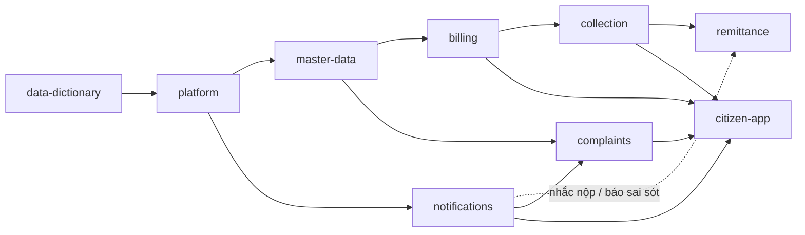
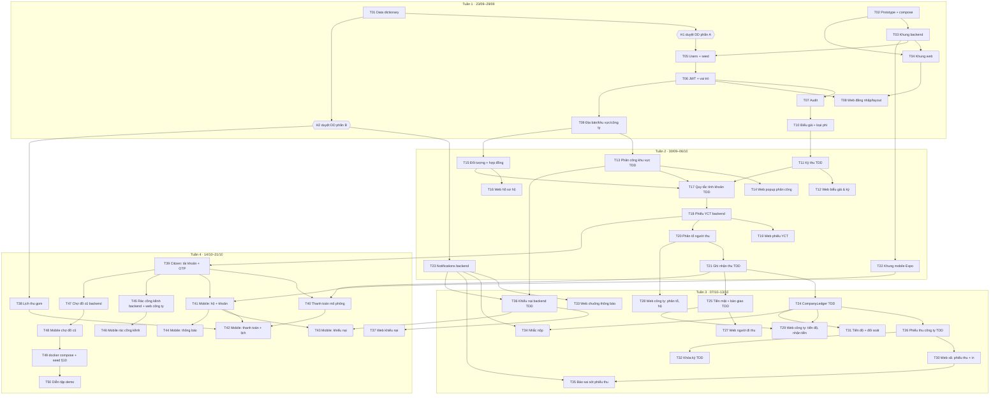

# Kế hoạch triển khai: Demo thu giá dịch vụ VSMT — Spring Boot + React + Expo

**Ngày lập:** 23/09/2026 · **Mốc demo:** thứ Tư 21/10/2026 · **Nguồn:** `SPEC.md` v1.0 (đã duyệt), `docs/intent/demo-springboot.md`, `docs/reference/prototype-inventory.md`
**Danh sách task chi tiết:** `tasks/todo.md` (đích task list mặc định, không dùng tracker ngoài)

---

## 1. Tổng quan

Dựng lại prototype HTML/JS v3.1 thành monorepo `backend/` (Spring Boot + PostgreSQL + Flyway), `web/` (React + AntD, 4 vai trò nội bộ) và `mobile/` (Expo, người dân) trong 4 tuần, để chạy trọn kịch bản demo SPEC §10. Kế hoạch đi đúng thứ tự module SPEC §2: `data-dictionary` → `platform` → `master-data` → `billing` → `collection` → `remittance` → `notifications` → `complaints` → `citizen-app`. Phần rủi ro nhất là **luồng tiền** (lập khoản → ghi nhận thu → phiếu thu/đối soát/khóa kỳ); phần này xong trước cuối tuần 3. Khiếu nại và app người dân nằm ở tuần 4.

**Tổng số:** 50 task P0/P1 + 3 task dự phòng P2 + 2 cổng duyệt của người dùng (H1, H2) + 4 checkpoint cuối tuần.

| Tuần | Khoảng ngày | Task | Số task | Checkpoint |
|---|---|---|---|---|
| 1 | 23/09 – 29/09 | T01–T10 | 10 | CP1 · 29/09 |
| 2 | 30/09 – 06/10 | T11–T23 | 13 | CP2 · 06/10 |
| 3 | 07/10 – 13/10 | T24–T36 | 13 | CP3 · 13/10 |
| 4 | 14/10 – 21/10 | T37–T50 | 14 | CP4 · 21/10 (demo) |
| Dự phòng | chỉ làm khi còn thời gian | T51–T53 | 3 | — |

**Mức ưu tiên:** `P0` = cần cho kịch bản demo §10 · `P1` = tiêu chí nghiệm thu §9 nhưng không có trong kịch bản · `P2` = dự phòng, có thể hoãn (người dùng quyết định).

---

## 2. Quyết định kiến trúc (theo SPEC, không thêm mới)

- **Monorepo 3 app + 1 CSDL** đúng SPEC §5; prototype cũ chuyển vào `prototype/` ở T02, chỉ để tham chiếu UI.
- **Lát dọc theo năng lực, tách backend/web khi vượt ~5 file.** Một năng lực (vd. "phân công khu vực") gồm một task backend (migration + entity + service + API + test) và một task web (màn hình + hook + test). Mỗi nửa kiểm chứng được độc lập: backend qua integration test + Swagger, web qua Vitest + thao tác tay. Không làm kiểu "toàn bộ schema trước, toàn bộ API sau".
- **Quy ước đếm file:** cặp entity + repository, file DTO `record` gom chung, migration + seed đi kèm, mỗi cặp tính là **1 đơn vị**. Ba task scaffold (T03, T04, T22) vượt 5 file; đã ghi rõ trong từng task.
- **Quy tắc tiền nằm trong service, viết test trước** (SPEC §7). Task có nhãn **[TDD]** bắt đầu bằng `/agent-skills:test`.
- **Một nguồn số liệu công ty–kỳ duy nhất:** `CompanyLedgerService` (T24). Báo cáo tiến độ, đối soát, màn công ty, khóa kỳ, nhắc nộp đều gọi nó. Đây là cách bảo đảm tiêu chí "tiến độ = đối soát = màn công ty".
- **Seed demo** nằm ở `db/seed/` và chỉ nạp ở profile `demo` (Flyway `locations` thêm `db/seed`). File seed đặt tên `V{n}_1__seed_*.sql` để chạy ngay sau migration schema tương ứng. Test integration không nạp seed.
- **Số phiên bản Flyway được cấp trước** (bảng dưới). Hai luồng làm song song không bao giờ tranh cùng một số.

| Ver | Task | Nội dung | | Ver | Task | Nội dung |
|---|---|---|---|---|---|---|
| V1 | T05 | users | | V11 | T23 | notifications |
| V2 | T07 | audit_logs | | V12 | T25 | cash_handovers |
| V3 | T09 | districts, areas, companies | | V13 | T26 | company_receipts |
| V4 | T10 | tariff_versions, tariff_rates, fee_types | | V14 | T34 | payment_reminders |
| V5 | T11 | collection_periods | | V15 | T35 | receipt_issues |
| V6 | T13 | area_assignments | | V16 | T36 | complaints, complaint_events |
| V7 | T15 | service_subjects, service_contracts | | V17 | T38 | collection_schedules |
| V8 | T18 | charge_requests, charges | | V18 | T39 | citizen_accounts |
| V9 | T20 | collector_assignments | | V19 | T45 | bulky_waste_requests |
| V10 | T21 | payments, collection_visits | | V20 | T47 | market_posts, market_comments |

> V21 trở đi để dành cho sửa đổi sau. Hai luồng có thể merge lệch thứ tự (vd. V11 của luồng B vào `main` trước V10 của luồng A). Test không bị ảnh hưởng vì Testcontainers luôn tạo CSDL mới, nhưng CSDL trên máy dev sẽ báo lỗi validate. Khi gặp lỗi đó, reset bằng `docker compose down -v && docker compose up -d db` (dữ liệu chỉ là seed). Nếu cần sửa schema đã chạy, luôn tạo migration mới, không sửa file cũ (SPEC §8).

---

## 3. Đồ thị phụ thuộc

### 3.1 Mức module (SPEC §2, có điều chỉnh thứ tự thông báo, xem G2)

### 3.2 Mức task (cạnh chính; phụ thuộc đầy đủ ghi trong `todo.md`)

**Đường găng (critical path, 15 bước tuần tự):** T01 → H1 → T05 → T06 → T09 → T13 → T17 → T18 → T20 → T21 → T24 → T26 → T32 → T49 → T50. Bước nào trên đường này trễ thì mốc demo trễ theo. Task ngoài đường găng có thể dời trong tuần.

---

## 4. Các giai đoạn theo tuần và checkpoint

### Tuần 1 — Nền móng (23/09 – 29/09) · T01–T10
Data dictionary; chuyển prototype; khung backend và web; đăng nhập JWT, vai trò, audit; địa bàn/khu vực/công ty; biểu giá QĐ 65/2026.
- **H1 (người dùng, mục tiêu 25/09):** duyệt data dictionary **phần A** (platform, master-data, billing, collection, remittance) và trả lời các câu hỏi gắn với phần A (G1, G3, G4, G5, G8, G9, G10, G11, G14, G15, G16). Chưa qua H1 thì không task nào được tạo entity/migration.
- **H2 (người dùng, mục tiêu 02/10):** duyệt **phần B** (notifications, complaints, citizen-app, CollectionSchedule).

**CP1 · 29/09: demo được gì**
- `docker compose up -d db` + `./mvnw spring-boot:run` chạy trên seed; Swagger thấy API auth, areas, companies, tariffs.
- Web: đăng nhập 4 vai trò nội bộ, mỗi vai trò ra đúng menu; gọi API sai vai trò nhận 403; công ty A đọc công ty B nhận 403/404 (SPEC §9.2 nghiệm thu).
- `./mvnw verify` và `npm run lint && npm run test && npm run build` (web) đều xanh.

### Tuần 2 — Danh mục, lập khoản, bắt đầu thu (30/09 – 06/10) · T11–T23
Kỳ thu tháng/quý; màn quản trị kỳ; phân công khu vực có lịch sử + popup; hồ sơ hộ (đối tượng + hợp đồng); quy tắc tính khoản và phiếu YCT (xem trước, phát hành); phân tổ người đi thu; ghi nhận kết quả thu. Luồng B: khung Expo, notifications backend.

**CP2 · 06/10: demo được gì**
- Kịch bản §10 **bước 1–2 chạy trên web:** quản trị mở kỳ 10/2026; cán bộ xã phân công KV24 bằng popup, lập phiếu YCT toàn xã, xem trước, phát hành; phát hành lại không sinh trùng.
- §10 **bước 3 (phần backend)** chạy qua Swagger/test: phân tổ, ghi nhận 2 tiền mặt + 1 vắng; gửi trùng không tạo 2 thanh toán.
- App Expo mở trên điện thoại (Expo Go) và gọi được API của laptop.
- **Cổng go/no-go phạm vi:** nếu tới CP2 còn nợ từ 2 task P0 trở lên, bật danh sách cắt ở mục 7.

### Tuần 3 — Hoàn tất luồng tiền + thông báo + khiếu nại backend (07/10 – 13/10) · T24–T36
Sổ công ty–kỳ (`CompanyLedgerService`); tiền mặt và bàn giao; phiếu thu công ty + in; tiến độ + đối soát; khóa kỳ; web người đi thu và web công ty; chuông thông báo; nhắc nộp; báo sai sót phiếu thu; khiếu nại backend.

**CP3 · 13/10: demo được gì**
- §10 **bước 3 trên giao diện:** công ty DV01 phân tổ; người đi thu (web giao diện mobile) ghi 2 hộ tiền mặt, 1 hộ vắng; công ty nhận tiền mặt.
- §10 **bước 5:** xã lập phiếu thu một phần, in phiếu có số tiền bằng chữ; tiến độ và đối soát ra "Đang nộp"; ba màn (tiến độ, đối soát, công ty) cùng một con số; nhắc nộp làm chuông DV01 có thông báo; DV01 báo sai sót, xã xử lý.
- §10 **bước 8:** khóa kỳ khi còn nợ bị chặn, lý do rõ ràng.
- Coverage dòng của service `billing`, `collection`, `remittance` ≥ 80% (nếu T03 được phép thêm JaCoCo, xem G10).
- Chạy `/agent-skills:review` trên toàn bộ diff của luồng tiền.

### Tuần 4 — Khiếu nại liên thông + app người dân + đóng gói demo (14/10 – 21/10) · T37–T50
Web khiếu nại; lịch thu gom; tài khoản dân + OTP cố định; thanh toán mô phỏng; các màn mobile (hộ, khoản, thanh toán, lịch, khiếu nại, thông báo, rác cồng kềnh, chợ đồ cũ); `docker compose up --build`; diễn tập.

**CP4 · 21/10 (mốc demo): demo được gì**
- Chạy trọn §10 bước 1–9 trên dữ liệu seed, bằng `docker compose up` + `npx expo start`, không lỗi console, không dữ liệu thật.
- Toàn bộ test xanh ở cả 3 app; danh sách lỗi còn lại (nếu có) đã được người dùng chấp nhận.

---

## 5. Rủi ro và cách giảm

| # | Rủi ro | Mức | Cách giảm |
|---|---|---|---|
| R1 | Duyệt data dictionary chậm, chặn mọi task entity | Cao | Duyệt 2 phần (H1 phần A trước, H2 sau); T02–T04 không cần duyệt nên làm song song; T01 gom sẵn câu hỏi để trả lời một lần |
| R2 | Số liệu tiền lệch giữa tiến độ / đối soát / màn công ty | Cao | Chỉ một `CompanyLedgerService` (T24), viết test trước; integration test so 3 API trên cùng dữ liệu |
| R3 | Phân công đổi giữa kỳ làm phải thu gán nhầm công ty (G3) | Cao | Hỏi ở H1; test chuyên cho trường hợp đổi công ty giữa kỳ (T13, T24) |
| R4 | Phạm vi quá lớn: 50 task / ~21 ngày làm việc ≈ 2,4 task/ngày | Cao | Chạy 2 luồng song song từ tuần 2 (mục 6); cổng go/no-go tại CP2; danh sách cắt có thứ tự (mục 7) |
| R5 | Docker/Testcontainers trên Windows không chạy | Trung bình | T03 kiểm tra ngay ngày đầu; phương án dự phòng là chạy integration test trỏ vào db của docker-compose (profile `it-local`) |
| R6 | Expo Go trên điện thoại không gọi được API laptop (LAN, firewall, SDK lệch) | Trung bình | T22 làm sớm ở tuần 2 với tiêu chí "gọi được /api từ điện thoại"; dùng IP LAN hoặc `npx expo start --tunnel`; ghim phiên bản SDK |
| R7 | Hai luồng song song xung đột file chung (migration, SecurityConfig, menuConfig, schema.d.ts) | Trung bình | Số Flyway cấp trước (mục 2); luồng B chỉ sửa package/thư mục module của mình; rebase lên main sau mỗi task; `schema.d.ts` sinh lại, không sửa tay |
| R8 | Kiểu TS lệch với API | Thấp | Mọi task web/mobile chạy `npm run gen:api` và commit `schema.d.ts` |
| R9 | Điểm mở (§11, G1–G16) được trả lời muộn làm đổi quy tắc tiền | Trung bình | Quy tắc gói trong service có test; task chạm điểm mở gắn nhãn **cần hỏi trước**; đổi quy tắc chỉ cần sửa service + test |
| R10 | Phiên Claude sửa lan ra ngoài phạm vi task | Trung bình | Mỗi task ≤ ~5 đơn vị file; review diff trước khi tick; `/agent-skills:review` ở mỗi checkpoint |

---

## 6. Việc làm song song được

Một người, nhưng có thể mở **2 phiên Claude** trên 2 git worktree:

- **Tuần 1:** một luồng. Có thể mở thêm phiên thứ hai cho T02/T04 trong lúc chờ H1.
- **Luồng A (backend luồng tiền, đường găng):** T05 → T06 → T09 → T11 → T13 → T15 → T17 → T18 → T20 → T21 → T24 → T25 → T26 → T31 → T32 → T34 → T35 → T39 → T40 → T49 → T50.
- **Luồng B (web/mobile và module phụ, từ tuần 2):** T12 → T14 → T16 → T19 → T22 (Expo) → T23 (notifications, sau H2) → T27 → T28 → T29 → T30 → T33 → T36 → T37 → T38 → T41…T48. Task web của luồng B chỉ bắt đầu khi API tương ứng của luồng A đã merge.
- **Làm song song an toàn:** T02 ‖ T01; T03 ‖ T04 (sau khi T03 có OpenAPI); các task web của năng lực đã có API (T12, T14, T16, T19, T27, T28); T38 (lịch thu gom) làm lúc nào cũng được sau H2.
- **Bắt buộc tuần tự:** migration theo số phiên bản; mọi thứ phụ thuộc T24 (sổ công ty–kỳ); T32 khóa kỳ chạy sau khi phiếu thu và ghi nhận thu đã xong.
- **Cần thống nhất trước:** task phát thông báo (T34, T35, T36) gọi `NotificationService.publish(...)`, hợp đồng này chốt ở T23 trước rồi mới chạy song song.
- **Kéo sớm nếu dư sức:** T37, T38, T39 có thể kéo lên cuối tuần 3 ở luồng B để giảm tải tuần 4 (tuần 4 đang có 14 task).

---

## 7. Phạm vi so với mốc 4 tuần: không chắc vừa, đề xuất cắt để người dùng chọn

Nếu chỉ làm **một luồng**, 50 task P0/P1 **không vừa** 4 tuần một cách an toàn (cần ~2,4 task/ngày, không còn đệm cho sửa lỗi và diễn tập). Hai luồng song song thì vừa sát nút. Các mục dưới **chưa bị bỏ**; tất cả vẫn nằm trong `todo.md`. Người dùng quyết định cắt tại CP2 (hoặc sớm hơn), theo thứ tự đề xuất:

| # | Đề xuất cắt/hoãn | Tiết kiệm | Ảnh hưởng |
|---|---|---|---|
| C1 | T51 Màn quản trị tài khoản → dùng tài khoản seed | 1 task | Không ảnh hưởng §10; lệch SPEC §9.2 (màn quản trị tài khoản) |
| C2 | T52 Màn nhật ký audit → audit vẫn ghi DB, xem bằng SQL | 1 task | Không ảnh hưởng §10 |
| C3 | T53 Lịch sử hộ + báo sai thông tin hộ (người đi thu) | 1 task | Lệch SPEC §9.5 một phần |
| C4 | Bình luận chợ đồ cũ (`MarketComment`) trong T47/T48 | ~0,5 task | §10 bước 7 chỉ cần đăng bài |
| C5 | Tải ảnh thật (chợ đồ cũ, rác cồng kềnh) → ảnh mẫu tĩnh | ~0,5 task | Không ảnh hưởng luồng nghiệp vụ |
| C6 | T16 Web hồ sơ hộ rút còn danh sách + form tạo/sửa, bỏ lọc nâng cao | ~0,5 task | Vẫn đạt "CRUD đối tượng + hợp đồng" |
| C7 | T49 docker hóa backend + web → demo bằng `./mvnw spring-boot:run` + `npm run dev` | ~0,5 task | Lệch §10 bước 9 |
| C8 | T38 Lịch thu gom → dữ liệu tĩnh trong app | 1 task | Lệch SPEC §9.3/9.9 (entity `CollectionSchedule`) |
| C9 | Bản `.xlsx` của data dictionary (SPEC §9.1 "nếu cần") | — | Chưa có task; làm khi người dùng yêu cầu |

---

## 8. Việc hoãn (ngoài 4 tuần, theo SPEC §1 và §7)

Vai trò Lãnh đạo; miễn giảm / hoàn / xóa nợ (chỉ giữ cờ miễn 100%); thanh toán thật, VietQR, sao kê; HĐĐT; KBNN; import Excel thật; triển khai production; push notification thật (dùng polling); Playwright E2E (§7 cho phép tự động hóa sau); các quyết định còn mở O1–O7 (demo dùng mặc định ở §11). Ba task P2 (T51–T53) và mục C4–C9 chỉ hoãn khi người dùng chọn cắt.

---

## 9. Khoảng trống / mâu thuẫn trong SPEC (cần người dùng trả lời, kế hoạch không tự quyết)

| # | Điểm | Task bị chạm |
|---|---|---|
| G1 | **Ai khóa kỳ?** §1 bảng vai trò giao "mở/khóa kỳ thu" cho Quản trị, nhưng dòng Cán bộ xã cũng có "khóa kỳ", luồng tiền ghi "xã khóa kỳ", §10 bước 8 "Xã thử khóa kỳ" | T11, T12, T32 |
| G2 | **Thứ tự module:** §2 cho `notifications` chỉ phụ thuộc `platform` và xếp sau `remittance`, nhưng nhắc nộp, báo sai sót phiếu thu (remittance) và báo sai thông tin hộ (collection) phải phát thông báo. Kế hoạch dựng notifications core (T23) trước T34/T35; đây chỉ là đổi thứ tự, không đổi quy tắc | T23, T34, T35, T53 |
| G3 | **"Phải thu theo công ty được phân công tại kỳ phát sinh":** khi đổi công ty giữa kỳ thì lấy ngày nào (ngày mở kỳ, ngày phát hành khoản, hạn nộp)? Có chụp `companyId` lên `Charge` lúc phát hành không? Phạm vi phiếu YCT "theo công ty" cũng cần mốc ngày này | T13, T17, T18, T24 |
| G4 | **Thanh toán một phần / thu thừa:** `Charge` chỉ có Chưa thu / Đã thu / Miễn giảm, nhưng `Payment` cộng dồn; prototype cho người thu ghi đè số thực thu. "Công ty đã thu" tính theo Σ `Payment` hay Σ số tiền khoản Đã thu (R8)? | T21, T24 |
| G5 | **Ai ghi `CashHandover`:** §9.5 "người đi thu → công ty", §1 công ty "nhận tiền mặt", §10 bước 3 "người đi thu bàn giao". Một bên ghi hay cần xác nhận hai phía? | T25, T27, T29 |
| G6 | **ReceiptIssue "Đã xử lý" nghĩa là gì:** chỉ đóng kèm ghi chú, hay được sửa/hủy phiếu thu? SPEC chỉ cấm sửa sau khóa kỳ | T35 |
| G7 | **"Báo sai thông tin hộ"** của người đi thu (§1, §9.5) không có entity; prototype chỉ phát thông báo `info` | T53 |
| G8 | **`CITIZEN` là vai trò của `User` (§9.2) và cũng có `CitizenAccount` (§9.9):** một bảng hay hai? | T05, T39 |
| G9 | **Thành phần giá QĐ 65/2026** (thu gom / vận chuyển / xử lý / VAT) cho 4 nhóm giá: prototype chỉ có tổng/tháng và một bộ 45k/20k/12k/3k cho nhóm 80k. Cần số chính thức để seed | T10 |
| G10 | **Dependency ngoài §3 (§8 yêu cầu hỏi trước):** mẫu code §6 dùng Lombok (`@RequiredArgsConstructor`) nhưng Lombok không có trong §3; §7 đặt coverage ≥ 80% nhưng không có công cụ đo (JaCoCo); thư viện JWT chưa nêu; web cần `@ant-design/icons` và có thể một HTTP client (mẫu dùng `api.get`); mobile cần `expo-secure-store` / `expo-image-picker` | T03, T04, T06, T22, T47 |
| G11 | **Mã chứng từ cho kỳ quý:** `PT-CT-MMYY-nnn`, `YCT-MMYY-nn`, `KT-MMYY-…` với kỳ `2026-Q4` thì MMYY lấy tháng nào? | T18, T26 |
| G12 | **Phạm vi khiếu nại phía công ty:** "được chuyển **hoặc thuộc khu vực mình**". Công ty có thấy/phản hồi khiếu nại xã chưa chuyển không? | T36 |
| G13 | **Loại phí `BULKY` (150.000đ) trong billing** cho phép lập phiếu YCT phí rác cồng kềnh, trong khi O5 nói phí rác cồng kềnh không sinh `Charge`. Hai khái niệm dễ lẫn | T10, T17, T45 |
| G14 | **Đổi công ty phụ trách khu vực:** `CollectorAssignment` của công ty cũ có tự kết thúc không? | T13, T20 |
| G15 | **Khóa kỳ chặn "khi còn công ty nợ":** tính cả kỳ chưa tới hạn? Có tính khoản hộ chưa thu (công ty chưa thu được) là "nợ" của công ty không? (R9–R11 dựa trên phải thu − đã nộp) | T32 |
| G16 | **Hai loại hạn:** `CollectionPeriod.dueDate` (hạn công ty nộp xã) và `ChargeRequest.dueDate` (hạn hộ đóng). "Quá hạn" của khoản hộ dùng hạn nào khi hai phiếu YCT cùng kỳ có hạn khác nhau? | T17, T18 |

Các điểm mở chính thức O1–O7 (§11) giữ nguyên mặc định demo; task nào chạm thì ghi rõ trong `todo.md`.

---

## 10. Cách dùng kế hoạch với agent-skills

1. Trước khi bắt đầu, commit `SPEC.md`, `docs/` và `tasks/` để cây git sạch (lệnh build cần điều này).
2. Mỗi task mở **một phiên Claude mới**: `/agent-skills:build T05`. Gõ `/agent-skills:build` không kèm mã thì Claude lấy task `[ ]` kế tiếp có phụ thuộc đã xong.
3. Task gắn **[TDD]** (quy tắc tiền): chạy `/agent-skills:test T21` trước để có test đỏ, sau đó `/agent-skills:build T21`.
4. Task gắn **cần hỏi trước**: trả lời câu hỏi (ghi vào `docs/data-dictionary.md` hoặc `docs/adr/`) rồi mới build.
5. Xong task: tất cả lệnh kiểm chứng xanh, đọc diff, tick `[x]` trong `todo.md`, commit nhỏ một task một commit.
6. Cuối tuần (CP1–CP4): chạy toàn bộ test, `/agent-skills:review` trên diff của tuần, chạy các bước §10 tương ứng.
7. Luồng B chạy trong worktree riêng, chỉ sửa file thuộc module của mình, rebase lên `main` sau mỗi task.
8. Không dùng `/agent-skills:build auto` cho luồng tiền và khóa kỳ; đi từng task, có người duyệt.
